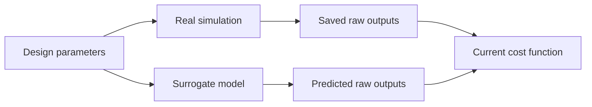

# yadof

**Optimize expensive simulations with reusable data and a strategy you can edit.**

yadof is a Python framework for engineers and researchers running simulation-based
design studies. It runs evaluations locally or on an existing HTCondor cluster,
preserves their raw outputs, and provides surrogate models and search components
that you compose in ordinary Python.

Use it for problems such as antenna design, circuit tuning, and multibody
dynamics, where each simulation matters and the design objectives may evolve.

[**Release 0.5.1**](https://github.com/YS-Pan/yadof/releases/tag/v0.5.1) ·
Python **3.10+** ·
[Quick start](#try-the-starter-task) ·
[User guide](user_doc/README.md) ·
[Examples](examples/README.md)

## Why yadof?

An expensive simulation often produces a whole curve or field. yadof keeps that
data separately from the function that scores it. For example, an antenna's saved
frequency response can be evaluated against a revised bandwidth target without
rerunning the simulator, provided the recorded data still fits the task.



Surrogates learn from recorded parameter/output pairs. Both real and predicted
outputs pass through the current task's cost function.

- **Reuse what you have measured.** Preserve scalars, curves, and fields, then
  recalculate objectives from compatible history as requirements change.
- **Own the optimization loop.** Write candidate selection, real evaluation,
  training, and their ordering in `submit/optimization.py`. Complete examples
  cover real-only search, sequential training, and overlapping training with
  evaluation.
- **Keep a trace of each run.** Recorded evidence and generation snapshots support
  inspection, diagnosis, and continuation at completed generation boundaries.
  Cost and timing views show results and failures; checkpoint tools compare
  surrogate predictions with recorded observations.

## Try the starter task

Use a Python 3.10+ environment. Download
[`yadof-0.5.1-py3-none-any.whl`](https://github.com/YS-Pan/yadof/releases/download/v0.5.1/yadof-0.5.1-py3-none-any.whl)
into your current directory, then install it:

```powershell
python -m pip install "./yadof-0.5.1-py3-none-any.whl[surrogate,plot]"
python -m yadof version
```

The `surrogate` extra supplies PyTorch for the default optimization program;
`plot` supplies Matplotlib for the result plots. See the
[installation guide](user_doc/package_foundation.md) for other extras and
installation options.

The unmodified starter calculates `response = input_value ** 2` for a parameter
in `[-1, 1]`. It needs no external simulator. Use a new `my-study` directory:

```powershell
python -m yadof init ./my-study
python -m yadof check --workspace ./my-study
python -m yadof smoke-test --workspace ./my-study --mode local
python -m yadof run --workspace ./my-study --mode local --generations 1 --population-size 8 --no-smoke-test
python -m yadof view all --workspace ./my-study
```

You should see:

- A successful static check and one midpoint smoke evaluation with cost about
  `0.1`, the starter's normalized cost at its target.
- One completed optimization generation with eight evaluated candidates.
- Nine recorded results, including the separate smoke evaluation, and cost/time
  PNGs under `my-study/.yadof/tool_output/`.

Raw evaluation evidence is stored under `my-study/recorded_data/`. This small run
demonstrates execution, recording, and inspection; it does not establish surrogate
quality or optimization performance. The explicit generation limit matters:
`run` defaults to **50 generations** when it is omitted.

## Work with an AI coding agent

The intended workflow is a human directing an AI coding agent: you define the
engineering problem, objectives, and execution budget; the agent authors the
workspace and follows the installed documentation. The project was developed and
verified with [OpenAI Codex](https://openai.com/codex/).

Open the intended writable workspace in your agent, using the Python environment
where yadof is installed. A useful starting prompt is:

```text
Set up a yadof workspace for the simulation described below.

Before making changes, run:
python -m yadof docs show user README.md

Follow that document's routing and execution policy.

Simulation and input files: ...
Design variables, ranges, and constraints: ...
Outputs to preserve and objectives to optimize: ...
Expected time per evaluation and execution budget: ...
Allowed concurrency and workspace location: ...
```

The installed user guide is version-matched and written primarily for the agent
acting on your instructions. It covers task authoring, validation, and when a run
needs explicit authorization. The same CLI and Python APIs are available for
direct use. More task prompts are in [prompt examples](user_doc/example_prompts/README.md).

## Define your simulation

A workspace contains the task-specific code. yadof supplies the shared execution,
recording, optimization, and analysis machinery.

| What you define | Workspace file |
| --- | --- |
| Parameters, ranges, and feasibility constraints | `job_template/parameters_constraints.py` |
| How to run the simulator and collect raw outputs | `job_template/workflow.py` |
| How raw outputs become normalized minimization objectives | `submit/calc_cost.py` |
| Search, evaluation, surrogate training, and their ordering | `submit/optimization.py` |
| Execution mode, concurrency, and timeouts | `config.py` |

Start with the [task-authoring guide](user_doc/optimization_workflow.md).
[Adapters](user_doc/adapters/README.md) are available for HFSS, ngspice, and Project
Chrono; simulator software and licenses come from your environment.

For an edited or external task, the standalone smoke command requires
`--real-task`. Follow the [smoke and run guide](user_doc/config_and_run.md) to
choose an execution budget and inspect the result before a longer campaign.

Task corrections can reuse meaningful historical data. Parameter names, order,
and count, plus the objective count, must remain stable within that workflow;
structural changes need a new workspace. The run guide explains generation
snapshots, which edits take effect at generation boundaries, and how to continue
a completed run. Use a separate workspace for each concurrent campaign.

## Choose the program and execution mode

The starter combines GA for one objective or NSGA-III for multiple objectives,
GPSAF surrogate assistance, and a conditional implicit neural representation
(INR) model. These choices and their settings are visible in the workspace's
Python program.

The [optimization program examples](user_doc/optimization_program_examples.md)
show how to use real evaluations alone, change training order, or select different
history for search and surrogate training. A real-only program can run with the
core package; the starter's surrogate requires the extra installed above.

| Mode | Evaluation contract |
| --- | --- |
| `local` | Run a prepared workflow in a subprocess for each candidate, retaining job files. This is the starter's mode. |
| `fast` | Run an explicit `evaluation.py` kernel in reusable, isolated local worker processes. The starter needs that kernel before using this mode. |
| `distributed` | Submit prepared workflows to an existing HTCondor pool. Worker machines need the task's simulator environment; they do not need yadof installed. |

See [configuration and execution](user_doc/config_and_run.md) for worker limits,
timeouts, and cluster requirements.

Surrogate benefit depends on the task and budget. PCA/SVD is available for
diagnostics. Hierarchical CAE and posterior/qNEHVI work are experimental; the
current [posterior example](examples/optimization-programs/posterior_assisted_fallback.md)
uses full real evaluation because posterior-driven selection is blocked by its
readiness checks.

## Inspect results and go further

`view all` produces cost and timing summaries and plots. The installation above
also supports the read-only surrogate checkpoint tools. Once a run has trained a
model, you can explore its predictions as scalars, curves, and field slices.
The terminal `summary`, `audit`, and `inspect` commands work without a window;
the desktop explorer additionally requires Tkinter. See
[history and tools](user_doc/config_and_run.md#history-and-tools).

| Next step | Start here |
| --- | --- |
| Explore a complete HFSS task or the five optimization programs | [Source examples](examples/README.md) |
| Compare strategies across repeatable studies | [yadof-benchmark](yadof-benchmark/user_doc/README.md), installed separately |
| Migrate a workspace using `build_optimization()` | [0.5 migration guide](user_doc/migration_0_5.md) |
| Understand the release history | [Version history](dev_doc/history.md) |
| Change yadof or contribute | [Development guide](dev_doc/README.md) |

The source examples are tracked in this repository and excluded from wheel and
sdist artifacts. The independent `yadof-benchmark` package owns benchmark
orchestration and packaged baselines; installing yadof alone does not install it.

For compatibility and the tested machine snapshot, see
[the development environment](dev_doc/development_environment.md). For questions
or reproducible bug reports, [open an issue](https://github.com/YS-Pan/yadof/issues).
