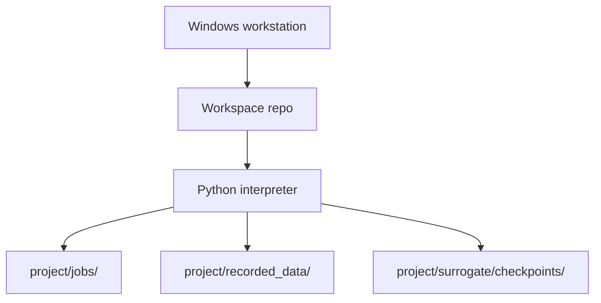
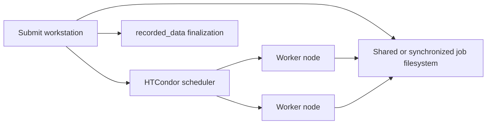

# 4+1 Physical View

## Current Local Deployment

## Runtime Locations
- Source code: `project/`.
- Prepared jobs: default `project/jobs/`, configurable by `project/config.py`.
- Recorded rawData: `project/recorded_data/rawData/<job_name>/`.
- Recorded manifest: `project/recorded_data/manifest.json`.
- Surrogate checkpoints: `project/surrogate/checkpoints/`.
- Tool outputs: typically `project/tools/`.

## Future Distributed Deployment

## Physical Constraints
- Local tests should not require HTCondor or simulator software.
- Real simulator adapters may require Windows-only COM automation and installed applications.
- Job path should be configurable so users can move high-write runtime folders to faster storage.
- `recorded_data` manifest writes must stay atomic because future distributed finalization may introduce more concurrency.
