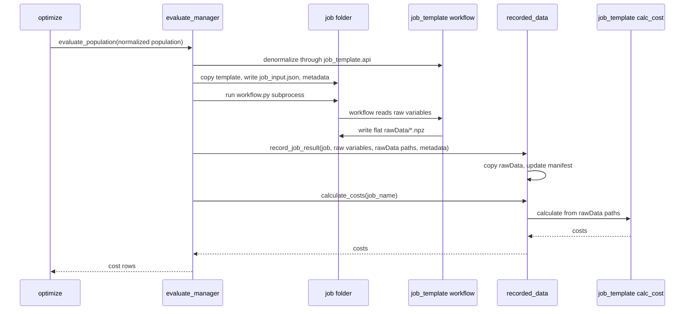
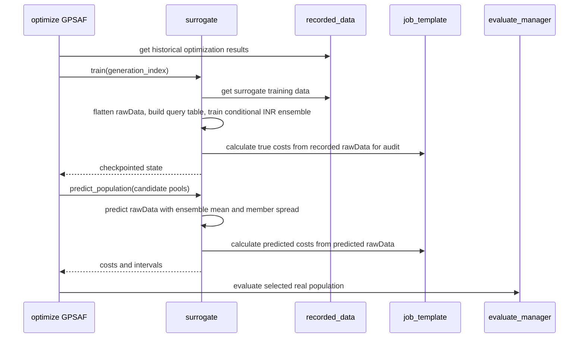

# 4+1 Process View

## Local Evaluation Sequence

## Surrogate-Assisted Generation

## Failure Handling
- Prepare failure: `evaluate_manager` creates a synthetic failure result if possible, records best effort, and returns `inf`.
- Workflow failure: local runner captures return code, stdout/stderr tails, status, and rawData presence.
- Timeout: local runner terminates the process tree and records status `timeout`.
- Record failure: evaluation continues; returned row becomes `inf`.
- Invalid rawData: `recorded_data.query` skips invalid completed rawData for history/training and exposes diagnostics.

## Concurrency Notes
- Current local evaluation is sequential at the API level.
- `recorded_data` manifest writes are protected by process-local and file-level locks.
- Future distributed mode should reuse the same record/finalize semantics.
