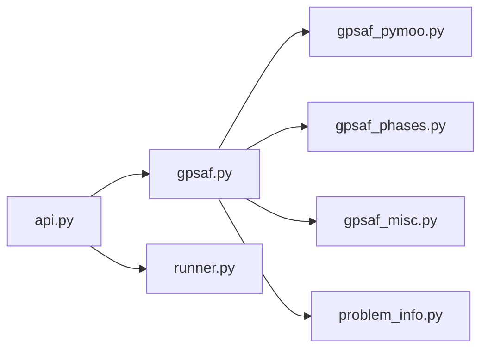
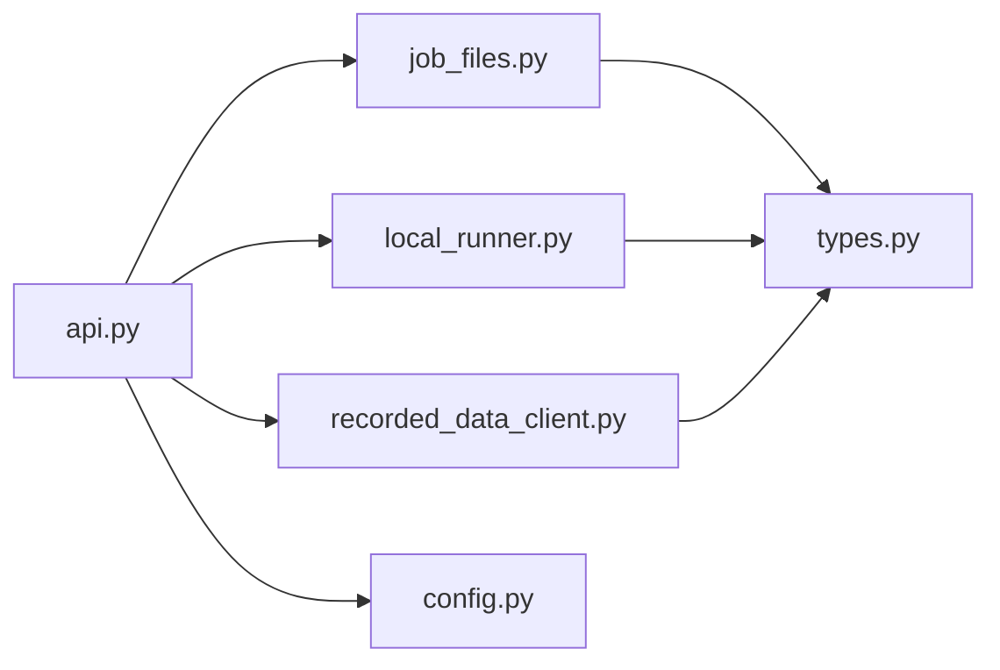
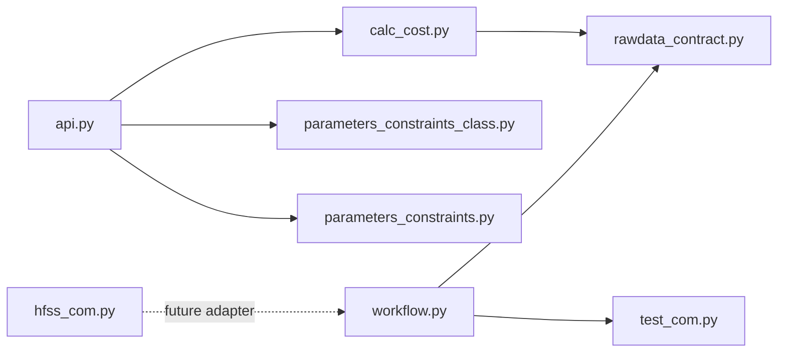
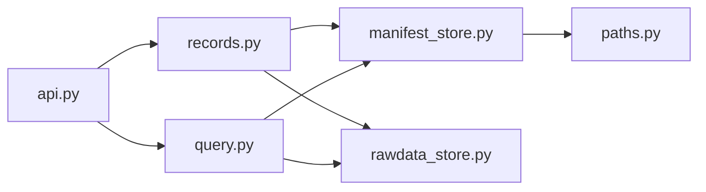
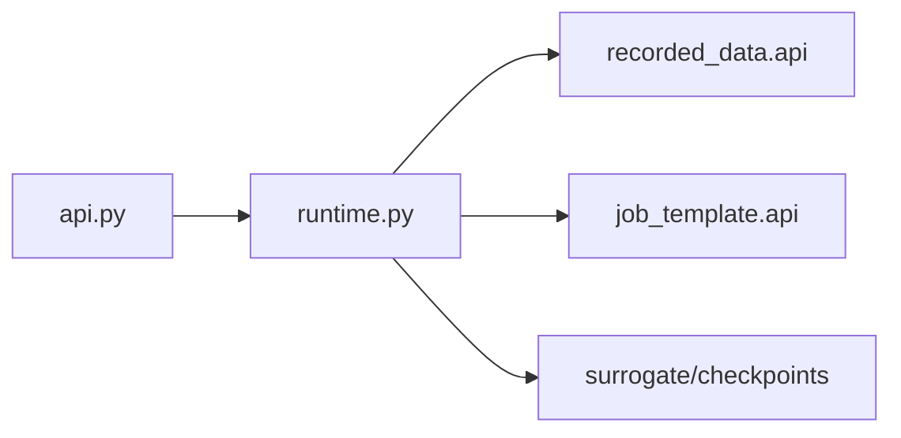

# C4 Component

## Optimize Components

- `api.py`: stable entry point.
- `gpsaf.py`: one-generation orchestration.
- `gpsaf_pymoo.py`: GA/NSGA2 ask-tell adapter in normalized space.
- `gpsaf_phases.py`: surrogate alpha/beta candidate phases and fallback.
- `gpsaf_misc.py`: history loading, evaluation API calls, cost helpers.
- `problem_info.py`: variable/objective metadata from `job_template.api`.
- `runner.py`: generation metadata helpers.

## Evaluate Manager Components

- `job_files.py`: copy template, write job input, compute static hash.
- `local_runner.py`: subprocess workflow execution and timeout handling.
- `recorded_data_client.py`: adapter to `recorded_data.api`.
- `types.py`: immutable job handoff objects.

## Job Template Components

- `workflow.py`: raw variable input to flat rawData output.
- `calc_cost.py`: rawData to three bounded objective costs.
- `rawdata_contract.py`: `.npz` schema validation.
- `test_com.py`: current pure-Python simulator stand-in.
- `hfss_com.py`: real simulator adapter reference surface.

## Recorded Data Components

- `records.py`: record creation and rawData copy.
- `query.py`: normalized variables, costs, history, training data, diagnostics.
- `manifest_store.py`: locking, schema, atomic JSON writes.
- `rawdata_store.py`: `.npz` metadata and file loading.

## Surrogate Components

- `runtime.py`: training-data load, rawData flattening, RBF/IDW ensemble, prediction, intervals, checkpoints.
- `api.py`: stable optimizer-facing exports.
