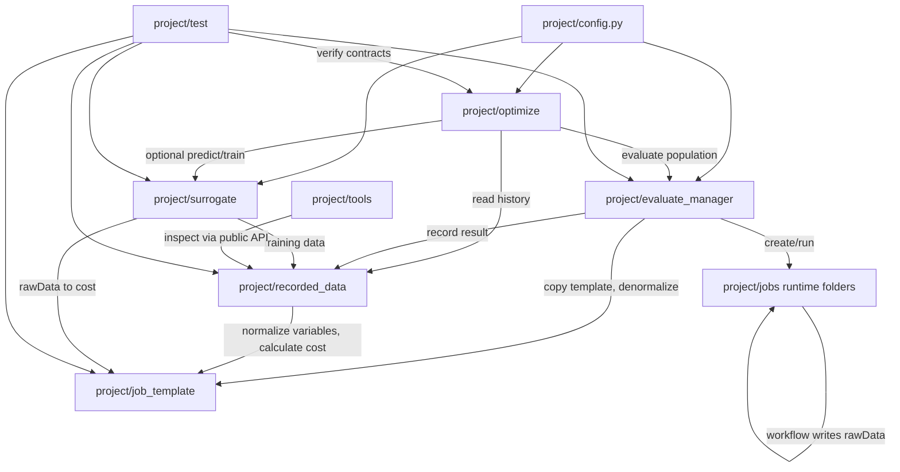

# C4 Container

## Containers

## Container Responsibilities
- `optimize`: search policy, history warm start, GPSAF-style surrogate assistance, generation metadata.
- `evaluate_manager`: job preparation, local execution, failure isolation, recording handoff.
- `job_template`: task-specific parameter definitions, workflow, rawData schema, and cost calculation.
- Current default `job_template`: pure-Python rawData generation plus three `[0, 1]` test objectives.
- `recorded_data`: durable real-evaluation archive and dynamic historical views.
- `surrogate`: rawData-first training and prediction.
- `tools`: optional user workflows for visualization and maintenance.
- `test`: local verification of contracts and failure behavior.

## Primary Data Flow
1. `optimize` creates normalized candidates.
2. `evaluate_manager` prepares one job per candidate and denormalizes through `job_template`.
3. Job `workflow.py` writes flat rawData `.npz` files.
4. `evaluate_manager` sends job results to `recorded_data`.
5. `recorded_data` stores raw evidence and asks `job_template` for dynamic cost when needed.
6. `surrogate` trains from recorded rawData and predicts rawData for optimizer-side candidate screening.

## Container Rules
- Core modules communicate through each other's `api.py` files.
- `config.py` may be imported directly as a small shared settings surface.
- `tools` may be flexible, but core modules and tests must not depend on tools.
- `jobs` folders are runtime state, not source modules.
