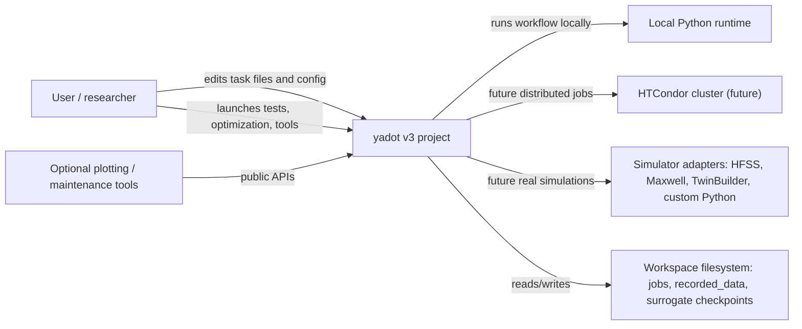

# C4 Context

## Scope
`yadot` is a local-first optimization framework for expensive simulation workflows. It coordinates optimization, job execution, rawData persistence, surrogate training, and optional user tools.

## Context Diagram

## External Actors
- User: edits task definitions, decides when old history is still valid, launches runs, inspects results.
- Local Python runtime: executes the current `workflow.py` in isolated job folders.
- Simulator adapters: future or optional adapters that turn variables into rawData.
- HTCondor: planned distributed backend, not implemented in the current local skeleton.
- Filesystem: the durable persistence layer for source files, job folders, individual metadata, optimization metadata, archived rawData, and surrogate checkpoints.

## System Responsibilities
- Generate candidate populations in normalized variable space.
- Convert normalized candidates into task-specific raw variables.
- Run a workflow that produces rawData only.
- Persist raw variables, rawData, and metadata.
- Calculate cost dynamically from rawData.
- Train and use surrogate models without bypassing rawData.

## Out Of Scope
- Binding the core framework to one simulator.
- Persisting `cost.json` as an authoritative result.
- Requiring HTCondor or a real simulator for default tests.
