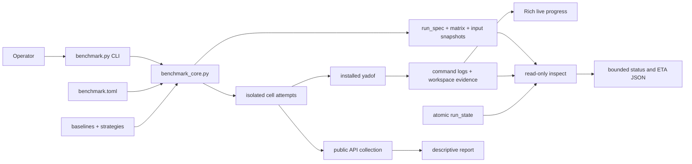

# C4 Containers

## CLI

`benchmark.py` parses commands, selects bounded or full output, maps errors to exit
codes, renders the final hypervolume table, and pauses a completed interactive
window. It contains no planning, state, ETA, or reporting algorithm.

## Core runner

`benchmark_core.py` validates TOML, creates plans/specs, preflights dependencies,
snapshots inputs, advances attempts, logs subprocesses, adapts yadof progress,
estimates completion, collects public observations, and builds reports.

## Inputs and generated state

Tracked baseline/strategy/config content is mutable for future runs. Run-local
specs, matrices, snapshots, and attempt artifacts are immutable. `run_state.json`
is the one atomically replaced execution index. Root `metrics.json`, `report.json`,
and `report.md` are latest derived views backed by append-only snapshots.

## Installed yadof boundary

Cells invoke a normal installed distribution and use public collection/viewer
surfaces. The runner does not import repository `src/`, scrape `.yadof` internals,
or patch a measured workspace.
