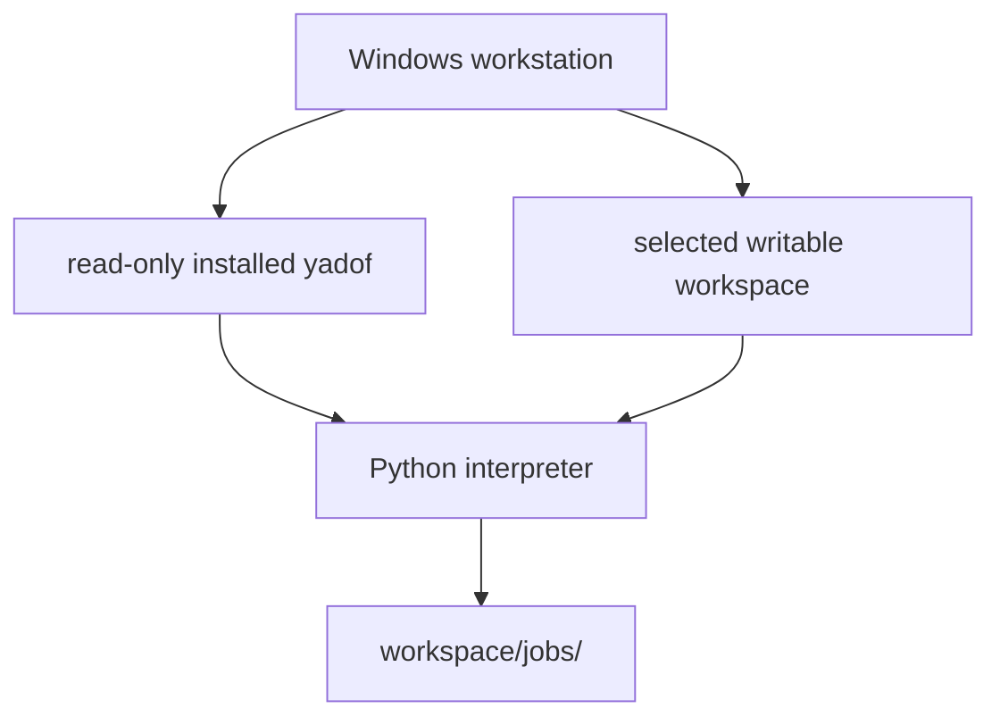
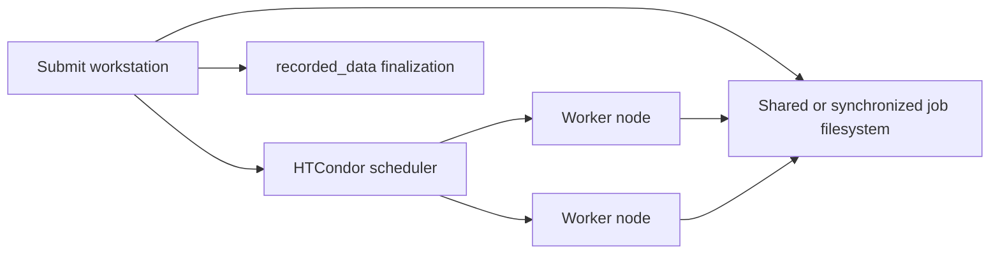

# 4+1 Physical View

## Package-Era Local Deployment

The transitional source optimizer still writes `project/jobs/`, records, and
checkpoints until their later package stages; new installed local/smoke calls use
only the selected workspace jobs path.

## Runtime Locations
- Installable package foundation source: `src/yadof/`; built wheels install its
  CLI/version/resources plus workspace/config/task-loader, safe init/check, and
  stable job-template framework support into the Python environment.
- Packaged local runtime source: `src/yadof/evaluate_manager/`, including copied
  worker support under `worker_files/`. Installed files are read-only inputs.
- Current persistence/optimization/surrogate/distributed source: `project/` until
  the remaining ordered package migration steps are completed.
- Administrator-only environment and cluster resources: `admin_tool/`. These scripts
  configure external systems and are never imported by the project runtime.
- Active simulator adapters copied into jobs: adapter files placed directly in `project/job_template/`.
- Optional adapter staging/reference files: `project/com_lib/`, not copied or imported by default. Reusable active-adapter fixes are synchronized back here after task-only assumptions are excluded.
- Generic tools: `project/tools/`; simulator-specific tools: `project/tools/specific/<software>/`.
- Prepared jobs: submit-side `project/jobs/` by default, configurable through the full config layer.
- Per-job copied config package: `project/jobs/<job_name>/config/`, copied from submit-side `project/config/` without caches. It includes `key.py`, `all.py`, and active modules under `specific/`.
- Per-job workflow lifecycle metadata: `project/jobs/<job_name>/individual_metadata.json`, written by the workflow and read by `evaluate_manager` during finalization.
- Recorded individual metadata: `project/recorded_data/indMeta.jsonl`.
- Recorded rawData: `project/recorded_data/rawData.npz`, a zip-based archive with members shaped like `job_name/file.npz`.
- Recorded optimization metadata: `project/recorded_data/optMeta/optMeta.jsonl`, including generation rows and surrogate-training metadata rows.
- Surrogate checkpoints: `project/surrogate/checkpoints/generation_*.json`.
- Surrogate model artifacts: `project/surrogate/checkpoints/generation_*_conditional_inr/` containing `inr_meta.json`, `member_*.pt`, and auxiliary target-scaling/query-table payloads.
- Tool outputs: typically `project/tools/`.
- Root temporary workspace: `temp/` is kept in git with a `.gitkeep` placeholder, while all other files under it are ignored. Use it for disposable diagnostics or manual scratch artifacts that should not become source.
- Selected package-era workspace root: supplied explicitly or defaulted to the
  current directory. Its `config.py`, `job_template/`, jobs, records, checkpoints,
  logs, and tool output are represented by absolute `WorkspaceContext` paths.
  Relative config paths resolve from this root; explicit absolute overrides may
  select a different writable volume.
- Package-era prepared local jobs: `workspace/jobs/<job_name>/`. Each contains the
  assigned parameter snapshot, workspace workflow/adapters/assets, package-owned
  `worker_misc.py`, compact `yadof_worker_config.json`, lifecycle/runner metadata,
  and flat rawData. It contains neither submit-side `calc_cost.py` nor `cost.json`.
- Initialized-workspace provenance: `.yadof/workspace.json`, containing only schema
  and version identifiers. It contains no package installation or other
  machine-specific absolute path. Init/check keep runtime directories lazy;
  evaluation creates only the effective workspace jobs directory.

## Installed Package And Local Runtime

- `yadof` wheel/sdist version is read from `src/yadof/_version.py`.
- The wheel contains `yadof --help`, `yadof version`, `yadof docs user|dev`,
  `yadof init`, `yadof check`, `yadof smoke-test --mode local`, packaged local job
  preparation/execution, the versioned software-neutral template, and
  build-time snapshots of the authoritative documentation trees.
- The wheel also contains `WorkspaceContext`, the effective config loader, the
  source-fresh isolated task loader, and stable `yadof.job_template` parameter,
  rawData, and cost helpers. None creates or discovers writable state beside the
  installed package.
- The wheel excludes the active `project/` task/runtime tree, simulator models,
  jobs, recorded history, checkpoints, caches, and secrets.
- Package resource commands are read-only and are verified from a clean environment
  outside the repository after installed files are made non-writable.
- Clean-install tests also construct a workspace and load config/task modules while
  site-packages is non-writable, verifying writable paths remain workspace-owned and
  the installed package hash remains unchanged.
- A second wheel-installed external test initializes and checks the generic
  workspace, verifies marker portability, rejects framework-side implementations in
  user `job_template/`, and again leaves installed package content unchanged.
- That read-only installed-wheel test also runs the unchanged generic smoke task,
  then edited-task failure and short-timeout API cases outside the repository. All
  jobs remain in the external workspace and installed package hashes stay unchanged.

## Optional Distributed Deployment

In the implemented HTCondor path, the submit side writes one `job.sub` per prepared
job folder. The submit file uses `executable = workflow.py`, `transfer_executable = True`,
and sandboxed Windows profile/temp environment variables. It does not set
a workflow argument line or make Python itself the HTCondor executable. It also does
not set `transfer_output_files`, so HTCondor returns generated files such as `rawData/`,
`individual_metadata.json`, and PyAEDT-created `batch.log` when they exist without
holding the job if optional files are absent.
The submit side also queries final job ClassAds through `condor_history` to record
memory/disk observations and cumulative remote wall-clock/suspension time. Those
records drive the next generation's effective memory/disk requests and per-job
execution limit; the source config remains unchanged and CPU request remains
manual. Each submit file carries only the current concrete memory/disk request and
does not use HTCondor-native resource-retry directives. If a job is held under the
standard memory/disk out-of-resources codes, the submit-side yadof process removes
that cluster, clears attempt outputs, and makes a fresh submission with only the
exhausted resource doubled. Normal jobs carry `allowed_execute_duration`, while the unindexed smoke job
omits it. A duration hold is removed by the submit side after it is recorded as a
timeout.
Windows distributed execution targets HTCondor's slot-user model:
`run_as_owner = False` and `load_profile = True`. This is a deployment contract, not
only a local debug preference. The expected pool contains many office/personal
workstations with different interactive owners, and any workstation may submit or
execute work, so owner execution cannot be required or used as a general fix path.
Worker scratch placement is controlled by each worker's HTCondor `EXECUTE`
directory. A worker scratch or RAM-disk directory should be configured on
the execute machines and advertised through worker ClassAd attributes; it is not
the same setting as the submit-side `JOBS_DIR`.

An administrator installs yadof and its dependencies and configures or maintains
the HTCondor software and hardware. A user uses the resulting environment but does
not perform those system-administration actions.

## Physical Constraints
- Local tests should not require HTCondor or simulator software.
- Distributed tests should mock HTCondor command execution unless they are explicit environment smoke tests.
- Distributed Windows jobs must remain compatible with slot-user execution. Do not
  design normal runtime behavior that requires `run_as_owner=True`, cross-machine
  owner credentials, or running jobs as the submitting desktop user.
- Real simulator adapters may require Windows-only COM automation and installed applications.
- Real workflow smoke tests may require task-specific simulator software. They are disposable checks under root `temp/` in the current layout and belong in the task workspace after package separation; they are not committed under `project/test/`.
- Maintained automated test modules live only under `project/test/`; software-specific source directories and adapter directories do not contain colocated tests.
- Job path should be configurable so users can move high-write runtime folders to faster storage.
- Machine-specific install locations must be discovered from repository-relative paths, explicit user arguments, standard install discovery, or existing environment variables. The project must not require users to add new system environment variables as a setup prerequisite.
- `created_at` is not part of the individual record contract; job creation time can be inferred from time-based job folder names when needed.
- `recorded_data` JSONL metadata writes and rawData archive updates must stay atomic because distributed finalization may introduce more concurrency.
