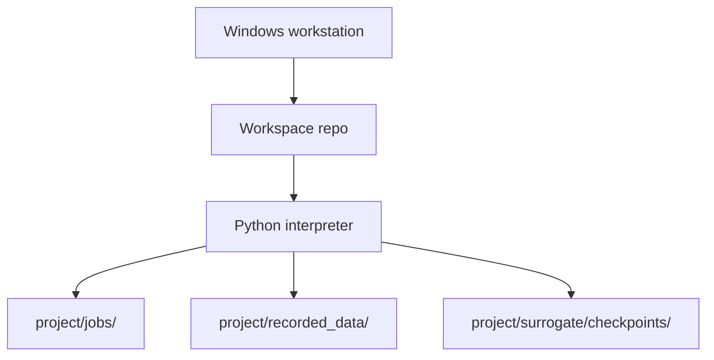
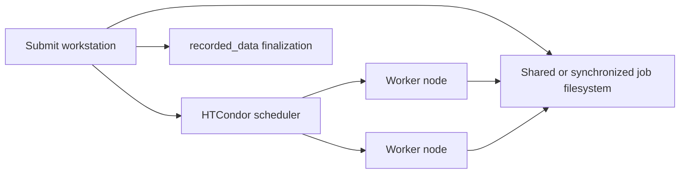

# 4+1 Physical View

## Current Local Deployment

## Runtime Locations
- Source code: `project/`.
- Active simulator adapters copied into jobs: adapter files placed directly in `project/job_template/`.
- Optional adapter staging/reference files: `project/com_lib/`, not copied or imported by default.
- Prepared jobs: submit-side `project/jobs/` by default, configurable through the full config layer.
- Per-job copied config: `project/jobs/<job_name>/config.py` and `project/jobs/<job_name>/config_all.py`, copied from the submit-side project during job preparation.
- Per-job workflow lifecycle metadata: `project/jobs/<job_name>/individual_metadata.json`, written by the workflow and read by `evaluate_manager` during finalization.
- Recorded individual metadata: `project/recorded_data/indMeta.jsonl`.
- Recorded rawData: `project/recorded_data/rawData.npz`, a zip-based archive with members shaped like `job_name/file.npz`.
- Recorded optimization metadata: `project/recorded_data/optMeta/optMeta.jsonl`, including generation rows and surrogate-training metadata rows.
- Surrogate checkpoints: `project/surrogate/checkpoints/generation_*.json`.
- Surrogate model artifacts: `project/surrogate/checkpoints/generation_*_conditional_inr/` containing `inr_meta.json`, `member_*.pt`, and auxiliary target-scaling/query-table payloads.
- Tool outputs: typically `project/tools/`.
- Root temporary workspace: `temp/` is kept in git with a `.gitkeep` placeholder, while all other files under it are ignored. Use it for disposable diagnostics or manual scratch artifacts that should not become source.

## Optional Distributed Deployment

In the implemented HTCondor path, the submit side writes one `job.sub` per prepared
job folder. The submit file uses `executable = workflow.py`, `transfer_executable = True`,
and sandboxed Windows profile/temp environment variables. It does not set
a workflow argument line or make Python itself the HTCondor executable. It also does
not set `transfer_output_files`, so HTCondor returns generated files such as `rawData/`,
`individual_metadata.json`, and PyAEDT-created `batch.log` when they exist without
holding the job if optional files are absent.
Windows distributed execution targets HTCondor's slot-user model:
`run_as_owner = False` and `load_profile = True`. This is a deployment contract, not
only a local debug preference. The expected pool contains many office/personal
workstations with different interactive owners, and any workstation may submit or
execute work, so owner execution cannot be required or used as a general fix path.
Worker scratch placement is controlled by each worker's HTCondor `EXECUTE`
directory. A worker scratch or RAM-disk directory should be configured on
the execute machines and advertised through worker ClassAd attributes; it is not
the same setting as the submit-side `JOBS_DIR`.

## Physical Constraints
- Local tests should not require HTCondor or simulator software.
- Distributed tests should mock HTCondor command execution unless they are explicit environment smoke tests.
- Distributed Windows jobs must remain compatible with slot-user execution. Do not
  design normal runtime behavior that requires `run_as_owner=True`, cross-machine
  owner credentials, or running jobs as the submitting desktop user.
- Real simulator adapters may require Windows-only COM automation and installed applications.
- Real workflow smoke tests may require task-specific simulator software such as PyAEDT/AEDT; default tests should skip those paths unless explicitly enabled.
- Job path should be configurable so users can move high-write runtime folders to faster storage.
- Machine-specific install locations must be discovered from repository-relative paths, explicit user arguments, standard install discovery, or existing environment variables. The project must not require users to add new system environment variables as a setup prerequisite.
- `created_at` is not part of the individual record contract; job creation time can be inferred from time-based job folder names when needed.
- `recorded_data` JSONL metadata writes and rawData archive updates must stay atomic because distributed finalization may introduce more concurrency.
