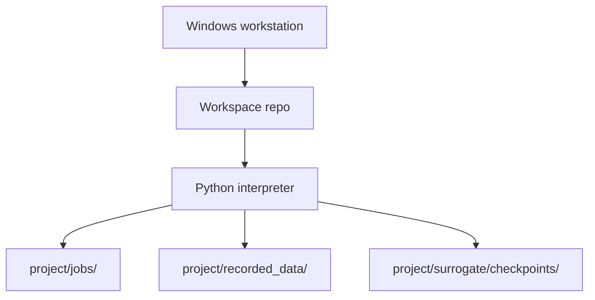
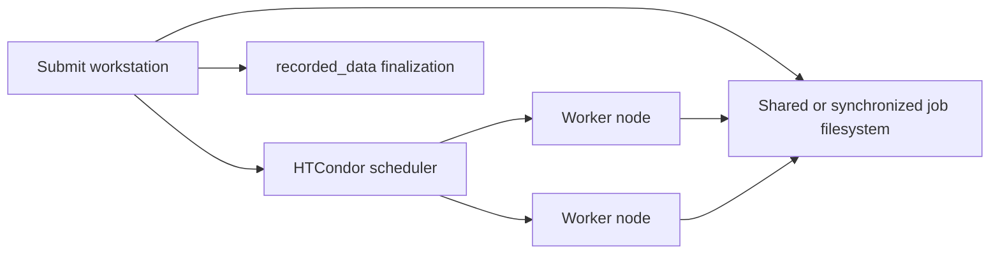

# 4+1 Physical View

## Current Local Deployment

## Runtime Locations
- Source code: `project/`.
- Active simulator adapters copied into jobs: adapter files placed directly in `project/job_template/`.
- Optional adapter staging/reference files: `project/com_lib/`, not copied or imported by default.
- Prepared jobs: default `project/jobs/`, configurable by `project/config.py`.
- Per-job workflow lifecycle metadata: `project/jobs/<job_name>/individual_metadata.json`, written by the workflow and read by `evaluate_manager` during finalization.
- Recorded individual metadata: `project/recorded_data/indMeta.jsonl`.
- Recorded rawData: `project/recorded_data/rawData.npz`, a zip-based archive with members shaped like `job_name/file.npz`.
- Recorded optimization metadata: `project/recorded_data/optMeta/optMeta.jsonl`.
- Surrogate checkpoints: `project/surrogate/checkpoints/generation_*.json`.
- Surrogate model artifacts: `project/surrogate/checkpoints/generation_*_conditional_inr/` containing `inr_meta.json`, `member_*.pt`, and auxiliary target-scaling/query-table payloads.
- Tool outputs: typically `project/tools/`.

## Optional Distributed Deployment

In the implemented HTCondor path, the submit side writes one `job.sub` per prepared
job folder. The submit file uses `executable = workflow.py`, `transfer_executable =
True`, sandboxed Windows profile/temp environment variables, and transfers
`rawData/` plus `individual_metadata.json` back on exit.

## Physical Constraints
- Local tests should not require HTCondor or simulator software.
- Distributed tests should mock HTCondor command execution unless they are explicit environment smoke tests.
- Real simulator adapters may require Windows-only COM automation and installed applications.
- The current default task requires PyAEDT/AEDT for real workflow execution; default tests should skip that smoke path unless explicitly enabled.
- Job path should be configurable so users can move high-write runtime folders to faster storage.
- `created_at` is not part of the individual record contract; job creation time can be inferred from time-based job folder names when needed.
- `recorded_data` JSONL metadata writes and rawData archive updates must stay atomic because distributed finalization may introduce more concurrency.
