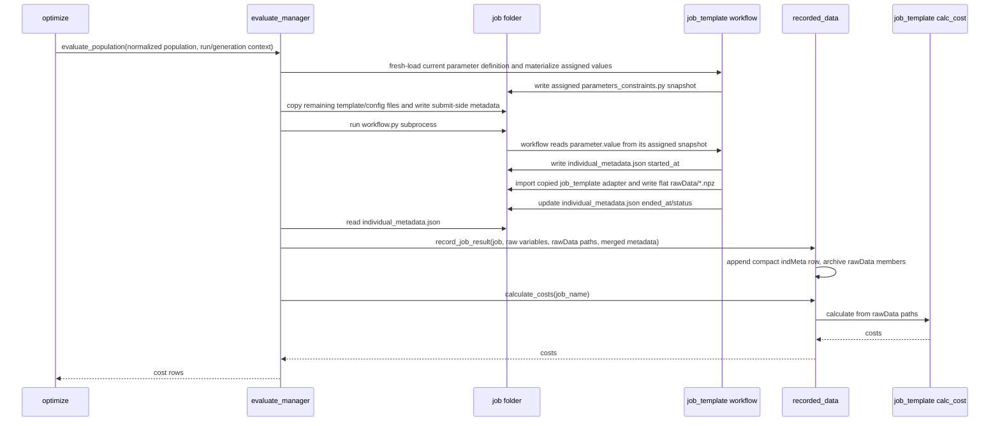
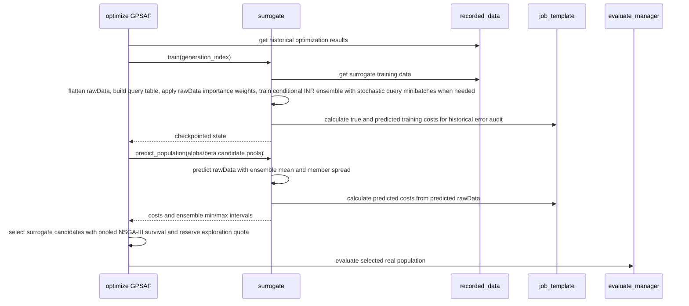

# 4+1 Process View

## Local Evaluation Sequence



## Surrogate-Assisted Generation



## Staggered Surrogate Training
- During a surrogate-assisted generation, `optimize` first checks whether the existing trained surrogate is fresh enough. The default lag rule allows one or two generations of lag, but blocks before a three-generation lag would be used.
- Candidate screening uses the latest completed in-memory surrogate state. Prediction never auto-trains as a side effect.
- Real jobs are prepared and submitted first. In distributed mode, `evaluate_manager.condor_runner` invokes the submit-side callback after all successful `condor_submit` calls and before polling job outputs.
- The callback starts one background surrogate training job for the submitted generation. Training metadata goes to `recorded_data/optMeta/optMeta.jsonl` with `record_type = "surrogate_training"`.
- If no trained surrogate exists yet, GPSAF falls back to baseline real candidates while the first staggered training pass is scheduled after evaluation submission.
## Distributed Evaluation Sequence

```mermaid
sequenceDiagram
    participant O as optimize
    participant E as evaluate_manager
    participant C as condor_runner
    participant H as HTCondor
    participant J as job folder
    participant R as recorded_data

    O->>E: evaluate_population(..., mode="distributed")
    E->>J: prepare all job folders with the local job contract
    E->>C: submit prepared jobs
    C->>J: write job.sub with executable = workflow.py and transfer_executable = True
    C->>J: write one concrete memory/disk request and no Condor retry directives
    C->>J: add generation-aware allowed_execute_duration for normal jobs; omit it for smoke
    C->>H: condor_submit job.sub
    H->>J: HTCondor runs transferred workflow.py directly under a slot user; generated outputs return on exit
    alt held for memory or disk exhaustion
        C->>H: read standard hold code and ClassAd usage, then remove old cluster
        C->>J: clear attempt outputs and record yadof retry history
        C->>H: submit same individual with only exhausted resource doubled
    end
    C->>J: poll condor.log, return job-local outputs, and read final resource/time ClassAd
    C-->>E: JobResult rows with requested/observed resources and execution duration when available
    E->>R: record_job_result through the shared finalization path
    E-->>O: dynamic cost rows or inf rows
```

Distributed Windows jobs are expected to run with `run_as_owner = False` and
`load_profile = True`. The process contract must not depend on running the payload
as the submitter's desktop owner because deployed office workstations have different
owners and may all act as submit or execute machines.

## Failure Handling
- Prepare failure: `evaluate_manager` creates a synthetic failure result if possible, records best effort, and returns `inf`.
- Workflow failure: `workflow.py` writes failure status and `ended_at` into `individual_metadata.json` when it can; simulator workflows may also record child-process metadata for cleanup. Local runner adds return code, stdout/stderr tails, and rawData presence.
- Submit failure: HTCondor submission errors are captured as per-job `error` metadata. The project does not attempt to repair the local HTCondor installation.
- Resource exhaustion: a standard memory/disk out-of-resources hold is removed and handled only by yadof. Yadof doubles the exhausted request and makes a fresh submission until that resource's configured retry count is exhausted. Cleanup or resubmission failure is terminal for that individual; workflow errors, timeouts, and other holds do not enter this path.
- Result collection failure: HTCondor collection errors, including invalid legacy `rawData_outputs.zip` fallback archives, are captured as per-job `error` metadata. Already-returned nested `rawData/*.npz` files take precedence over the fallback zip.
- Timeout: local runner terminates the process tree. A normal HTCondor job is limited by the scheduler-side `allowed_execute_duration`; hold code 46/47 is recorded as `timeout` and the held job is removed without retry. The submit-side whole-generation deadline remains a separate safety budget and best-effort removes any jobs still pending. Smoke jobs deliberately have neither timeout.
- Record failure: evaluation continues; returned row becomes `inf`.
- Invalid rawData: `recorded_data.query` skips invalid completed rawData for history/training and exposes diagnostics.

## Concurrency Notes
- Local evaluation can run multiple independent workflow subprocesses at once when
  `LOCAL_EVALUATION_MAX_WORKERS` is greater than 1. Each individual still follows
  the same prepare -> run -> record path, and costs are returned in the original
  population order. The worker count is re-read through the full config layer for each
  local evaluation call, so a mid-run edit can take effect at the next generation.
- Parameter loading uses a fresh isolated module namespace for every query or job
  preparation. Concurrent local preparation does not reload a shared module or
  mutate a shared import path, and a range edit is visible to the next prepared job.
- `recorded_data` JSONL metadata writes and rawData archive updates are protected by process-local and file-level locks.
- Distributed mode reuses the same record/finalize semantics: workers write job-local individual metadata and submit-side finalizers send compact records to `recorded_data`.
- Automatic per-job time limits use the newest smoke execution time for generation zero and the preceding generation for later jobs. The controller trims the configured high tail, treats timed-out rows as infinity, and falls back to the configured one-hour baseline when no finite calibration exists. When smoke is disabled, that baseline is treated as the smoke measurement and receives the normal bootstrap multiplier.
- Automatic generation-to-generation memory/disk calibration and held-job request doublings are both yadof policies. HTCondor enforces only the concrete request in each submission; all retry attempts for an individual share the original generation-level deadline.
