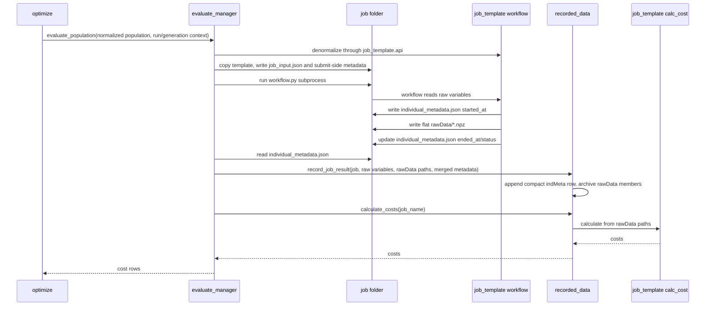
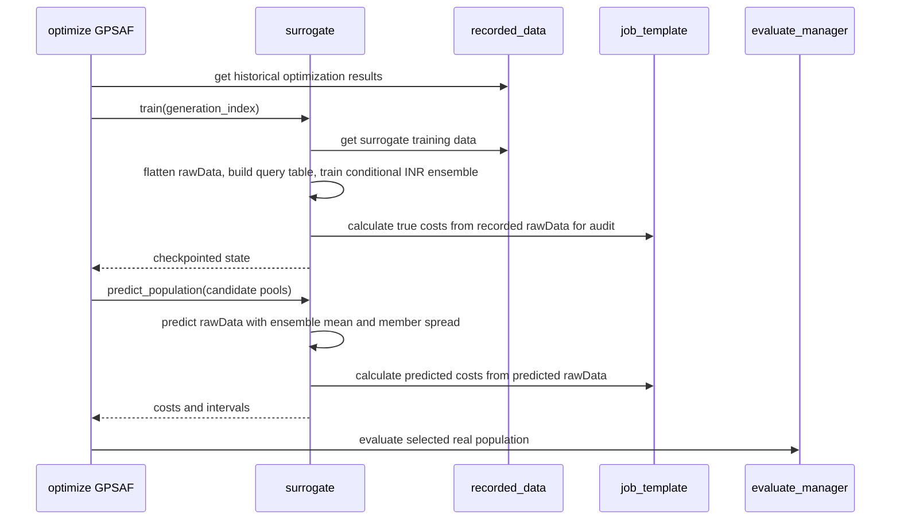
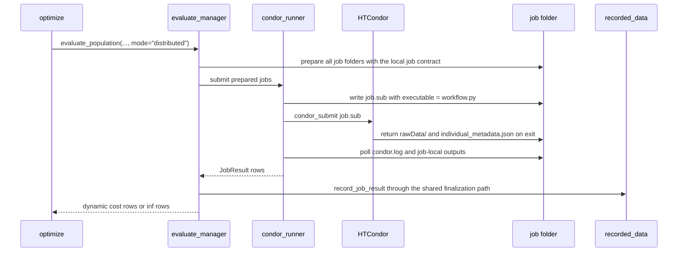

# 4+1 Process View

## Local Evaluation Sequence

## Surrogate-Assisted Generation

## Distributed Evaluation Sequence

## Failure Handling
- Prepare failure: `evaluate_manager` creates a synthetic failure result if possible, records best effort, and returns `inf`.
- Workflow failure: `workflow.py` writes failure status and `ended_at` into `individual_metadata.json` when it can; local runner adds return code, stdout/stderr tails, and rawData presence.
- Submit failure: HTCondor submission errors are captured as per-job `error` metadata. The project does not attempt to repair the local HTCondor installation.
- Timeout: local runner terminates the process tree; HTCondor runner best-effort removes the submitted cluster id. Both record status `timeout` and preserve any returned job-local metadata.
- Record failure: evaluation continues; returned row becomes `inf`.
- Invalid rawData: `recorded_data.query` skips invalid completed rawData for history/training and exposes diagnostics.

## Concurrency Notes
- Current local evaluation is sequential at the API level.
- `recorded_data` JSONL metadata writes and rawData archive updates are protected by process-local and file-level locks.
- Distributed mode reuses the same record/finalize semantics: workers write job-local individual metadata and submit-side finalizers send compact records to `recorded_data`.
