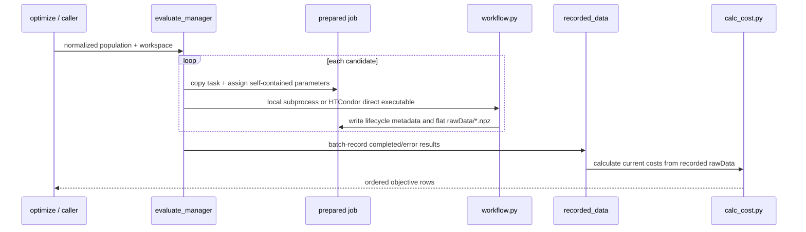

# 4+1 process view

## Evaluation sequence

Local mode uses bounded process concurrency and per-individual timeouts. It runs the
job-local `workflow.py` directly, rejects forbidden cost output, validates the flat
rawData directory, captures stdout/stderr tails, and maps every outcome to a
`JobResult`.

Distributed mode prepares the same job folder. The submit file executes
`workflow.py` directly with Windows file association, transfers only the job inputs,
and explicitly returns `rawData.zip` plus `individual_metadata.json`; it never
returns `rawData/`. Submit-side collection requires a readable archive whose members
are unique direct `.npz` names, restores them into `rawData/`, then applies the same
validation and recording path.

Distributed orchestration invokes after-submit surrogate scheduling, polls terminal
or returned-output state, owns bounded memory/disk resubmission, enforces a separate
whole-generation deadline, and collects final ClassAd provenance. For each normal
job it also derives the current execute segment and elapsed wall-clock from the
submit-side `condor.log`. Once that clock reaches the adaptive limit, yadof records
timeout locally and stops polling the job regardless of whether its bounded
`condor_rm` cleanup succeeds. If a representative job remains pending, one delayed
`condor_q -better-analyze` query reports failed match requirements without mutating
or failing the queue.

Surrogate training has at most one background task per workspace. Scheduler and
model state maps are workspace-keyed and protected by locks. Clearing one workspace
waits/resets only its schedule/state. Persistence uses workspace-local locks and
atomic replacement for mutable files.

Completed population results are recorded as one atomic batch when possible. The
archive and manifest are copied/published once per batch, then costs are derived in
one query. A failed batch falls back to individual recording so one malformed result
does not discard otherwise valid evidence.

## Failure and retry semantics

- Preparation, task loading, submit, workflow, timeout, hold, archive restoration,
  rawData validation, recording, and cost calculation failures are per individual.
- Standard HTCondor memory/disk holds may create a fresh bounded submission with
  only the exhausted request doubled. The old cluster is removed and stale runtime
  outputs are cleared first. Workflow and timeout failures are never resource
  retried.
- Normal jobs have two per-job enforcement layers using the same adaptive limit:
  Condor `allowed_execute_duration` and the yadof submit-side execution watchdog.
  Queue, transfer, eviction-idle, and suspension time do not consume the watchdog
  clock. Standalone smoke omits both; the whole-generation deadline remains
  separate.
- Timeout cleanup invokes `condor_rm` with a bounded command wait. Local result
  finalization never waits for Condor to confirm removal and preserves any cleanup
  error as metadata.
- A callback or history/ClassAd diagnostic failure is recorded/logged but cannot
  cancel jobs that were successfully submitted.

## Concurrency and publication

- Job directory creation is collision-safe.
- Task modules are fresh-loaded and removed from global module state after use.
- Recorded-data JSONL and archive writes use workspace-local process/file locks and
  atomic replacement.
- Surrogate training scheduling permits at most one background trainer per
  workspace and bounds model lag.
- Population results are reassembled in original input order, independent of worker
  completion order.
