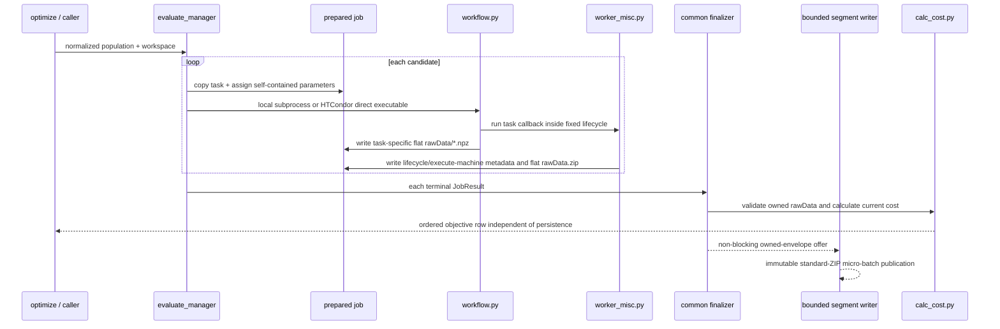

# 4+1 process view

## Evaluation sequence

```mermaid
sequenceDiagram
    participant O as optimize / caller
    participant E as evaluate_manager
    participant J as prepared job
    participant W as workflow.py
    participant S as worker_misc.py
    participant F as common finalizer
    participant R as bounded segment writer
    participant C as calc_cost.py
    O->>E: normalized population + workspace
    loop each candidate
        E->>J: copy task + assign self-contained parameters
        E->>W: local subprocess or HTCondor direct executable
        W->>S: run task callback inside fixed lifecycle
        W->>J: write task-specific flat rawData/*.npz
        S->>J: write lifecycle/execute-machine metadata and flat rawData.zip
    end
    E->>F: each terminal JobResult
    F->>C: validate owned rawData and calculate current cost
    C-->>O: ordered objective row independent of persistence
    F-->>R: non-blocking owned-envelope offer
    R-->>R: immutable standard-ZIP micro-batch publication
```

Local mode uses bounded process concurrency and per-individual timeouts. It runs the
job-local `workflow.py` directly, rejects forbidden cost output, validates the flat
rawData directory, captures stdout/stderr tails, and maps every outcome to a
`JobResult`.

Fast mode does not enter prepared-job composition. The parent assigns parameters in
memory, creates only an ephemeral candidate scratch below the configured fast root,
and sends a logical identity plus named values to one reusable spawn worker. The
worker fresh-loads `evaluation.py`, may invoke external local software, and returns
named rawData mappings and JSON diagnostics through one bounded pipe. The parent
finalizes each completed item immediately, so at most one result per worker waits
in transport and completion order does not change population order. Current cost
and worker release complete before the finalizer's non-blocking best-effort
recorder offer.
Timeout, native/Python worker exit, or task failure terminates the observed process
tree, cleans scratch, replaces the worker, records the isolated failure, and
continues queued candidates. No scheduler-submitted callback is fabricated.

For CLI runs, progress is enabled by default in every backend. One generation-level
bar starts at zero and advances on each terminal individual outcome, regardless of
completion order. It reports finished/total plus successful, error, and remaining
counts. Preparation, execution, collection, rawData, and current-cost failures stay
visible as completed error outcomes instead of leaving an apparently stalled
generation. Best-effort recording loss does not alter progress success. Non-
interactive streams receive complete snapshot lines; interactive
terminals update the active bar in place. `--no-progress` disables both the bar and
the existing detailed backend messages for that invocation.

Before starting a local batch, shared resource calibration reads compatible smoke
or preceding-generation records. Local policy combines that per-job estimate with a
fresh physical-CPU/available-memory/free-disk snapshot and the configured cap. Each
workflow process tree is sampled while it runs; peak summed RSS, accumulated CPU
time, average CPU cores, process count, and current job-directory disk use are
recorded under local and backend-neutral keys for the next calibration.

Distributed mode prepares the same job folder. The submit file executes
`workflow.py` directly with Windows file association, transfers only the job inputs,
and explicitly returns `rawData.zip` plus `individual_metadata.json`; it never
returns `rawData/`. Submit-side collection requires a readable archive whose members
are unique direct `.npz` names, restores them into `rawData/`, then applies the same
validation and recording path.

The workflow invokes package worker support while running. That helper samples the
machine name in the execute process and writes `execute_machine` into
`individual_metadata.json`. Visualization prefers that returned execute-side value.
When a timed-out HTCondor job cannot return the file, the submit side may instead
record `condor_execute_machine` plus its slot and `condor_user_log` source from the
execution segment in the job-local event log. This fallback never overrides worker
identity. ViewTime may derive the same value in memory from a historical record's
stored `condor_log_tail`; it recognizes removal from an active segment and a
terminal segment not collected before the central deadline, without rewriting
history. A job that never received an execute event, or was queued after an
ordinary eviction when the deadline expired, remains `unknown`.

HTCondor ClassAd collection maps CPU, memory, and disk observations onto the same
backend-neutral resource keys used by local mode. Its next request and local mode's
next worker plan therefore consume one calibration implementation even though
submission, hold retry, and host-capacity enforcement remain backend-specific.

Distributed orchestration invokes after-submit surrogate scheduling, polls terminal
or returned-output state, owns bounded memory/disk resubmission, enforces a separate
whole-generation deadline, and collects final ClassAd provenance. For each normal
job it also derives the current execute segment and elapsed wall-clock from the
submit-side `condor.log`, including the segment's machine/slot identity. Once that
clock reaches the adaptive limit, yadof records timeout locally and stops polling
the job regardless of whether its bounded
`condor_rm` cleanup succeeds. If a representative job remains pending, one delayed
`condor_q -better-analyze` query reports failed match requirements without mutating
or failing the queue.

Surrogate training has at most one background task per workspace. Scheduler and
model state maps are workspace-keyed and protected by locks. Clearing one workspace
waits/resets only its schedule/state. Training consumes a captured campaign-hot
history bundle, so pending or same-generation evidence need not wait for durability.

One daemon writer belongs to one campaign, not to a backend or generation. Its
candidate and byte reservations include queued and in-flight envelopes. It flushes
at evaluation/population/generation boundaries into count/byte-bounded immutable
segments. Queue refusal, oversized input, writer failure, or writer death increments
loss counters and never changes a current objective row. A bounded shutdown may
report an unknown in-flight outcome; such a writer retains the OS campaign lock
until its filesystem call returns.

## Generation-boundary task changes

`run_generations()` reloads effective configuration for each generation and copies
the complete task source tree into one immutable snapshot before evaluation. The
supported coherence contract is exactly one task/config snapshot per generation;
even fast worker imports use that tree. Between generations, a user may
change cost interpretation, parameter ranges/levels, fixed-width objective policy,
evaluator/workflow logic, or task helpers to correct or deliberately redefine the
optimization problem. The following generation reinterprets mechanically usable
history through the new definitions. Parameter identity/count and objective count
remain stable in the current contract; structural dimension changes are separate
future work.

Yadof does not decide whether that change is scientifically valid. Separate
interpretation/evaluation fingerprints identify the reload and invalidate only the
relevant derived cache, but they are not
an automatic old-history exclusion policy. A record is omitted only when the
current parameter/rawData/cost path cannot process it. The user decides whether old
evidence should be retained, explicitly cleared, or separated into another
workspace. Runtime components, including future in-memory history caches and
asynchronous recorders, must not freeze the task snapshot selected when the
campaign began.

## External PyChrono subprocess

The canonical packaged-adapter contract is
[pychrono_subprocess_contract.md](pychrono_subprocess_contract.md). A task-side
parent resolves only the absolute `YADOF_PYCHRONO_PYTHON` executable and launches a
task-owned child script by argument vector, with no Conda activation, PATH search,
parent-interpreter fallback, `pychrono` import in yadof, or yadof import in the
child. Each invocation receives an isolated scratch, a v1 JSON request, a cleaned
Python environment, captured bounded diagnostics, and an exact process-tree
timeout/cancellation boundary.
On Windows, that child environment alone receives the selected runtime prefix's
standard Conda DLL directories before its inherited PATH so released PyChrono
native modules can load without activation or parent/global environment mutation.

The child atomically publishes schema-compatible NPZ files and a v1 JSON result
last. The parent accepts evidence only after exit-zero, identity/version/path,
size/hash, no-pickle NPZ, rawData-schema, and complete-directory validation. A
prepared workflow then publishes the files into its final flat `rawData/`; a fast
kernel copies arrays into named memory before scratch cleanup. All missing runtime,
missing entry, malformed output, child error/crash, timeout, and validation cases
stay distinct and converge on normal per-individual failure isolation.

## Failure and retry semantics

- Preparation, task loading, submit, workflow, timeout, hold, archive restoration,
  rawData validation, and cost calculation failures are per individual. Recording
  loss is a separate best-effort outcome and cannot convert a successful result.
- Standard HTCondor memory/disk holds may create a fresh bounded submission with
  only the exhausted request doubled. The old cluster is removed and stale runtime
  outputs are cleared first. Workflow and timeout failures are never resource
  retried.
- Normal jobs have two per-job enforcement layers using the same adaptive limit:
  Condor `allowed_execute_duration` and the yadof submit-side execution watchdog.
  Queue, transfer, eviction-idle, and suspension time do not consume the watchdog
  clock. Standalone smoke omits both; the whole-generation deadline remains
  separate.
- Timeout cleanup invokes `condor_rm` with a bounded command wait. Local result
  finalization never waits for Condor to confirm removal and preserves any cleanup
  error as metadata.
- A callback or history/ClassAd diagnostic failure is recorded/logged but cannot
  cancel jobs that were successfully submitted.

## Concurrency and publication

- Job directory creation is collision-safe.
- Task modules are fresh-loaded and removed from global module state after use.
- One OS byte-range lock permits one campaign per workspace. One bounded daemon
  writer publishes new standard-ZIP segments by atomic rename and never opens an
  older segment in the hot write path.
- Surrogate training scheduling permits at most one background trainer per
  workspace and bounds model lag.
- Population results are reassembled in original input order, independent of worker
  completion order.
- Fast workers never write recorded data. The parent is the only finalizer and the
  campaign writer is the only segment publisher.
