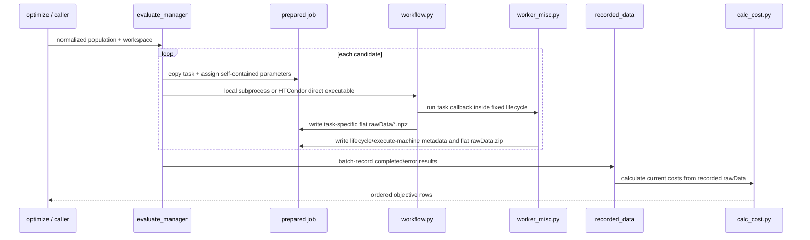

# 4+1 process view

## Evaluation sequence

```mermaid
sequenceDiagram
    participant O as optimize / caller
    participant E as evaluate_manager
    participant J as prepared job
    participant W as workflow.py
    participant S as worker_misc.py
    participant R as recorded_data
    participant C as calc_cost.py
    O->>E: normalized population + workspace
    loop each candidate
        E->>J: copy task + assign self-contained parameters
        E->>W: local subprocess or HTCondor direct executable
        W->>S: run task callback inside fixed lifecycle
        W->>J: write task-specific flat rawData/*.npz
        S->>J: write lifecycle/execute-machine metadata and flat rawData.zip
    end
    E->>R: batch-record completed/error results
    R->>C: calculate current costs from recorded rawData
    C-->>O: ordered objective rows
```

Local mode uses bounded process concurrency and per-individual timeouts. It runs the
job-local `workflow.py` directly, rejects forbidden cost output, validates the flat
rawData directory, captures stdout/stderr tails, and maps every outcome to a
`JobResult`.

Fast mode does not enter prepared-job composition. The parent assigns parameters in
memory, creates only an ephemeral candidate scratch below the configured fast root,
and sends a logical identity plus named values to one reusable spawn worker. The
worker fresh-loads `evaluation.py`, may invoke external local software, and returns
named rawData mappings and JSON diagnostics through one bounded pipe. The parent
validates and records each completed item immediately, so at most one result per
worker waits in transport and completion order does not change population order.
Timeout, native/Python worker exit, or task failure terminates the observed process
tree, cleans scratch, replaces the worker, records the isolated failure, and
continues queued candidates. No scheduler-submitted callback is fabricated.

Before starting a local batch, shared resource calibration reads compatible smoke
or preceding-generation records. Local policy combines that per-job estimate with a
fresh physical-CPU/available-memory/free-disk snapshot and the configured cap. Each
workflow process tree is sampled while it runs; peak summed RSS, accumulated CPU
time, average CPU cores, process count, and current job-directory disk use are
recorded under local and backend-neutral keys for the next calibration.

Distributed mode prepares the same job folder. The submit file executes
`workflow.py` directly with Windows file association, transfers only the job inputs,
and explicitly returns `rawData.zip` plus `individual_metadata.json`; it never
returns `rawData/`. Submit-side collection requires a readable archive whose members
are unique direct `.npz` names, restores them into `rawData/`, then applies the same
validation and recording path.

The workflow invokes package worker support while running. That helper samples the
machine name in the execute process and writes `execute_machine` into
`individual_metadata.json`. Visualization prefers that returned execute-side value.
When a timed-out HTCondor job cannot return the file, the submit side may instead
record `condor_execute_machine` plus its slot and `condor_user_log` source from the
execution segment in the job-local event log. This fallback never overrides worker
identity. ViewTime may derive the same value in memory from a historical record's
stored `condor_log_tail`; it recognizes removal from an active segment and a
terminal segment not collected before the central deadline, without rewriting
history. A job that never received an execute event, or was queued after an
ordinary eviction when the deadline expired, remains `unknown`.

HTCondor ClassAd collection maps CPU, memory, and disk observations onto the same
backend-neutral resource keys used by local mode. Its next request and local mode's
next worker plan therefore consume one calibration implementation even though
submission, hold retry, and host-capacity enforcement remain backend-specific.

Distributed orchestration invokes after-submit surrogate scheduling, polls terminal
or returned-output state, owns bounded memory/disk resubmission, enforces a separate
whole-generation deadline, and collects final ClassAd provenance. For each normal
job it also derives the current execute segment and elapsed wall-clock from the
submit-side `condor.log`, including the segment's machine/slot identity. Once that
clock reaches the adaptive limit, yadof records timeout locally and stops polling
the job regardless of whether its bounded
`condor_rm` cleanup succeeds. If a representative job remains pending, one delayed
`condor_q -better-analyze` query reports failed match requirements without mutating
or failing the queue.

Surrogate training has at most one background task per workspace. Scheduler and
model state maps are workspace-keyed and protected by locks. Clearing one workspace
waits/resets only its schedule/state. Persistence uses workspace-local locks and
atomic replacement for mutable files.

Completed population results are recorded as one atomic batch when possible. The
archive and manifest are copied/published once per batch, then costs are derived in
one query. A failed batch falls back to individual recording so one malformed result
does not discard otherwise valid evidence.

## External PyChrono subprocess

The canonical pre-adapter contract is
[pychrono_subprocess_contract.md](pychrono_subprocess_contract.md). A task-side
parent resolves only the absolute `YADOF_PYCHRONO_PYTHON` executable and launches a
task-owned child script by argument vector, with no Conda activation, PATH search,
parent-interpreter fallback, `pychrono` import in yadof, or yadof import in the
child. Each invocation receives an isolated scratch, a v1 JSON request, a cleaned
Python environment, captured bounded diagnostics, and an exact process-tree
timeout/cancellation boundary.

The child atomically publishes schema-compatible NPZ files and a v1 JSON result
last. The parent accepts evidence only after exit-zero, identity/version/path,
size/hash, no-pickle NPZ, rawData-schema, and complete-directory validation. A
prepared workflow then publishes the files into its final flat `rawData/`; a fast
kernel copies arrays into named memory before scratch cleanup. All missing runtime,
missing entry, malformed output, child error/crash, timeout, and validation cases
stay distinct and converge on normal per-individual failure isolation.

## Failure and retry semantics

- Preparation, task loading, submit, workflow, timeout, hold, archive restoration,
  rawData validation, recording, and cost calculation failures are per individual.
- Standard HTCondor memory/disk holds may create a fresh bounded submission with
  only the exhausted request doubled. The old cluster is removed and stale runtime
  outputs are cleared first. Workflow and timeout failures are never resource
  retried.
- Normal jobs have two per-job enforcement layers using the same adaptive limit:
  Condor `allowed_execute_duration` and the yadof submit-side execution watchdog.
  Queue, transfer, eviction-idle, and suspension time do not consume the watchdog
  clock. Standalone smoke omits both; the whole-generation deadline remains
  separate.
- Timeout cleanup invokes `condor_rm` with a bounded command wait. Local result
  finalization never waits for Condor to confirm removal and preserves any cleanup
  error as metadata.
- A callback or history/ClassAd diagnostic failure is recorded/logged but cannot
  cancel jobs that were successfully submitted.

## Concurrency and publication

- Job directory creation is collision-safe.
- Task modules are fresh-loaded and removed from global module state after use.
- Recorded-data JSONL and archive writes use workspace-local process/file locks and
  atomic replacement.
- Surrogate training scheduling permits at most one background trainer per
  workspace and bounds model lag.
- Population results are reassembled in original input order, independent of worker
  completion order.
- Fast workers never write recorded data. The parent is the only recorder and
  consumes memory results continuously under recorded-data locking/atomicity.
