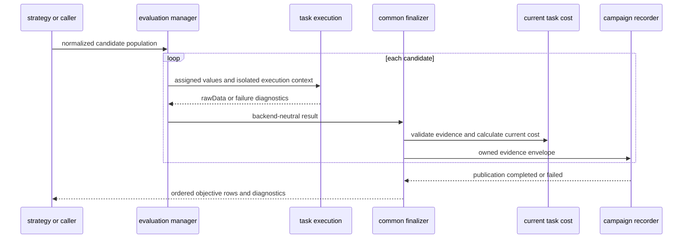

# 4+1 process view

## Evaluation sequence

```mermaid
sequenceDiagram
    participant O as strategy or caller
    participant E as evaluation manager
    participant T as task execution
    participant F as common finalizer
    participant C as current task cost
    participant R as campaign recorder
    O->>E: normalized candidate population
    loop each candidate
        E->>T: assigned values and isolated execution context
        T-->>E: rawData or failure diagnostics
        E->>F: backend-neutral result
        F->>C: validate evidence and calculate current cost
        F->>R: owned evidence envelope
    end
    R-->>F: publication completed or failed
    F-->>O: ordered objective rows and diagnostics
```

The evaluation manager finalizes candidates as they complete while preserving
input order at the population boundary. Current cost is calculated from validated
evidence before recorder admission. Bounded recorder capacity may pause producers;
publication failure stops the campaign rather than losing accepted evidence.

## Backend processes

- **Fast:** reusable local workers receive assigned values and an isolated
  candidate context, load task evaluator code, and return named memory rawData.
  Worker crash, timeout, or task failure affects only that candidate and worker.
- **Local:** the submit host prepares a self-contained job and launches its task
  workflow as a subprocess. Process-tree cleanup and job diagnostics remain local
  backend responsibilities.
- **Distributed:** the submit host prepares the same logical job, HTCondor executes
  it under administrator policy, and returned evidence is restored and validated
  before entering the common finalizer.

Backend-specific resource observations may inform later concurrency, requests, or
timeouts, but do not alter evidence meaning.

## Derived candidate selection

A rawData-first surrogate consumes recorded real evidence. Posterior-capable
components may create stable function draws and project complete predicted rawData
through one frozen current-cost interpreter. Candidate selection retains only the
derived objective samples and diagnostics.

Posterior-assisted selection is explicit and fail-closed. It requires its declared
readiness; unavailable or unusable derived state follows the strategy's documented
fallback or stop boundary. Every selected candidate still enters the common real
evaluation, finalization, and recording sequence.

## Generation-boundary task changes

Before each generation the campaign reloads effective configuration and captures
the complete current task source roots. The generation uses that one immutable
snapshot for parameters, evaluation, cost interpretation, and optimization
composition. Edits made during a generation become visible only at a later
generation boundary.

Mechanically compatible history is reinterpreted through the new snapshot. Source
identity can invalidate caches and record provenance, but the user remains
responsible for deciding whether earlier evidence should be retained, cleared, or
separated.

## External simulator subprocesses

A packaged adapter may launch task-owned child code in a separately provisioned
simulator runtime. The yadof-side process and simulator child do not import each
other's frameworks. They communicate through bounded, versioned, validated files
inside candidate-isolated scratch, and only complete rawData crosses into the
normal backend result.

Interpreter provisioning, host availability, ACLs, and machine configuration are
administrator responsibilities. Task model construction and measurements remain
workspace responsibilities. The adapter owns invariant launch, isolation,
validation, timeout, cleanup, and publication behavior.

## Failure and recovery

- Candidate preparation, execution, transport, validation, and current-cost
  failures are isolated and recorded with the correct objective width.
- Backend-specific retry is permitted only for declared recoverable conditions and
  remains bounded.
- Timeout or cancellation terminates the candidate process tree and ignores
  partial evidence.
- Recorder failure is campaign-fatal because later evaluation must not proceed with
  a gap in accepted evidence.
- History readers tolerate unrelated or corrupt entries by isolating them rather
  than mutating surviving evidence.

## Concurrency and publication

- Candidate execution contexts and scratch directories are unique.
- Task modules are loaded in isolated temporary namespaces.
- One active campaign holds one workspace lock and one recorder writer.
- Population results are reassembled in input order regardless of completion order.
- Workers never write recorded data directly; the common finalizer and recorder own
  that boundary.
