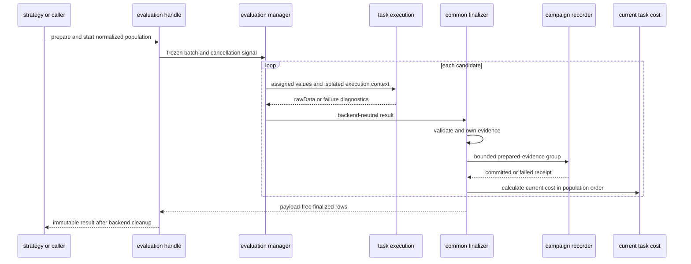
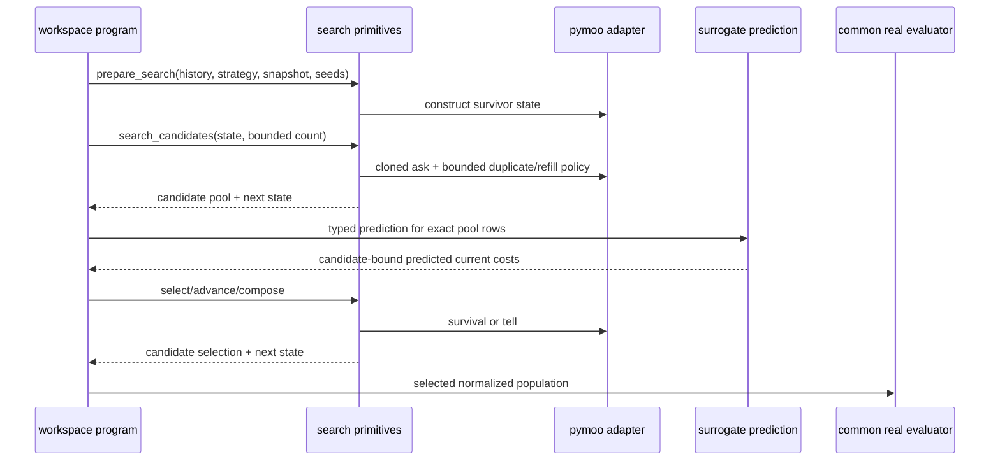
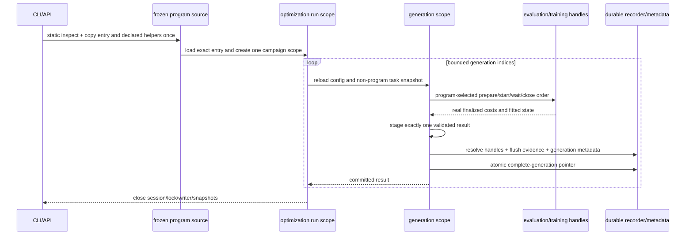
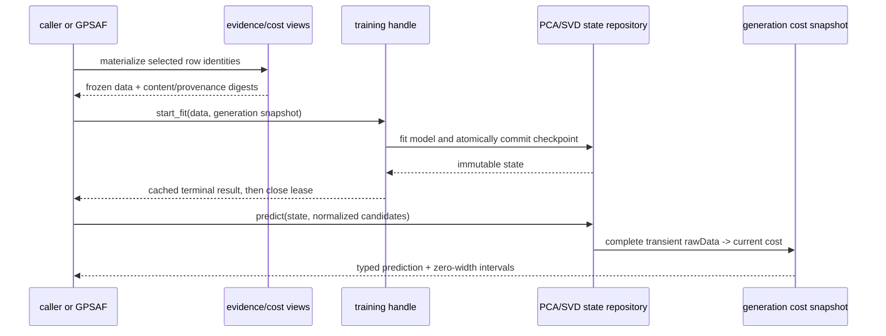

# 4+1 process view

## Evaluation sequence

```mermaid
sequenceDiagram
    participant O as strategy or caller
    participant H as evaluation handle
    participant E as evaluation manager
    participant T as task execution
    participant F as common finalizer
    participant R as campaign recorder
    participant C as current task cost
    O->>H: prepare and start normalized population
    H->>E: frozen batch and cancellation signal
    loop each candidate
        E->>T: assigned values and isolated execution context
        T-->>E: rawData or failure diagnostics
        E->>F: backend-neutral result
        F->>F: validate and own evidence
        F->>R: bounded prepared-evidence group
        R-->>F: committed or failed receipt
        F->>C: calculate current cost in population order
    end
    F-->>H: payload-free finalized rows
    H-->>O: immutable result after backend cleanup
```

The evaluation manager prepares candidates as they complete while preserving input
order for interpretation and return. The coordinator flushes on the existing
segment count/byte target or the population tail. Current cost starts only after
the candidate's immutable segment is recovery-visible. Bounded recorder capacity
may pause producers; publication failure wakes the affected receipts and stops the
campaign rather than losing accepted evidence.

`wait()` may be called by multiple threads and returns the same cached terminal
result; its timeout does not cancel work. `cancel()` changes running state to
cancelling once. Fast drains queued work and kills active worker trees, local
terminates active workflow trees and short-circuits queued candidates, and
distributed stops submission/polling and attempts cluster removal. Every unfinished
started row still passes through the common finalizer as `cancelled`; a completion
already observed by the backend remains completed evidence.

## Backend processes

- **Fast:** reusable local workers receive assigned values and an isolated
  candidate context, load task evaluator code, and return named memory rawData.
  Worker crash, timeout, or task failure affects only that candidate and worker.
- **Local:** the submit host prepares a self-contained job and launches its task
  workflow as a subprocess. Process-tree cleanup and job diagnostics remain local
  backend responsibilities.
- **Distributed:** the submit host prepares the same logical job, HTCondor executes
  it under administrator policy, and returned evidence is restored and validated
  before entering the common finalizer.

Backend-specific resource observations may inform later concurrency, requests, or
timeouts, but do not alter evidence meaning.

## Derived candidate selection

A rawData-first surrogate consumes recorded real evidence. Posterior-capable
components may create stable function draws and project complete predicted rawData
through one frozen current-cost interpreter. Candidate selection retains only the
derived objective samples and diagnostics.

Posterior-assisted selection is explicit, generation-local, and fail-closed. It
requires its declared readiness; unavailable or unusable derived state follows the
selector's documented fallback or stop boundary. It returns a typed selection to
the workspace program, which sends every candidate through common real evaluation,
finalization, recording, and commit.

The deterministic search path is explicit and generation-local:

```mermaid
sequenceDiagram
    participant O as workspace program
    participant S as search primitives
    participant P as pymoo adapter
    participant M as surrogate prediction
    participant E as common real evaluator
    O->>S: prepare_search(history, strategy, snapshot, seeds)
    S->>P: construct survivor state
    O->>S: search_candidates(state, bounded count)
    S->>P: cloned ask + bounded duplicate/refill policy
    S-->>O: candidate pool + next state
    O->>M: typed prediction for exact pool rows
    M-->>O: candidate-bound predicted current costs
    O->>S: select/advance/compose
    S->>P: survival or tell
    S-->>O: candidate selection + next state
    O->>E: selected normalized population
```

Every primitive leaves its input state unchanged. Exhausted bounded refill raises
an explicit insufficient-pool error; a derived GPSAF/posterior selection may discard
its entire partial result and start a fresh full-real search, but failure of that
real path propagates. Durable resume always reconstructs from committed history at
the next generation boundary, never from a serialized pymoo stack.

## Explicit workspace program lifecycle

```mermaid
sequenceDiagram
    participant C as CLI/API
    participant F as frozen program source
    participant R as optimization run scope
    participant G as generation scope
    participant E as evaluation/training handles
    participant D as durable recorder/metadata
    C->>F: static inspect + copy entry and declared helpers once
    F->>R: load exact entry and create one campaign scope
    loop bounded generation indices
        R->>G: reload config and non-program task snapshot
        G->>E: program-selected prepare/start/wait/close order
        E-->>G: real finalized costs and fitted state
        G->>G: stage exactly one validated result
        G->>D: resolve handles + flush evidence + generation metadata
        G->>D: atomic complete-generation pointer
        G-->>R: committed result
    end
    R-->>C: close session/lock/writer/snapshots
```

Static workspace checking parses the literal declaration, exact synchronous entry
signature, helper containment, and import-safe module top levels without importing
or calling the program. The run loads only the frozen source root. Undeclared
sibling imports therefore fail closed, and live program edits cannot affect the
active command. User exceptions and base exceptions propagate after owned handles,
writer, snapshots, and the campaign lock are closed; an incomplete generation does
not advance the pointer.

## Explicit PCA/SVD fit and prediction

```mermaid
sequenceDiagram
    participant O as caller or GPSAF
    participant D as evidence/cost views
    participant H as training handle
    participant P as PCA/SVD state repository
    participant C as generation cost snapshot
    O->>D: materialize selected row identities
    D-->>O: frozen data + content/provenance digests
    O->>H: start_fit(data, generation snapshot)
    H->>P: fit model and atomically commit checkpoint
    P-->>H: immutable state
    H-->>O: cached terminal result, then close lease
    O->>P: predict(state, normalized candidates)
    P->>C: complete transient rawData -> current cost
    C-->>O: typed prediction + zero-width intervals
```

Cancellation is checked before fit, after model construction, and immediately
before checkpoint publication. A cancellation observed before commit publishes no
manifest; if atomic commit wins the race, the handle completes with that committed
state. Prediction never calls finalization or the recorder. The workspace program
materializes one explicit Stage 2 view before GPSAF selection and retains that
immutable value for pure state-age inspection, prediction, and training. Selection
never starts or waits for a fit. It may use the newest compatible state within the
declared lag; PCA/SVD reconstructs that state's exact historical row subset from
the current view and rehashes it before recovery. The program starts real
evaluation, starts training on the captured prior evidence, then explicitly
waits/closes both lifecycles before commit. PCA/SVD, conditional-INR, and
hierarchical-CAE implement the
runtime-checkable deterministic component protocol; GPSAF binds each prediction
DTO to exact pool candidate IDs before positional tournaments or simulated pymoo
advancement. Before selection, programs explicitly initialize error (PCA/SVD
held-out folds, exact oracle zero, or documented prequential warmup). After real
evaluation they update the last-five batch maximum-error average using the
captured predictions. Selection itself does not fit. Training-free components
can declare a current generation through the same pure freshness interface even
with empty training data. No evaluator path exposes an after-submit callback.

## Generation-boundary task changes

Before each generation the campaign reloads effective configuration and captures
the current non-program task source. The generation uses that one immutable
snapshot for parameters, evaluation, and cost interpretation. An explicit
program's entry/helper source was frozen before the run and is classified out of
this copy; its hashes remain attached to the complete provenance. Edits to
non-program task sources made during a generation become visible only at a
later generation boundary.

A session registry retains every evaluation or training handle created against its current snapshot.
Beginning another generation fails while any such handle is open, including a
completed-but-not-closed handle. Session close copies the registry, cancels and
closes each handle without holding the recorder state lock, and only then shuts down
the writer and deletes snapshots.

At a normal generation boundary the registry follows each handle's declared
policy: training is waited/closed, while evaluation retains its cancellation-close
policy after the real evaluation composition has already waited. Abnormal session
shutdown closes every handle before writer/snapshot cleanup.

Mechanically compatible history is reinterpreted through the new snapshot. Source
identity can invalidate caches and record provenance, but the user remains
responsible for deciding whether earlier evidence should be retained, cleared, or
separated.

History reinterpretation first freezes an `EvidenceDataset` without decoding
rawData. It then walks rows in stable order through one frozen task interpreter,
materializing and releasing at most one candidate payload at a time. The resulting
`CostTable` binds every interpretation to row identity, objective schema, and task
fingerprint. Identity-based joins feed current history and compatibility adapters;
pending, failed, or derived rows cannot enter committed optimizer history.

## External simulator subprocesses

A packaged adapter may launch task-owned child code in a separately provisioned
simulator runtime. The yadof-side process and simulator child do not import each
other's frameworks. They communicate through bounded, versioned, validated files
inside candidate-isolated scratch, and only complete rawData crosses into the
normal backend result.

Interpreter provisioning, host availability, ACLs, and machine configuration are
administrator responsibilities. Task model construction and measurements remain
workspace responsibilities. The adapter owns invariant launch, isolation,
validation, timeout, cleanup, and publication behavior.

## Failure and recovery

- Candidate preparation, execution, transport, validation, and current-cost
  failures are isolated with the correct objective width. Valid rawData is
  committed as completed evidence before a current-cost failure is reported, so a
  later generation can replay the interpretation.
- Backend-specific retry is permitted only for declared recoverable conditions and
  remains bounded.
- Timeout or cancellation terminates the candidate process/worker tree or attempts
  scheduler removal and ignores partial rawData. Started cancellation is durable
  diagnostic evidence; cancellation before start creates no record.
- Recorder failure is campaign-fatal because later evaluation must not proceed with
  a gap in accepted evidence.
- History readers tolerate unrelated or corrupt entries by isolating them rather
  than mutating surviving evidence.
- Execution failure, missing evidence, and callback/shape/non-finite interpretation
  failure remain distinct cost-table statuses; only the optimizer conversion emits
  fixed-width failure sentinels.

## Concurrency and publication

- Candidate execution contexts and scratch directories are unique.
- Task modules are loaded in isolated temporary namespaces.
- One active campaign holds one workspace lock and one recorder writer.
- Population results are reassembled in input order regardless of completion order.
- Workers never write recorded data directly; the common finalizer and recorder own
  that boundary.
- A process lost after commit but before cost may leave interpretation absent; a
  new session still recovers the evidence. Queue admission alone is never a commit.
