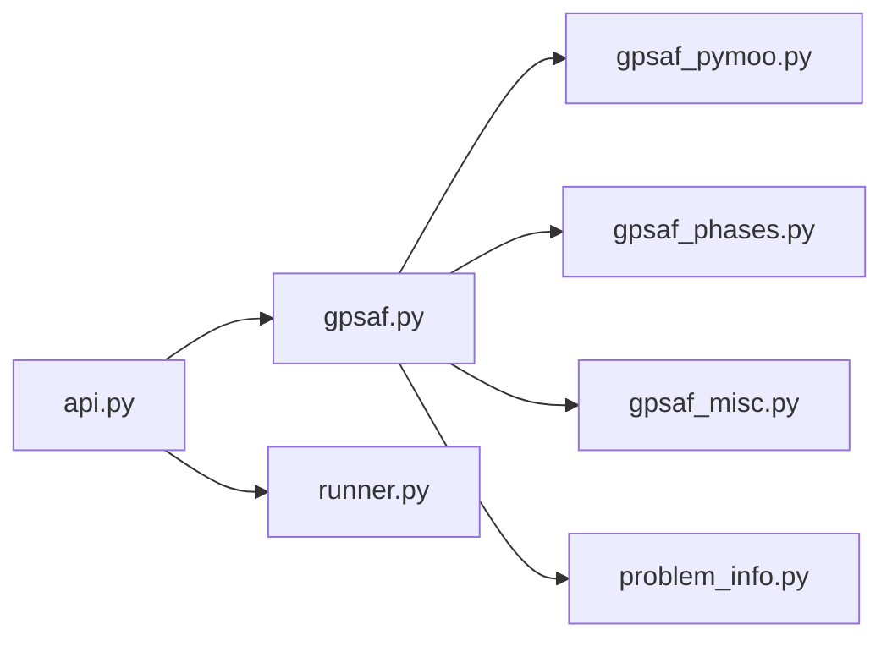
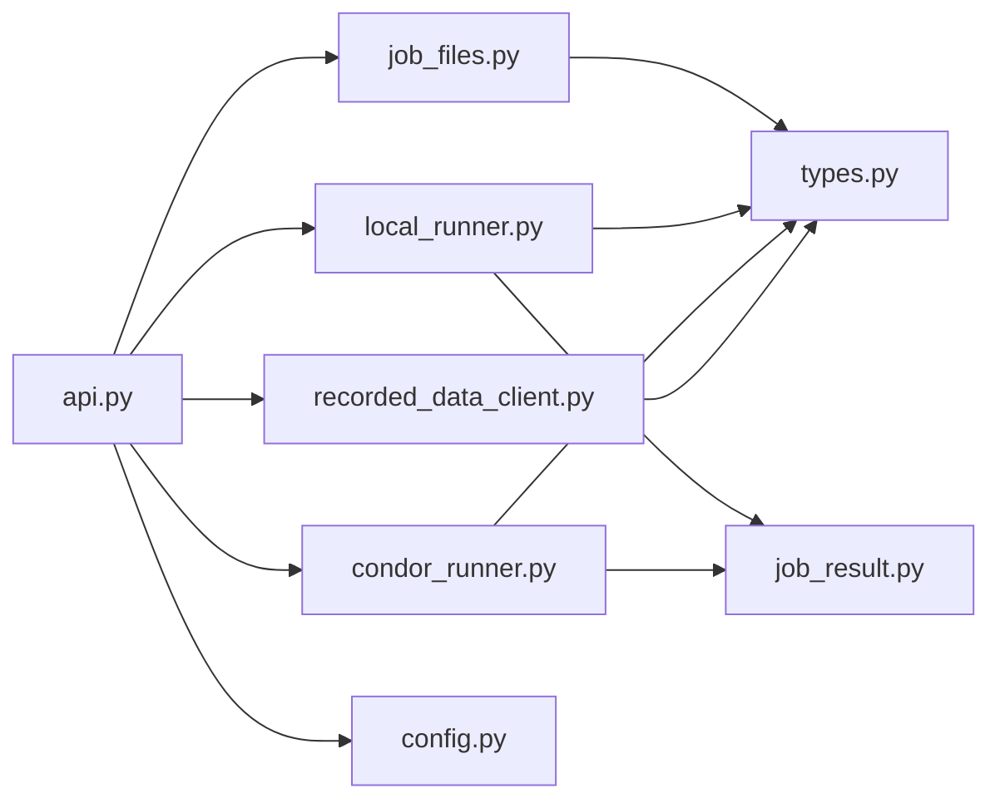
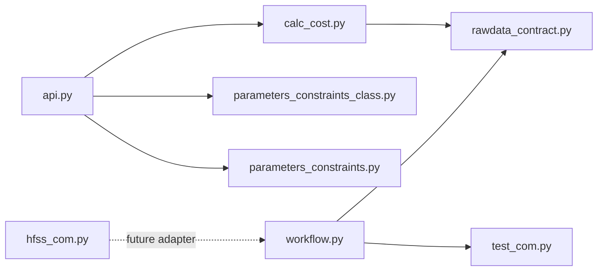
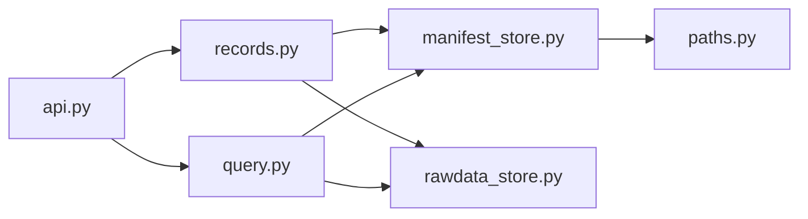
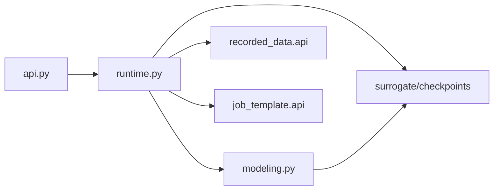

# C4 Component

## Optimize Components

- `api.py`: stable entry point.
- `gpsaf.py`: one-generation orchestration.
- `gpsaf_pymoo.py`: GA/NSGA-III ask-tell adapter in normalized space, including Das-Dennis reference-direction selection and NSGA-III survival helpers.
- `gpsaf_phases.py`: surrogate alpha/beta pooled NSGA-III candidate selection, anti-starvation exploration quota, uncertainty diagnostics, and fallback.
- `gpsaf_misc.py`: history loading, evaluation API calls, cost helpers.
- `problem_info.py`: variable/objective metadata from `job_template.api`.
- `runner.py`: generation metadata helpers.

## Evaluate Manager Components

- `api.py`: backend selection, local per-individual worker-pool coordination, failure isolation, and ordered cost return.
- `job_files.py`: copy template, write job input and run/generation context, compute static hash.
- `local_runner.py`: subprocess workflow execution, timeout handling, and job-local `individual_metadata.json` collection.
- `condor_runner.py`: direct-`.py` HTCondor submit-file generation, submission, polling, timeout removal, and job-local result collection.
- `job_result.py`: shared metadata, rawData discovery, and `JobResult` construction helpers used by local and HTCondor backends.
- `recorded_data_client.py`: adapter to `recorded_data.api`.
- `types.py`: immutable job handoff objects.

## Job Template Components

- `workflow.py`: raw variable input to flat rawData output plus workflow-owned `individual_metadata.json` lifecycle timestamps.
- `calc_cost.py`: rawData to three bounded objective costs plus task-owned rawData importance weights for surrogate training.
- `rawdata_contract.py`: `.npz` schema validation.
- `test_com.py`: current pure-Python simulator stand-in.
- `hfss_com.py`: real simulator adapter reference surface.

## Recorded Data Components

- `records.py`: compact individual metadata creation, optimization metadata creation, workflow timing promotion, and rawData archiving.
- `query.py`: normalized variables, costs, history, training data, diagnostics.
- `manifest_store.py`: JSONL locking, append/rewrite helpers, and status normalization.
- `rawdata_store.py`: `rawData.npz` member archiving, repeated-variable metadata scrubbing, metadata extraction, and archive loading.

## Surrogate Components

- `runtime.py`: optimizer-facing service boundary; loads training data, flattens rawData into query-aligned numeric slots, applies task-owned importance weights, scales targets, reconstructs predicted rawData, calculates audited costs and ensemble member min/max intervals, and writes checkpoint summaries.
- `modeling.py`: PyTorch conditional INR deep ensemble; owns Fourier coordinate features, field embeddings, weighted relative/full-field losses, member bootstrap/mixup training, member prediction, and model artifacts.
- `api.py`: stable optimizer-facing exports.
