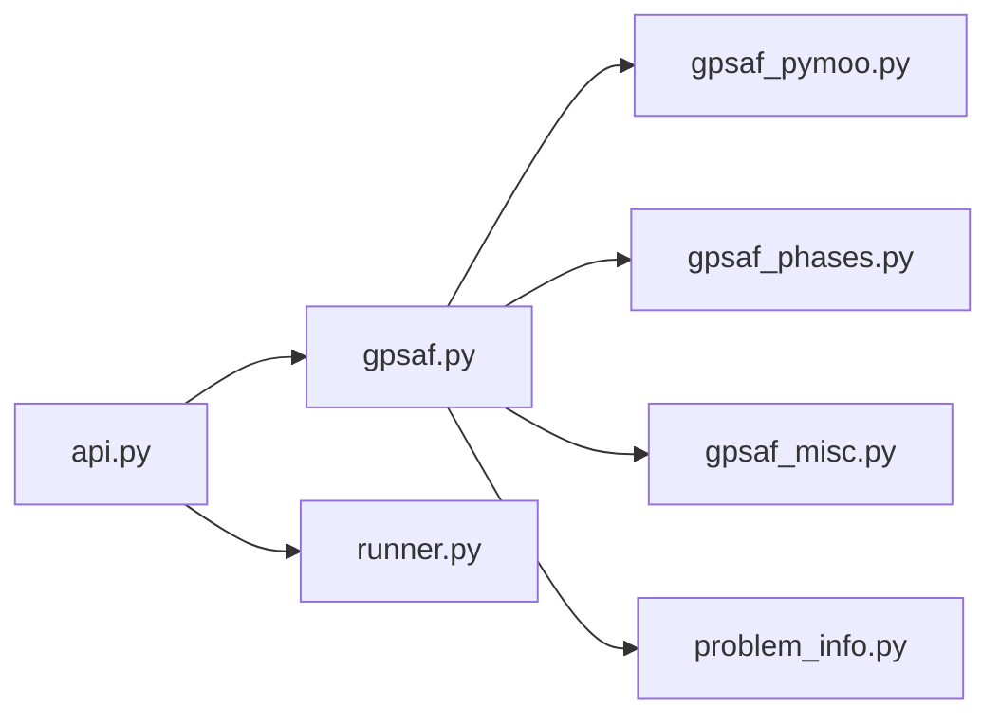
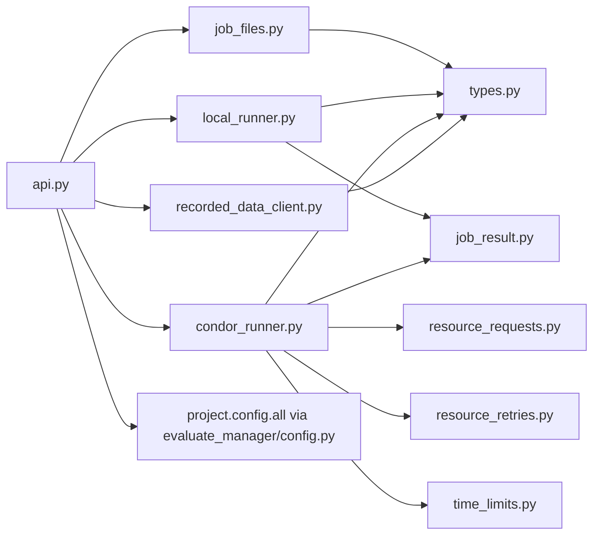
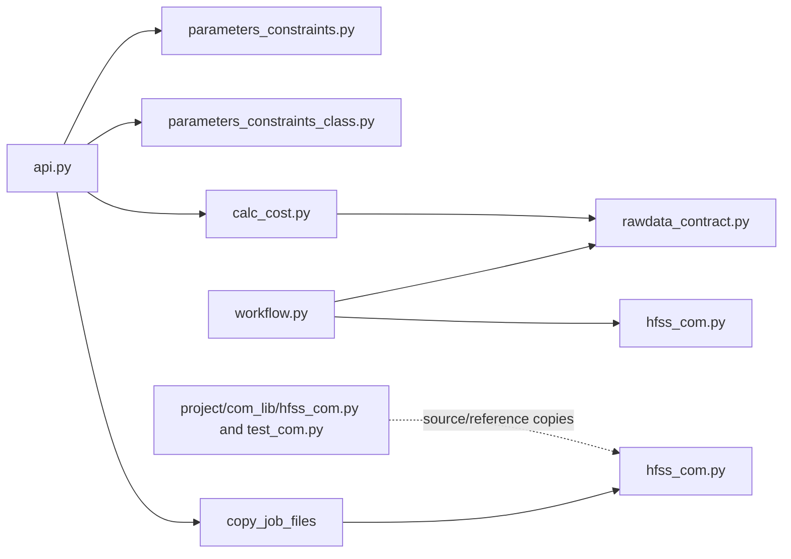
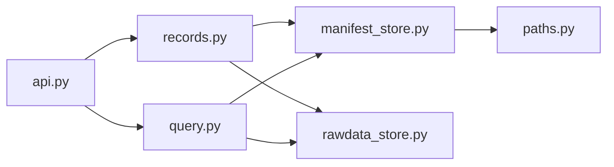
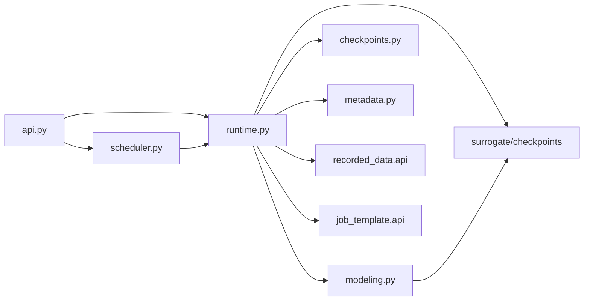

# C4 Component

## Optimize Components

- `api.py`: stable entry point.
- `gpsaf.py`: one-generation orchestration.
- `gpsaf_pymoo.py`: GA/NSGA-III ask-tell adapter in normalized space, including Das-Dennis reference-direction selection and NSGA-III survival helpers.
- `gpsaf_phases.py`: surrogate alpha/beta pooled NSGA-III candidate selection, anti-starvation exploration quota, uncertainty diagnostics, and fallback.
- `gpsaf_misc.py`: history loading, evaluation API calls, cost helpers.
- `problem_info.py`: variable/objective metadata from `job_template.api`.
- `runner.py`: generation metadata helpers.

## Evaluate Manager Components

- `api.py`: backend selection, local per-individual worker-pool coordination, failure isolation, and ordered cost return.
- `job_files.py`: copy the template, ask `job_template.api` to fresh-load and
  materialize one assigned parameter snapshot, copy the cache-free `config/`
  package, write run/generation metadata, and compute the static hash.
- `local_runner.py`: subprocess workflow execution, timeout handling, and job-local `individual_metadata.json` collection.
- `resource_requests.py`: generation-aware adaptive HTCondor memory/disk request
  calculation from recorded Condor measurements; it returns one concrete request
  and CPU remains manual.
- `resource_retries.py`: removable yadof-side state machine for standard HTCondor
  out-of-memory/out-of-disk holds. It doubles only the exhausted resource, bounds
  retries independently, records attempt history, and clears attempt outputs before
  a fresh submission.
- `time_limits.py`: per-job HTCondor execution-limit calculation. Smoke jobs are unlimited; normal jobs use fixed or generation-aware automatic limits from recorded execution time.
- `condor_runner.py`: Windows HTCondor submit-file generation, submission, polling,
  yadof resource-retry orchestration, generation-budget timeout removal,
  `allowed_execute_duration` hold handling, final ClassAd resource/time collection,
  and job-local result collection. Submit files contain no Condor-native resource
  retry directives.
- `job_result.py`: shared metadata, rawData discovery, and `JobResult` construction helpers used by local and HTCondor backends.
- `recorded_data_client.py`: adapter to `recorded_data.api`.
- `types.py`: immutable job handoff objects.
- `config.py`: generic evaluation settings accessors. Its refresh path reloads the
  active extensions exposed by `config.specific` before the full config surface,
  without naming a simulator-specific module.

## Job Template Components

- `parameters_constraints_class.py`: current parameter definitions plus per-job
  `normalized_value` and raw `value` assignment, forward denormalization, and reverse
  normalization for historical raw variables.
- `api.py`: fresh parameter-file loading, current parameter queries, job-local
  parameter materialization, definition-only hash signatures, cost calculation, and
  job copying.
- `workflow.py`: passes the assigned job-local `parameters_constraints.py` snapshot
  directly to the simulator adapter, produces flat rawData output, owns
  `individual_metadata.json` lifecycle timestamps, and loads runtime HFSS defaults
  from job-local config/environment.
- `calc_cost.py`: task-owned rawData-to-cost logic plus optional rawData importance weights for surrogate training. It decides the current objective names/count and may select objective-relevant windows from richer rawData at calculation time.
- `rawdata_contract.py`: `.npz` schema validation.
- `hfss_com.py`: optional HFSS/PyAEDT simulator adapter. A workflow can copy it into `job_template` for active use, while `project/com_lib/hfss_com.py` keeps the synchronized reusable reference copy.
- `project/com_lib/test_com.py`: retained pure-Python simulator stand-in; it must be copied into `job_template` before a workflow can use it.

## Recorded Data Components

- `records.py`: compact individual metadata creation, optimization metadata creation, workflow timing promotion, and rawData archiving.
- `query.py`: normalized variables, costs, history, training data, diagnostics.
- `manifest_store.py`: JSONL locking, append/rewrite helpers, and status normalization.
- `rawdata_store.py`: `rawData.npz` member archiving, repeated-variable metadata scrubbing, metadata extraction, and archive loading.

## Surrogate Components

- `runtime.py`: optimizer-facing service boundary; loads training data, flattens rawData into query-aligned numeric slots, applies task-owned importance weights, scales targets, reconstructs predicted rawData, calculates audited costs and ensemble member min/max intervals, and delegates checkpoint/metadata writes.
- `scheduler.py`: staggered training coordinator; starts background training after real jobs are submitted, waits for pending work when lag limits require it, and exposes latest-state freshness checks.
- `checkpoints.py`, `metadata.py`, and `types.py`: checkpoint serialization, recorded surrogate-training metadata, and shared surrogate dataclasses/type aliases.
- `modeling.py`: PyTorch conditional INR deep ensemble; owns Fourier coordinate features, field embeddings, importance-weighted stochastic query minibatches for large fields, weighted relative/full-field losses, member bootstrap/mixup training, member prediction, and model artifacts.
- `api.py`: stable optimizer-facing exports.
