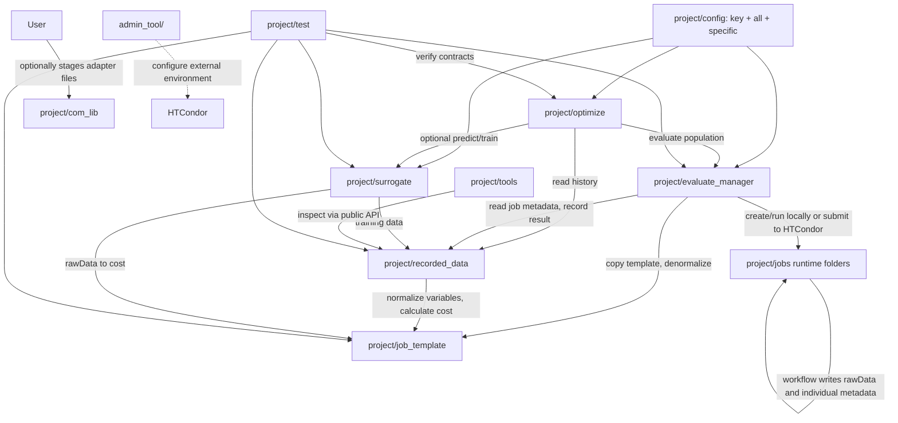

# C4 Container

## Containers

## Container Responsibilities
- `optimize`: NSGA-III search policy for multi-objective runs, history warm start, GPSAF-style surrogate assistance, generation metadata, and evaluation run/generation context.
- `evaluate_manager`: job preparation, local execution, optional HTCondor submission, workflow metadata collection, failure isolation, recording handoff.
- `job_template`: task-specific parameter definitions, workflow, rawData schema, and cost calculation.
- `com_lib`: optional holding area for simulator/custom-code adapter source/reference copies. Files here are not runtime dependencies; when a task needs one, the user copies it into `job_template` so prepared jobs stay self-contained. Reusable active-adapter fixes are synchronized back into the matching reference copy.
- `job_template`: active task files for rawData generation plus task-owned objective costs calculated after recording. The framework does not fix simulator filename, rawData names, objective names, or objective count.
- `recorded_data`: durable real-evaluation archive and dynamic historical views.
- `surrogate`: rawData-first conditional INR ensemble training, audited rawData prediction, ensemble member min/max cost interval generation, staggered background training scheduling, and training metadata reporting.
- `tools`: optional user workflows for visualization, task preparation, and result
  inspection. Generic tools stay at the module root and simulator-specific tools
  live under `specific/<software>/`. `project/tools/` excludes system-administration tools.
- `admin_tool/`: administrator-only HTCondor configuration scripts and operational
  documentation. It configures the external environment and is not a runtime
  container or a dependency of project code.
- `test`: local verification of contracts and failure behavior.

## Primary Data Flow
1. `optimize` creates normalized candidates.
2. `evaluate_manager` prepares one job per candidate, copies the cache-free `project/config/` package into the job folder, and denormalizes through `job_template`.
3. Job `workflow.py` runs either as a local subprocess or HTCondor payload, imports adapter files copied from `job_template`, writes `individual_metadata.json` at start/end, and writes flat rawData `.npz` files.
4. `evaluate_manager` reads job-local metadata and sends job results to `recorded_data`.
5. `recorded_data` stores raw evidence once per individual, archives rawData, and asks `job_template` for dynamic cost when needed.
6. `surrogate` trains a conditional INR ensemble from recorded rawData, with task-owned importance weights for objective-relevant windows, and predicts rawData for optimizer-side candidate screening.

## Container Rules
- Core modules communicate through each other's `api.py` files.
- Runtime modules import `project.config.all` as the full generic settings surface; routine generic overrides live in `key.py`, while simulator settings and environment contributions stay below `config/specific/`.
- `tools` may be flexible, but core modules and tests must not depend on tools.
- `jobs` folders are runtime state, not source modules.
