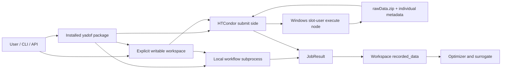

# C4 containers

## Installed package

The package owns defaults, config validation, workspace handling, task loading, job
composition, evaluation backends, optimization, rawData-first persistence and
surrogate logic, tools, minimal worker helpers, templates, adapters, and docs. It is
read-only at runtime and never stores user state below site-packages.

## Workspace

Each workspace owns root `config.py`, `job_template/`, prepared jobs, recorded
evidence, checkpoints, logs, and tool output. `parameters_constraints.py`,
`workflow.py`, `calc_cost.py`, copied adapters, models, and assets are task-owned.
Relative configured paths are resolved from this explicit root.

## Prepared job

A job is the execution boundary. It contains the copied task payload, one assigned
self-contained parameter snapshot, package-provided `worker_misc.py`, preparation
metadata, an initially empty `rawData/`, and later runtime artifacts. It contains no
copied framework config tree, `calc_cost.py`, yadof wheel/archive/package, or
authoritative `cost.json`.

## Execution and persistence

Local mode runs the copied `workflow.py` with the selected Python. Distributed mode
uses HTCondor to run the same `workflow.py` directly. Execute nodes need installed
task dependencies such as NumPy/PyAEDT, but do not receive or import yadof. The
workflow packages direct `.npz` files into top-level `rawData.zip`; Condor returns
that archive rather than the `rawData/` directory. Submit-side code validates and
restores it before recording.

Prepared jobs merge a current workspace task payload with package worker resources.
Local and distributed results converge on the same `JobResult`, rawData validation,
recording, current-cost derivation, failure isolation, and tuple-shape contracts.
