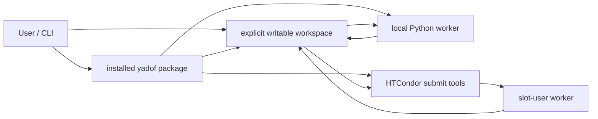

# C4 containers

The package owns defaults, config validation, task loading, job composition,
optimization, evaluation backends, rawData-first persistence/surrogate logic, tools,
worker support, templates, adapters, and docs. Each workspace owns root `config.py`,
`job_template/`, jobs, recorded evidence, checkpoints, logs, and tool output.

Prepared jobs merge a current workspace task payload with package worker resources.
Local and distributed results converge on the same `JobResult`, rawData validation,
recording, current-cost derivation, failure isolation, and tuple-shape contracts.
