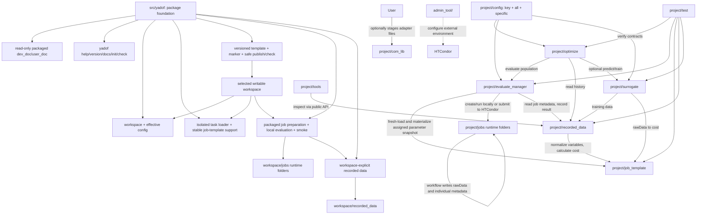

# C4 Container

## Containers

## Container Responsibilities
- `src/yadof` package and local runtime: distribution metadata handoff, the single runtime
  version, repository-independent CLI, read-only document/versioned-template
  resources, explicit workspace/config/task loading, safe init/check, and installed
  job-template framework support. It also owns workspace job composition, local
  subprocess execution, dynamic local cost return, and the standalone safe smoke
  command. It also owns workspace-explicit record/query APIs. It does not import or
  wrap the current `project/` runtime.
- Selected workspace: package-era user boundary containing short
  `config.py`, a portable `.yadof/workspace.json` marker, user-owned task files/assets,
  prepared local jobs, and workspace-local runtime paths. Init/check create and
  validate this boundary; packaged local evaluation writes jobs and durable history
  only below its effective workspace paths. Other runtime state migrates later.
- `optimize`: NSGA-III search policy for multi-objective runs, history warm start, GPSAF-style surrogate assistance, generation metadata, and evaluation run/generation context.
- `yadof.evaluate_manager`: authoritative package-era job preparation and local
  execution. It merges package worker support with workspace payload, calculates
  current costs after workspace recording, and isolates each local or record failure.
- `yadof.recorded_data`: workspace-explicit durable individual/optimization metadata,
  zip-based rawData archiving, diagnostics, and dynamic cost/normalization views.
- `project.evaluate_manager`: transitional source runtime used by the not-yet-migrated
  optimizer/recording/distributed path. Its HTCondor behavior remains current until
  later stages move those responsibilities.
- `job_template`: task-specific parameter definitions, workflow, rawData schema, and cost calculation.
- `com_lib`: optional holding area for simulator/custom-code adapter source/reference copies. Files here are not runtime dependencies; when a task needs one, the user copies it into `job_template` so prepared jobs stay self-contained. Reusable active-adapter fixes are synchronized back into the matching reference copy.
- `job_template`: active task files for rawData generation plus task-owned objective costs calculated after recording. The framework does not fix simulator filename, rawData names, objective names, or objective count.
- `recorded_data`: durable real-evaluation archive and dynamic historical views.
- `surrogate`: rawData-first conditional INR ensemble training, audited rawData prediction, ensemble member min/max cost interval generation, staggered background training scheduling, and training metadata reporting.
- `tools`: optional user workflows for visualization, task preparation, and result
  inspection. Generic tools stay at the module root and simulator-specific tools
  live under `specific/<software>/`. `project/tools/` excludes system-administration tools.
- `admin_tool/`: administrator-only HTCondor configuration scripts and operational
  documentation. It configures the external environment and is not a runtime
  container or a dependency of project code.
- `test`: local verification of contracts and failure behavior.

## Primary Data Flow

Package local/smoke flow:

1. The caller selects an explicit workspace and loads current effective config.
2. `yadof.evaluate_manager` rejects task collisions with reserved package worker
   filenames, copies all other task adapters/assets except submit-side `calc_cost.py`,
   materializes assigned parameters, and adds package `worker_misc.py` plus a small
   effective-worker JSON summary.
3. The local subprocess runs `workflow.py` in the prepared workspace job, producing
   flat rawData and lifecycle metadata only.
4. The submit process validates rawData, records raw variables/rawData/metadata under
   the effective workspace record path, then derives the cost tuple through the
   workspace's freshly loaded `calc_cost.py`.

The transitional source optimization flow remains:

1. `optimize` creates normalized candidates.
2. `evaluate_manager` prepares one job per candidate, asks `job_template.api` to
   fresh-load the requested template directory, writes a job-local
   `parameters_constraints.py` containing assigned normalized/raw values, and copies
   the cache-free `project/config/` package into the job folder.
3. Job `workflow.py` runs either as a local subprocess or HTCondor payload, reads
   assigned values only from its job-local parameter snapshot, imports adapter files
   copied from `job_template`, writes `individual_metadata.json` at start/end, and
   writes flat rawData `.npz` files.
4. `evaluate_manager` reads job-local metadata and sends job results to `recorded_data`.
5. `recorded_data` stores raw evidence once per individual, archives rawData, and asks `job_template` for dynamic cost when needed.
6. `surrogate` trains a conditional INR ensemble from recorded rawData, with task-owned importance weights for objective-relevant windows, and predicts rawData for optimizer-side candidate screening.

## Container Rules
- Wheel construction maps root documentation into `yadof` resources at build time;
  root documentation remains authoritative and is not duplicated in source.
- Installed framework files and resources are read-only inputs. All task/runtime
  paths derive from an explicit `WorkspaceContext` or an explicit absolute config
  override; no user-data path derives from package `__file__`.
- Workspace config and task modules are fresh snapshots. Temporary CLI/API overrides
  never rewrite config, and task imports do not survive in global import state.
- Init validates a staged workspace and publishes the marker last when adding files
  to an existing directory. Existing targets are conflicts; rollback removes only
  files/directories created by that init attempt. Repeated init never upgrades or
  repairs user files.
- Check is report-only: it may import parameter/cost modules as contract validation
  but only parses `workflow.py`; it never installs software, launches evaluation, or
  mutates the workspace.
- Package job composition reserves `worker_misc.py` and
  `yadof_worker_config.json`; a same-named workspace task file is an actionable
  error, never an overwrite. Task-local adapters and arbitrary assets otherwise
  copy recursively, while `calc_cost.py`, runtime rawData, and cost files do not.
- Prepared-job provenance records installed yadof version, workspace root/marker,
  definition-only static hash, and only the effective local worker settings needed
  for diagnosis. It never copies package config source into the workspace.
- Package recorded-data calls always receive a workspace/context. Metadata and
  archive writes share process/file locks and atomic same-directory replacements;
  empty-history reads create no directory, and no path derives from package source.
- Core modules communicate through each other's `api.py` files.
- Runtime modules import `project.config.all` as the full generic settings surface; routine generic overrides live in `key.py`, while simulator settings and environment contributions stay below `config/specific/`.
- `tools` may be flexible, but core modules and tests must not depend on tools.
- `jobs` folders are runtime state, not source modules.
