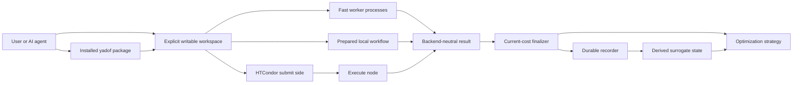

# C4 containers

```mermaid
flowchart LR
    User["User or AI agent"] --> Package["Installed yadof package"]
    User --> Workspace["Explicit writable workspace"]
    Package --> Workspace
    Workspace --> Fast["Fast worker processes"]
    Workspace --> Local["Prepared local workflow"]
    Workspace --> Submit["HTCondor submit side"]
    Submit --> Execute["Execute node"]
    Fast --> Result["Backend-neutral result"]
    Local --> Result
    Execute --> Result
    Result --> Finalizer["Current-cost finalizer"]
    Finalizer --> Records["Durable recorder"]
    Finalizer --> Strategy["Optimization strategy"]
    Records --> Surrogate["Derived surrogate state"]
    Surrogate --> Strategy
```

## Installed package

The package owns workspace handling, configuration, task loading, job composition,
evaluation backends, current-cost interpretation support, persistence, optimization
components, surrogate components, CLI routing, tools, templates, adapters, and
installed documentation. It never stores user state below site-packages.

## Workspace

A workspace owns configuration, submit-side task interpretation and optimization
composition, evaluate-side task code and assets, prepared jobs, recorded evidence,
component state, logs, and tool output. Relative configured paths resolve from this
explicit root.

## Evaluation containers

- **Fast evaluation** runs task-owned evaluators in reusable isolated local worker
  processes and returns named memory-backed rawData. It creates no durable
  per-candidate job directory.
- **Local evaluation** creates a prepared job and launches its task workflow on the
  submit host.
- **Distributed evaluation** transfers the same prepared task boundary through
  HTCondor and returns file-backed evidence and diagnostics.

Prepared jobs contain task inputs, one assigned parameter snapshot, and the small
package-owned worker support needed for invariant execute-side lifecycle. They do
not contain the yadof package or submit-side cost/optimization code.

## Finalization and persistence

All backends produce the same logical result shape. The common finalizer validates
owned rawData, applies the current task cost policy, preserves ordered failure
rows, and hands accepted evidence to the campaign recorder. The recorder publishes
immutable segments under bounded backpressure; later evaluation cannot pass the
population boundary until accepted evidence is durable.

Surrogate prediction and posterior projection are derived submit-side computation,
not additional evaluation backends. They consume recorded evidence and current task
interpretation, may help select candidates, and never publish predicted rawData.

## Container invariants

- A task or external simulator may write only within its assigned execution or
  scratch boundary.
- Execute nodes need task dependencies but never need yadof importability.
- Costs are calculated on the submit side from validated evidence.
- The recorder is the only durable candidate-evidence publisher.
- Tools are read-only consumers unless their command explicitly owns a separate
  user-selected output artifact.
