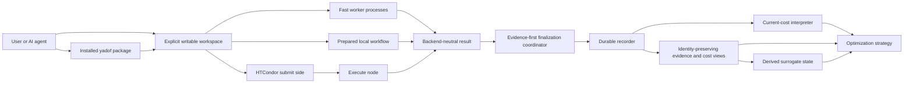

# C4 containers

```mermaid
flowchart LR
    User["User or AI agent"] --> Package["Installed yadof package"]
    User --> Workspace["Explicit writable workspace"]
    Package --> Workspace
    Workspace --> Fast["Fast worker processes"]
    Workspace --> Local["Prepared local workflow"]
    Workspace --> Submit["HTCondor submit side"]
    Submit --> Execute["Execute node"]
    Fast --> Result["Backend-neutral result"]
    Local --> Result
    Execute --> Result
    Result --> Finalizer["Evidence-first finalization coordinator"]
    Finalizer --> Records["Durable recorder"]
    Records --> Cost["Current-cost interpreter"]
    Cost --> Strategy["Optimization strategy"]
    Records --> Views["Identity-preserving evidence and cost views"]
    Views --> Strategy
    Views --> Surrogate["Derived surrogate state"]
    Surrogate --> Strategy
```

## Installed package

The package owns workspace handling, configuration, task loading, job composition,
evaluation backends, current-cost interpretation support, persistence, optimization
components, surrogate components, CLI routing, tools, templates, adapters, and
installed documentation. It never stores user state below site-packages.

## Workspace

A workspace owns configuration, submit-side task interpretation and optimization
composition, evaluate-side task code and assets, prepared jobs, recorded evidence,
component state, logs, and tool output. Relative configured paths resolve from this
explicit root.

## Evaluation containers

One backend-neutral evaluation handle sits in front of all three transports. A
prepared batch owns no runtime resource; start creates the bounded owner, wait
returns immutable finalized rows, cancel signals transport-specific cleanup, and
close releases the generation lease. The synchronous population and smoke APIs are
facades over this same lifecycle.

- **Fast evaluation** runs task-owned evaluators in reusable isolated local worker
  processes and returns named memory-backed rawData. It creates no durable
  per-candidate job directory.
- **Local evaluation** creates a prepared job and launches its task workflow on the
  submit host.
- **Distributed evaluation** transfers the same prepared task boundary through
  HTCondor and returns file-backed evidence and diagnostics. Cancellation stops
  further submission, collects an already observable completion, and attempts
  bounded removal of every remaining cluster.

Prepared jobs contain task inputs, one assigned parameter snapshot, and the small
package-owned worker support needed for invariant execute-side lifecycle. They do
not contain the yadof package or submit-side cost/optimization code.

## Finalization and persistence

All backends produce the same logical result shape. The common population-scoped
finalizer validates and owns rawData, groups prepared envelopes against the
recorder's existing count/byte targets, and waits for committed publication
receipts. Only then does it apply the frozen current task cost policy in stable
population order and expose result rows. The recorder publishes immutable segments
under bounded backpressure; later evaluation cannot pass the population boundary
until every receipt is committed or the campaign has failed.

Durable and live history are exposed through immutable identity-preserving evidence
datasets. RawData stays behind lazy segment references, while a separate task-bound
cost table records successful, failed, not-applicable, or missing interpretations by
row identity. Filter, copy, reorder, and optimizer/surrogate joins therefore never
use job names, physical-design equality, or array position as sample identity.

Cancellation after start is also finalized through this path. Unfinished rows are
durable `cancelled` execution evidence with not-applicable cost interpretation;
already completed evidence is retained. Cancellation before start creates neither
session nor evidence.

Surrogate prediction and posterior projection are derived submit-side computation,
not additional evaluation backends. They consume recorded evidence and current task
interpretation, may help select candidates, and never publish predicted rawData.

## Container invariants

- A task or external simulator may write only within its assigned execution or
  scratch boundary.
- Execute nodes need task dependencies but never need yadof importability.
- Costs are calculated on the submit side from validated evidence.
- Real-evaluation cost begins only after the corresponding evidence publication
  receipt is committed; cost remains replayable derived state.
- The recorder is the only durable candidate-evidence publisher.
- Tools are read-only consumers unless their command explicitly owns a separate
  user-selected output artifact.
