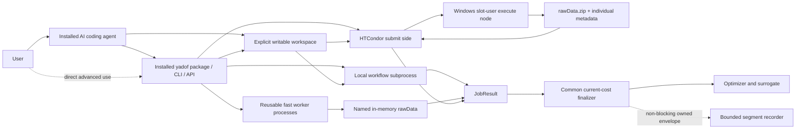

# C4 containers

```mermaid
flowchart LR
    User["User"] --> Agent["Installed AI coding agent"]
    Agent --> Package["Installed yadof package / CLI / API"]
    Agent --> Workspace["Explicit writable workspace"]
    User -. direct advanced use .-> Package
    Package --> Workspace
    Package --> Local["Local workflow subprocess"]
    Package --> Fast["Reusable fast worker processes"]
    Package --> Schedd["HTCondor submit side"]
    Schedd --> Worker["Windows slot-user execute node"]
    Workspace --> Local
    Workspace --> Schedd
    Local --> Result["JobResult"]
    Fast --> Memory["Named in-memory rawData"]
    Memory --> Result
    Worker --> Zip["rawData.zip + individual metadata"]
    Zip --> Schedd
    Schedd --> Result
    Result --> Finalizer["Common current-cost finalizer"]
    Finalizer --> Optimizer["Optimizer and surrogate"]
    Finalizer -. non-blocking owned envelope .-> Records["Bounded segment recorder"]
```

## Agent interaction

The AI coding agent is the normal task-authoring interface. It consumes the
version-matched installed user documentation under a human user's direction, edits
only the selected workspace files, and invokes the same package CLI/API that direct
users can invoke. It does not become a runtime dependency of prepared jobs or
execute nodes.

## Installed package

The package owns defaults, config validation, workspace handling, task loading, job
composition, evaluation backends, optimization, rawData-first persistence and
surrogate logic, tools, invariant worker lifecycle support, templates, adapters,
and docs. The optional `tools/cost_viewer/` subtree provides reusable read-only
history analysis, terminal reporting, and static rendering for CLI, Python, and
future GUI callers. The optional `tools/surrogate_viewer/` subtree reads workspace evidence
and checkpoints through either the desktop process or the `summary`/`audit`
terminal modes selected below `yadof view surrogate`; it does not enter the
execution or persistence pipeline. The package is read-only at runtime and never
stores user state below site-packages.

## Workspace

Each workspace owns root `config.py`, fixed submit-only `submit/`, evaluate-side
`job_template/`, prepared jobs, recorded evidence, checkpoints, logs, and tool
output. `submit/calc_cost.py`, `submit/optimization.py`, canonical parameters,
workflow, copied adapters, models, and assets are task-owned.
Their executable logic is limited to behavior that changes with the optimization
task; they call package support for invariant behavior. Relative configured paths
are resolved from this explicit root.

## Prepared job

A job is the execution boundary. It contains the copied task payload, one assigned
self-contained parameter snapshot, package-provided `worker_misc.py` owning the
fixed worker lifecycle, preparation metadata, an initially empty `rawData/`, and
later runtime artifacts. It contains no
copied framework config tree, any `submit/` source, yadof wheel/archive/package, or
authoritative `cost.json`.

## Execution and persistence

Fast mode runs an explicit task-owned `evaluation.py:evaluate_rawdata()` kernel in
reusable, replaceable local worker processes. It creates no durable per-candidate
job folder. Optional candidate scratch lives only below the configured fast scratch
root and is reclaimed by the parent. Local mode runs the copied `workflow.py` with the selected Python. Distributed mode
uses HTCondor to run the same `workflow.py` directly. Execute nodes need installed
task dependencies such as NumPy/PyAEDT, but do not receive or import yadof. The
workflow packages direct `.npz` files into top-level `rawData.zip`; Condor returns
that archive rather than the `rawData/` directory. Submit-side code validates and
restores it before recording.

Prepared jobs merge a current workspace task payload with package worker resources.
Fast results instead carry validated named memory payloads and explicitly set
`job_dir=None`. All three backends converge on one `JobResult` finalizer for rawData
ownership, current-cost derivation, worker release, failure isolation, and
tuple-shape contracts. Only afterward does a non-blocking offer enter the
campaign's bounded best-effort segment writer; recording loss cannot change a
valid result.

The listed `chrono_com.py` resource implements the PyChrono subprocess protocol.
Its task-side parent/child pair remains inside the local, fast, or execute-node
boundary: one absolute external interpreter, one task-owned child entry, one
candidate scratch, and versioned JSON/NPZ artifacts. Only validated rawData crosses
from that pair into the existing result container.
