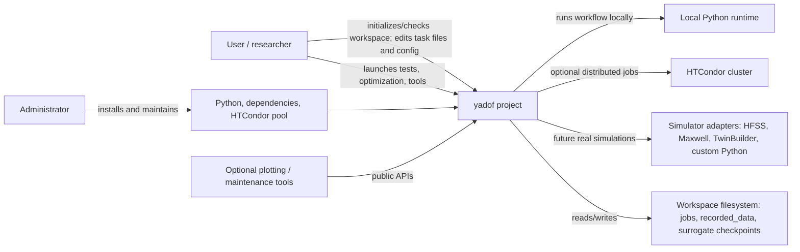

# C4 Context

## Scope
`yadof` is a local-first optimization framework for expensive simulation workflows. It coordinates optimization, job execution, rawData persistence, surrogate training, and optional user tools.

The current distribution transition has an installable `yadof` foundation for
version/help/document resources, safe generic workspace init/check, explicit
workspace/effective-config APIs, isolated task loading, prepared jobs, local
subprocess evaluation, and a standalone local smoke command. Persistence,
optimization, surrogate, and distributed execution remain under `project/` for
later staged migration.

## Context Diagram

## External Actors
- User: prepares task definitions, decides when old history is still valid, launches runs, and inspects results. A user does not configure or maintain the system environment.
- Administrator: installs yadof and dependencies, and configures and maintains HTCondor cluster software and hardware. Administrator actions are outside the normal campaign workflow.
- Local Python runtime: executes workspace `workflow.py` in isolated workspace job folders using the installed yadof environment.
- Simulator adapters: future or optional adapters that turn variables into rawData.
- HTCondor: optional distributed backend used by `evaluate_manager` when `EVALUATION_MODE = "distributed"`.
- Filesystem: the durable persistence layer for source files, job folders, individual metadata, optimization metadata, archived rawData, and surrogate checkpoints.

## System Responsibilities
- Publish one `yadof` distribution/command/import name with a single version source
  and read-only packaged documentation/template resources.
- Resolve one selected writable workspace into explicit absolute config, task,
  jobs, record, checkpoint, log, and tool-output paths.
- Merge and validate package defaults, workspace config, and temporary overrides;
  freshly load task modules without cross-workspace import contamination.
- Safely publish a versioned, simulator-neutral starter workspace without
  overwriting user files, and diagnose it without running its workflow.
- Compose package-owned worker support with workspace task files/assets, reject
  reserved-name collisions, and run local workflows without writing to the package.
- Offer an explicit one-individual, no-timeout local smoke path whose safety gate
  distinguishes the unchanged starter from edited or external tasks.
- Generate candidate populations in normalized variable space.
- Convert normalized candidates into task-specific raw variables.
- Run a workflow that produces rawData only.
- Persist raw variables, rawData, and metadata.
- Calculate cost dynamically from rawData.
- Train and use surrogate models without bypassing rawData.

## Out Of Scope
- Binding the core framework to one simulator.
- Persisting `cost.json` as an authoritative result.
- Requiring HTCondor or a real simulator for default tests.
- Installing, upgrading, or repairing external tools as a side effect of
  `yadof check`.
