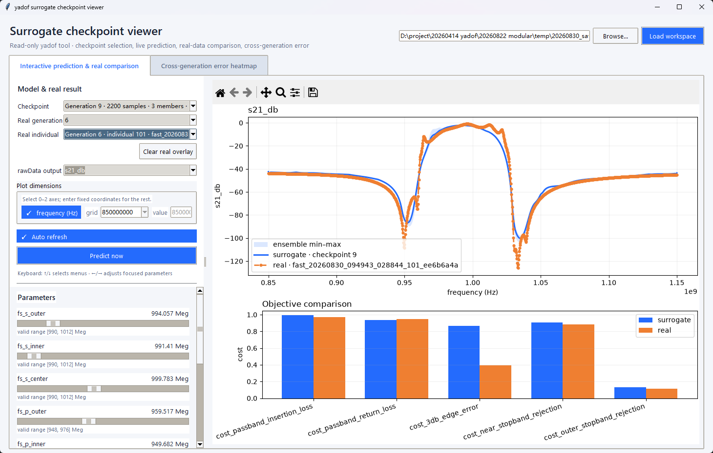
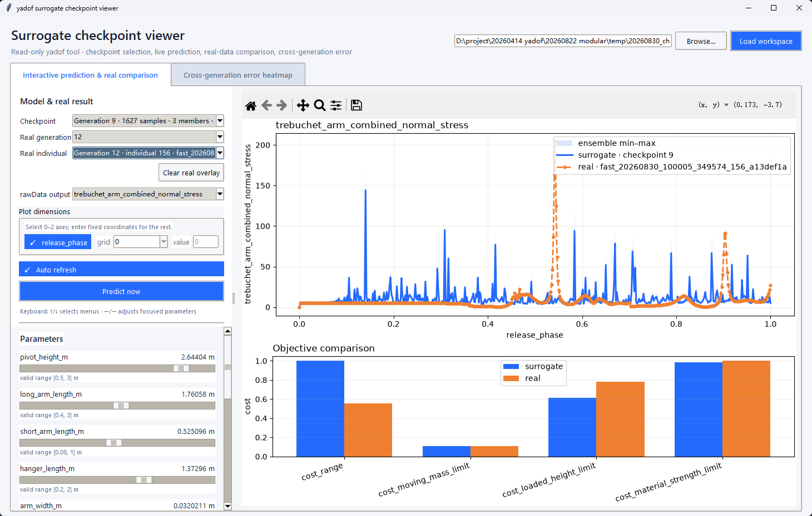

# 2026-08-30 14:34 - Surrogate spike contrast in Chrono and SAW

## Provenance

This context preserves a user observation made while inspecting surrogate-viewer
results in Codex task `01a050d3-a3b4-7b52-b3f0-1c0377306b04`. The two screenshots
were copied without image modification from the task attachments and renamed for
filename-first discovery:

| Original attachment | Context filename | Size and identity |
| --- | --- | --- |
| `codex-clipboard-a2a497cb-48dc-4da8-b3b1-2731d49a44a6.png` | [SAW `s21_db` smooth reference](20260830_143418_saw-s21-surrogate-smooth-reference.png) | `1460 x 930`; SHA-256 `2bb53ca08174d9cabe21c95b95dc9178a8f53e0824ac134799e8e0f8ae10166c` |
| `codex-clipboard-5cfe6394-cf44-43d0-9858-967ad1977ec9.png` | [Chrono arm-stress spike chatter](20260830_143418_chrono-arm-stress-surrogate-spike-chatter.png) | `1460 x 930`; SHA-256 `72ef15db65291610e451c6a8257b2795607cc1cbcfac6d5f6f5afd0de50020a5` |

The screenshots are visual evidence only. They do not preserve the checkpoint,
workspace, rawData arrays, model configuration, or exact selected parameter vector.

## Directly visible observations

### SAW `s21_db`

- The viewer shows checkpoint generation 9 with 2,200 samples and 3 members,
  compared with real generation 6, individual 101.
- The plotted output is `s21_db` against `frequency (Hz)` over approximately
  `0.85--1.15 GHz`.
- The real and surrogate traces share the same broad passband and rejection-band
  structure. The surrogate trace is comparatively smooth and does not show the
  dense narrow spike train seen in the Chrono screenshot.
- Local real/surrogate differences remain near steep transition regions, and the
  displayed `cost_3db_edge_error` bars differ substantially. Therefore visual
  smoothness alone is not evidence of objective accuracy.

### Chrono `trebuchet_arm_combined_normal_stress`

- The viewer shows checkpoint generation 9 with 1,627 samples and 3 members,
  compared with real generation 12, individual 156.
- The plotted output is `trebuchet_arm_combined_normal_stress` against
  `release_phase` over `0--1`.
- The real trace contains isolated high, narrow peaks, including a peak above 200
  near `release_phase ~= 0.54` and another near `0.90`.
- The surrogate trace contains many additional narrow peaks distributed across the
  phase axis, including locations without a visually corresponding real peak. In
  this screenshot they appear as high-frequency spike chatter rather than a smooth
  reconstruction of the real curve.

## Interpretation and limits

The user's working hypothesis is that discontinuities in the Chrono rawData cause
or amplify the surrogate chatter. Candidate physical sources include trebuchet-arm
unlock, projectile release, and contact or ground-collision events. Those event
attributions are **not verified** by the screenshots: no event log or time-aligned
simulation state was inspected here.

The SAW contrast shows that the dense chatter is not present in every displayed
surrogate result. It is consistent with a domain- or field-specific interaction
between discontinuous targets and the learned representation, but it does not by
itself distinguish model behavior from sampling, coordinate alignment, scaling,
checkpoint quality, or viewer adaptation. The exact surrogate component represented
by each checkpoint must also be verified before applying this observation to
conditional INR, Hierarchical CAE, or another component specifically.

Related measured context gives this observation a broader but still non-causal
setting:

- [Hierarchical CAE and PCA/SVD evidence](20260830_143110_hierarchical-cae-pca-svd-measured-evidence.md)
  records weak Chrono rawData and worst-field behavior relative to conditional INR,
  while SAW results are mixed and much less degraded.
- [Posterior calibration and qNEHVI structural evidence](20260830_143110_posterior-calibration-qnehvi-structural-evidence.md)
  records `19 smooth / 181 chatter-or-failure` Chrono labels for a prior exact-state
  calibration study.
- The [parked noise-robust Hierarchical CAE extension](../toDo/20260828_082308_noise-robust-regime-specialized-surrogate.md)
  preserves earlier evidence that Chrono roughness behaves more like a
  parameter-induced chatter/failure regime than independent measurement noise.

Those sources do not establish that this screenshot uses the same exact state,
model component, data partition, or individual. Their agreement is contextual
corroboration, not an identity match or causal proof, and the parked extension
remains inactive.

This document records evidence and uncertainty; it does not authorize an experiment
or prescribe a pending implementation.
