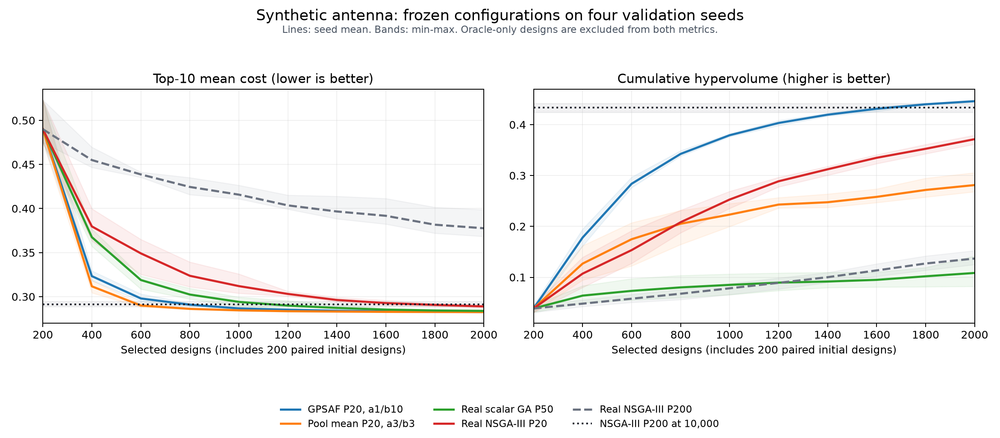

# 合成天线纯内存 GPSAF 配置筛选

## 结论与适用范围

本轮找到一个同时改善平均成本和 Pareto 覆盖的配置：**共同初始化 200 个设计，随后
NSGA-III 内部种群 20、每批入选 20、GPSAF α=1、β=10、γ=0.5、探索比例 0.1**。
保留已安装 GPSAF 的位置锦标赛、β 克隆推进、最近锚点聚类、PKT 和概率替换规则。
α=1 表示关闭 α 的竞争压力，仍计算该批锚点的预测成本。

配置仅使用 seed 101 调整，随后冻结，在 102、103、201、202 上验证。四个验证 seed
均在 **1440–1920 个入选设计**时同时严格超过各自原 NSGA-III **10000 个设计**的
最终 top-10 平均成本与累计 hypervolume，对应 **5.21–6.94 倍入选评估预算节省**。
2000 个设计时，配对 top-10 成本改善中位数为 2.735%，HV 改善中位数为 2.614%。

这是 synthetic-antenna 上的 **perfect-oracle、纯内存、探索性配置研究**。没有训练实际
surrogate，没有启动 Chrono、ngspice、HFSS，没有产生正式 recorded-data campaign，
没有修改 yadof/GPSAF 源码、benchmark 包或默认配置。评估预算节省不是本次 Python
墙钟加速，也不是对其他 baseline 或有预测误差模型的承诺。

图中实线是验证 seed 均值，浅色区域是最小–最大范围；黑色点线及灰带是对应
NSGA-III P200 在 10000 个设计时的均值和范围。具体是否越线按下表逐 seed 判断，
不以跨 seed 平均线代替配对判定。

## 来源、版本与实验边界

- 用户要求参考 [分析 GPSAF 优化提速问题](codex://threads/01a0647c-065f-7373-8c90-81db5e236abb)，
  用一系列不完整 benchmark、纯内存合成天线寻找算法配置并保存到 context。
- 前置调查及逐位回放：
  [DIAGNOSIS.md](../../../temp/20260903_gpsaf_diagnosis/DIAGNOSIS.md)。它确认默认
  α/β 的随机平局和最终筛选会丢失低平均成本点，并建议检查批量和 β 深度。
- 当前源码提交：`d54657da0823591750e878d1e605b92fd89a9da8`；运行安装包为
  `yadof 0.5.1`、`yadof-benchmark 0.5.0`。实际导入均来自所选环境的 site-packages。
- baseline：已安装 benchmark 的 `test-com/synthetic-antenna`。20 个连续参数均位于
  `[0,1]`，4 个目标为 `cost_s11_resonance`、`cost_beam_gain`、`cost_back_lobe`、
  `cost_axial_ratio_at_2p44`；沿用原 rawData kernel、物理阈值和 `soft_cost`。
- 实验脚本直接调用已安装 `evaluation.evaluate_rawdata()`，用
  `StructuredRawDataSample.cost_items()` 进入原 `calculate_cost()`。rawData 每次计算后
  释放；参数、成本、优化历史留在内存；每个 cell 完成后只写汇总、逐代 CSV 和入选 X/F NPZ。
- 使用已安装 search primitives 和 GPSAF phases；脚本进程内临时替换预测回调，提供
  同一 rawData/current-cost 链的精确结果。预测误差固定为零；从不修改 site-packages。
- 只有入选设计加入后续优化历史、top-10 和 HV。仅供 oracle 筛选的点不进入这些集合。
  入选 oracle 成本直接复用为精确真值，不为同一点再执行一次 kernel。
- 39 个采集范围内的已安装源文件 hash 在所有阶段一致，每个 cell 开始和结束均核验。
  source hash 映射保存在各阶段 `provenance.json`，不是只依赖相同版本字符串。

所有 `temp/...` 证据位置相对于包含源码 checkout 的**外层工作区**。这些实验数据保留在
工作区，未提交 Git；本 context 与图保存关键结论和数值，不依赖原会话才能理解。

## 预算、指标与冻结方式

每个 seed 的各配置使用逐位相同的 200 个随机初始设计及其成本。小种群/批量从此后开始：
`200 + 90 × 20 = 2000`，共 91 个有入选数据的代际边界。**不能把结果直接解释为从
20 个初始设计起跑的普通 P20 campaign**。原 P200 参考则是 200 × 50 = 10000。

每个设计的评分为四目标算术均值；top-10 是累计入选设计中最低十个评分的平均值，越低
越好。HV 使用全部累计入选点的非支配集合，固定参考点 `(1,1,1,1)`，越高越好。
越线要求严格小于/大于参考最终值，只在完整批次末判定；没有事后容差、插值或重复点充数。
同时越线数是这两条单调轨迹首次都超过参考的批次末计数。

| 阶段 | cells | 每个 cell 的预算/用途 |
| --- | ---: | --- |
| 复现校准 | 3 | 原 NSGA-III 10000、原 GPSAF 2000、前次 pooled-mean 对照 2000 |
| seed 101 初筛 | 23 | 每组 1000；比较 α/β、γ、探索比例、种群/批量、变异、最终筛选与无代理对照 |
| seed 101 复筛 | 8 | 每组 2000；包含小种群配合 β=10 的两个新增组合 |
| 验证参考 | 4 | seeds 102/103/201/202，各 10000 个 NSGA-III P200 设计 |
| 冻结配置验证 | 16 | 上述 4 seeds × 4 arms，各 2000 |
| 合计 | **54** | **125000 个累计实验预算单位；实际执行 423340 次合成 rawData kernel** |

验证配置于 `2026-09-03 01:07:36 UTC` 冻结。
`validation_plan.json` 冻结了 arms、seeds、预算、两项指标和完整报告规则；随后才查看
已经独立计算好的验证参考结果。验证输出没有用于继续调整参数。两个验证分区分别在
独立进程和输出目录中执行；没有共享可变优化状态。

## 保留原 GPSAF 规则的推荐候选

| 设置 | 本轮取值 |
| --- | --- |
| 初始化 | 配对全局随机 200 个设计，纳入入选预算 |
| 内部 NSGA-III population / 后续真实预算 batch | 20 / 20 |
| α / β / γ | 1 / 10 / 0.5 |
| exploration_fraction | 0.1：每批 18 个辅助点 + 2 个未辅助点 |
| crossover_probability / crossover_eta | 0.85 / 10.0 |
| mutation_probability / mutation_eta | 0.35 / 10.0 |
| mutated_dimensions_per_individual | 7 |
| reference_direction_method / partitions | `das-dennis` / 自动 |
| refill_attempts / archive_key_decimals | 8 / 10 |
| 误差与最终筛选 | 精确零误差；原始 GPSAF 选择，mean elite 配额为 0 |

这里的“推荐”是对该精确 baseline、初始化和 oracle 条件的候选配置判断。没有更改
包默认值，也没有把实验初始化/批量安排声明为已经完成正式 campaign 验收的默认程序。

| 验证 seed | NSGA-III 10000 top-10 | 候选 2000 top-10 | NSGA-III 10000 HV | 候选 2000 HV | 首次 top-10 越线 | 首次两项同时越线 | 同时越线预算倍数 |
| --- | ---: | ---: | ---: | ---: | ---: | ---: | ---: |
| 102 | 0.294830562 | 0.282373234 | 0.424017526 | 0.448335056 | 640 | 1440 | 6.944 |
| 103 | 0.290832033 | 0.282555430 | 0.438457609 | 0.447021260 | 840 | 1720 | 5.814 |
| 201 | 0.288695160 | 0.282960909 | 0.441624432 | 0.444534723 | 820 | 1920 | 5.208 |
| 202 | 0.290341683 | 0.282721849 | 0.430272210 | 0.444364395 | 840 | 1660 | 6.024 |

每个 2000 预算 cell 有 17820 次 oracle 预测；再计 200 初始化和 180 个未辅助点，
按独立 cell 核算是 **18200 次 kernel**。实际执行时同 seed 初始设计可在进程内共享，
但各 arm 的入选预算仍完整计入初始 200。仅按 top-10 的越线可给出更大倍数，
这里优先报告两项指标同时达到的 5.21–6.94 倍。

## 对照与归因

所有以下数字都来自同一冻结验证矩阵；百分比/比值先按 seed 配对，再取中位数。

| 配置，预算均为 2000 | top-10 超过原 10000 参考 | HV 超过原 10000 参考 | top-10 相对参考差值中位数 | HV/参考 HV 中位数 |
| --- | ---: | ---: | ---: | ---: |
| 原 GPSAF 规则，P20，α1/β10 | 4/4 | 4/4 | −2.735% | 1.026 |
| pooled-mean，P20，α3/β3 | 4/4 | 0/4 | −2.806% | 0.637 |
| 无 surrogate，标量均值 GA，P50 | 4/4 | 0/4 | −2.384% | 0.241 |
| 无 surrogate，NSGA-III，P20 | 3/4 | 0/4 | −0.589% | 0.863 |

pooled-mean 仍生成相同种类 α/β 候选池，但最后从全部已评分候选中选平均成本最低的
18 个点，再加 2 个未辅助点。它是**实验性选择变体**，不是现有 `gpsaf_settings()`
的一个开关。均值 GA 对照仍计算并保留原四个物理成本，只在内部搜索时将它们的算术均值
作为单目标输入；没有修改 baseline 的 `calc_cost.py`。

核心判断：

- **单看 top-10 会夸大 surrogate 的独立贡献。** 无 surrogate 的均值 GA 也在
  900–1450 个设计超过旧参考 top-10。调整搜索目标和批量本身已经贡献明显收益。
- 在相同 P20、相同 2000 入选预算下，推荐 GPSAF 相比无 surrogate NSGA-III 的
  top-10 改善中位数为 **2.067%**，HV 提升中位数为 **19.873%**，四个 seed 方向一致。
  相对于原 P200/10000 的 5 倍比较同时包含种群/批量调整和 oracle 辅助，不能把整个
  倍数全部归因给 surrogate。
- 推荐 GPSAF 与 pooled-mean 的 top-10 差值中位数只有 **+0.025%**，而 HV 提升
  中位数为 **62.086%**。因此这一 baseline 上，优先保留原 GPSAF 规则并调整预算结构
  和 β 深度，比只追求均值更均衡。
- 默认 α3/β3、P200 的 2000 设计 top-10 为 0.349822；只改为 P20 后为 0.290310；
  P20 配 β10 后，α3 得到 top-10/HV = 0.282117/0.448059，α1 得到
  0.282048/0.452947。这些是 **seed 101 调参观察**；α1 相对 α3 的优势没有独立
  多 seed 专项验证，不应外推为 α 永远无用。
- 初筛中增加 α 到 30、关闭探索、γ 改为 0，或仅保留较大的内部种群再缩小外部批量，
  都没有超过最终入选候选。23 组初筛和 8 组复筛的全部结果保留，未隐藏较差配置。
  自动 reference directions 也随 population 变化，本轮没有将其影响与 population 完全分离。

## 复核与限制

校准运行把原 NSGA-III 10000 行、原 GPSAF 2000 行、前次 pooled-mean 2000 行的
入选参数和成本全部逐位复现，合计 **14000 行 X/F**。这三条轨迹是校准证据，不是
额外的独立验证 seed。54/54 cells 完成，未发生运行失败或预算缺失；全部参数/成本
维度、有限性、`[0,1]` 范围、10 位舍入去重、共同初始化、逐代 top-10、指标单调性和
最终 HV 均完成独立产物复核。

本轮采用完整合成 rawData/cost 链，而没有用直接解析 cost 代替天线模型。rawData
本身没有长期保存在本实验中；NPZ 保存入选 X/F 与代号，可按冻结的 kernel 重算。
这符合本次纯内存实验范围，不是对正常 yadof reliable-recording 合同的修改。

真实学习模型需要额外考虑非零误差、状态滞后和训练成本。共同初始 200 后采用 B20，
2000 预算包含 90 次后续更新，而 P200 只有 9 次；如果每次更新都训练昂贵模型，
这些成本可能改变最合适的批量。当前证据只说明精确 cheap-surrogate 条件下的算法潜力。
四个验证 seed 不是普遍最优性证明；没有复跑其他物理 baseline。

## 证据位置与身份

实验根目录：`temp/20260903_synthetic_gpsaf_tuning`。

- [完整报告与全部调参表](../../../temp/20260903_synthetic_gpsaf_tuning/REPORT.md)
- [运行脚本](../../../temp/20260903_synthetic_gpsaf_tuning/memory_benchmark.py)
- [冻结验证计划](../../../temp/20260903_synthetic_gpsaf_tuning/validation_plan.json)
- [结构化结果](../../../temp/20260903_synthetic_gpsaf_tuning/results_summary.json)
- [逐 seed 配对 CSV](../../../temp/20260903_synthetic_gpsaf_tuning/paired_results.csv)
- [全部 54 cells](../../../temp/20260903_synthetic_gpsaf_tuning/all_cells.csv)
- [产物复核](../../../temp/20260903_synthetic_gpsaf_tuning/artifact_verification.json)
- [全部产物 hash 清单](../../../temp/20260903_synthetic_gpsaf_tuning/manifest.json)

`calibration/`、`screening/`、`refinement/`、`validation_references/`、`validation_a/`、
`validation_b/` 分别保留各自 plan、provenance、summary，以及每个 cell 的 JSON/CSV/NPZ。
复现时用安装了相同版本的所选环境执行运行脚本，传入对应 `--plan` 和一个不存在的
`--output` 目录；程序拒绝复用已有输出目录。校准计划还依赖前置调查保留的 NPZ。

关键 SHA-256：

| 产物 | SHA-256 |
| --- | --- |
| `memory_benchmark.py` | `76dbb4e32341789e437281b2b2b4e7e7055723aa87f0e2ea7de139c72673f646` |
| `validation_plan.json` | `b37a9463cde7679e93521cc915b10f4bce64a9a3e7af85da1dcd46188e5d1509` |
| `results_summary.json` | `ac9e9157595697a9788b2ca6f64ce5e83f98f236e593e16a2421ce0f9e7d98c6` |
| `artifact_verification.json` | `96c8f97622047a992529098de0c4babb623154566f36a06e2b66cc75b1d82081` |
| 本文图像 | `2828a7a9ce766fb320a8948dac17a98434e80668ba3446aa1a6585fed3efc0a7` |

本次仓库变化仅包含本 context、图像和对应 change record，属于内容型文档变化，
按开发指南的文档例外执行 UTF-8、路径/hash、图像和 Git diff 校验，没有重建或重装 wheel。
