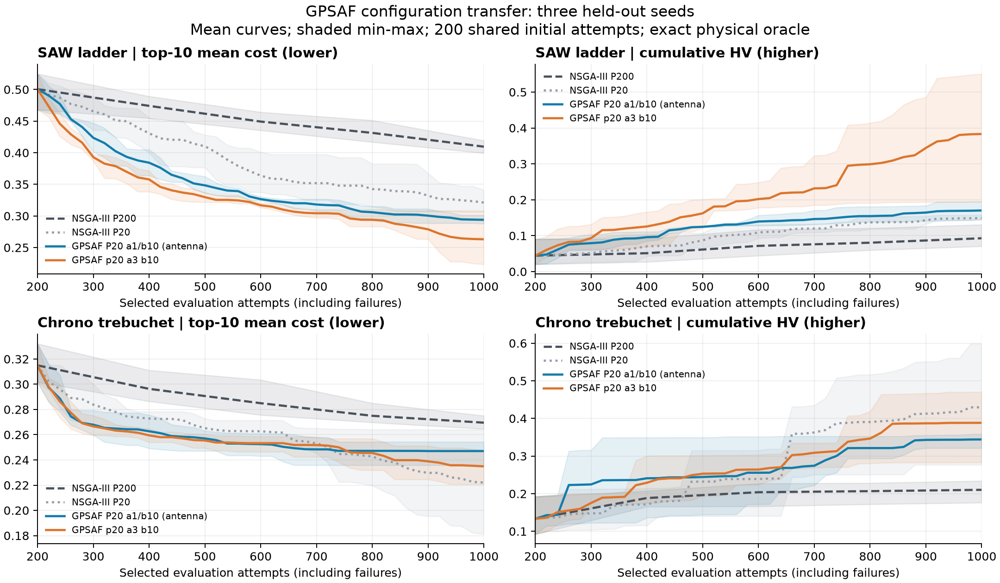

# SAW / Chrono 的 GPSAF 配置迁移研究

研究日期：2026-09-03。本文保存一组已完成的探索性证据，不修改当前默认配置，也不构成正式 benchmark campaign。

## 结论

这组数据不支持把某次调参的冠军直接当作通用最优。除了问题的物理模型和成本结构，随机种子、选用的指标和评估预算都会改变配置排序。

SAW：在 1,000 次预算和三个留出种子中，P20/α3/β10 对 P20/α1/β10 的 HV 三战全胜，配对提升中位数 137.11%；top-10 两胜一负，中位数降低 12.02%。在同初筛的 600 次预算处，α3 的两项指标均为三战全胜。初筛 seed101 选择 α1 的结论没有在留出种子上保持。

Chrono：α3/β10 相对 α1/β10 的 top-10 和 HV 都是两胜一负，但没有稳定超过无代理 P20。α3 对无代理 P20 的 top-10 配对变化中位数为 −0.17%，HV 为 −0.44%；top-10 胜出 2/3，HV 仅 1/3。α1 对同一对照两项都只胜出 1/3，top-10 中位数恶化 13.55%，HV 中位数下降 22.31%。

在本轮 1,000 次预算下，六个问题/留出种子组合的无代理 P20 都在 top-10 与 HV 上胜过无代理 P200。比较 GPSAF 应优先使用这个同为 P20 的对照，不能把缩小 P/B 的全部收益算成代理贡献。

上一轮 antenna 中 α1 相对 α3 的优势主要来自调参种子的消融；其多种子留出验证的是整套候选对 P200，而非 α1/α3 的直接多种子对照。因此两篇 context 不能独自证明 antenna 必须选 α1、SAW 必须选 α3 这样的稳定规律。

## 与上一轮的关系和研究边界

承接 [synthetic antenna 内存调优](20260903_091320_synthetic-gpsaf-memory-tuning.md)。沿用其 perfect-oracle 口径，把选中样本的累计尝试数作为质量比较预算；这次对每个新点实际调用安装包内的 SAW / Chrono 物理内核取得真值，并缓存重复点。

筛选变量为种群/批量 P=B、GPSAF α 和 β。γ=0.5、exploration_fraction=0.1 固定；所有组统一使用 antenna 候选的遗传算子：crossover_probability=0.85、crossover_eta=10、mutation_probability=0.35、mutation_eta=10、mutated_dimensions_per_individual=7、refill_attempts=8；reference_direction_method=das-dennis、reference_direction_partitions=None（自动），档案按 10 位小数去重。P200 对照共享这些算子设置，并非声称复现了包内默认配置的每个字段。

| 问题 | 变量 / 目标 | 原物理模型与成本 |
|---|---|---|
| SAW ladder | 10 / 5 | 原 ngspice BVD 梯形滤波器；5 个串联、4 个并联谐振器；850–1150 MHz 的 1,201 点 AC 响应。成本是通带插损、回损、3 dB 边缘误差、近端和外侧阻带抑制。 |
| Chrono trebuchet | 13 / 4 | 原 PyChrono 投石机模型，1 ms 步长、最多 6 s 仿真，原释放逻辑和 rawData；成本是射程、移动质量、装载高度和材料强度。 |

参数归一化映射调用安装包公开的 assign_parameters，保留分段范围；未简化物理模型、成本函数或失败判定。

## 配对实验设计

- 初筛：seed=101，两个问题各 8 组，每组 600 次选中尝试；共 16 组、9,600 次计分预算。
- 每个问题/种子的所有配置使用完全相同的 200 个初始 X/F；P20/P50 在这之后缩小种群与批量，初始 200 次包含在总预算内。
- 留出：seed=102、103、201，两个问题各 4 组，每组 1,000 次；共 24 组、24,000 次计分预算。验证 NSGA-III P200、NSGA-III P20、P20/α1/β10 和 P20/α3/β10。
- 方案冻结于 2026-09-03T03:14:18.894199+00:00，仅使用完整初筛结果选候选；600 和 1,000 次两个观察点均在留出运行前固定。
- 选择规则：保留 antenna 配置，并选初筛 HV 最高的不同 GPSAF 配置；如果 antenna 已赢初筛，则保留其最强的不同候选作挑战者。本轮两个问题均选出 α3/β10。Chrono 初筛 top-10 最好的 P50 组没有进入这次按 HV 选取的留出比较。
- 使用原 select_gpsaf_generation，包括 α/β、聚类、PKT、探索与补齐；只把预测入口接到原物理内核的精确成本与有效性掩码。预测误差为零，未训练或挑选真实代理模型。
- 失败计入预算。只有已选中且有限的成功结果进入搜索历史、top-10 和 HV；oracle 预测候选本身不进入这些档案。成本全为 1 的有限结果仍是有效惩罚值，不当作失败。

top-10 是累计已选中有限样本中，目标算术平均值最小的 10 个样本的平均 cost，越低越好；这个均值仅用于报告，没有替换 GPSAF / NSGA-III 的原 Pareto 选择规则。HV 使用累计有限样本和固定全 1 参考点，越高越好；不同问题的目标维度不同，不能横向比较 SAW 与 Chrono 的绝对 HV。

## 完整初筛：seed 101，600 次

| 配置 | SAW top-10 ↓ | SAW HV ↑ | Chrono top-10 ↓ | Chrono HV ↑ | Chrono 失败尝试 | Oracle 请求/组 |
|---|---:|---:|---:|---:|---:|---:|
| NSGA-III P200 | 0.416095 | 0.047084 | 0.302153 | 0.155417 | 91 | 0 |
| NSGA-III P20 | 0.324009 | 0.095490 | 0.257351 | 0.379252 | 84 | 0 |
| P200 / α=3 / β=3 | 0.436395 | 0.050503 | 0.284414 | 0.224192 | 64 | 2,160 |
| P20 / α=3 / β=3 | 0.324001 | 0.128217 | 0.255097 | 0.318519 | 66 | 2,160 |
| P20 / α=1 / β=10 | 0.316960 | 0.165871 | 0.256559 | 0.403980 | 73 | 3,960 |
| P20 / α=3 / β=10 | 0.337243 | 0.152519 | 0.251008 | 0.419071 | 65 | 4,680 |
| P20 / α=10 / β=3 | 0.345324 | 0.113428 | 0.260136 | 0.390014 | 63 | 4,680 |
| P50 / α=1 / β=10 | 0.333562 | 0.124815 | 0.246169 | 0.309131 | 71 | 3,960 |

SAW 初筛没有失败尝试。以上每组均包含相同的初始 200 次；Oracle 请求是评分预算之外的预测调用口径，计费关系见后文。

初筛的 HV 冠军分别是 SAW 的 P20/α1/β10 和 Chrono 的 P20/α3/β10；Chrono 的 top-10 冠军则是 P50/α1/β10。选择标准不同，冠军已经不同。

α3/β10 与 α10/β3 在相同的 4,680 次 oracle 请求下，前者在 SAW 的 HV 高 34.46%，在 Chrono 高 7.45%，两者的 top-10 也都更低。这支持优先把该调参种子的预测预算分给 β，但这组完整的 β 消融没有进入多种子留出复验。

Chrono P50 组的较低 top-10 均值有明确取舍：其 top-10 点群平均 loaded-height cost 为 0.029487，低于 P20/α3/β10 的 0.072966；range cost 却是 0.842587，高于后者的 0.813455。这里是成本向量均值的分解，不能解读为 P50 的每项工程目标都更好。

## 留出结果：每组 1,000 次

### SAW ladder

| 种子 | 配置 | top-10 ↓ | HV ↑ | 失败尝试 |
|---:|---|---:|---:|---:|
| 102 | NSGA-III P200 | 0.399369 | 0.130838 | 0 |
| 102 | NSGA-III P20 | 0.316697 | 0.145816 | 0 |
| 102 | P20 / α=1 / β=10 | 0.301469 | 0.145507 | 0 |
| 102 | P20 / α=3 / β=10 | 0.308369 | 0.194428 | 0 |
| 103 | NSGA-III P200 | 0.410256 | 0.070556 | 0 |
| 103 | NSGA-III P20 | 0.306012 | 0.157767 | 0 |
| 103 | P20 / α=1 / β=10 | 0.287611 | 0.194523 | 0 |
| 103 | P20 / α=3 / β=10 | 0.223547 | 0.550686 | 0 |
| 201 | NSGA-III P200 | 0.419149 | 0.077317 | 0 |
| 201 | NSGA-III P20 | 0.341008 | 0.143718 | 0 |
| 201 | P20 / α=1 / β=10 | 0.292653 | 0.170737 | 0 |
| 201 | P20 / α=3 / β=10 | 0.257479 | 0.404834 | 0 |

### Chrono trebuchet

| 种子 | 配置 | top-10 ↓ | HV ↑ | 失败尝试 |
|---:|---|---:|---:|---:|
| 102 | NSGA-III P200 | 0.275054 | 0.176143 | 112 |
| 102 | NSGA-III P20 | 0.264009 | 0.276584 | 131 |
| 102 | P20 / α=1 / β=10 | 0.235812 | 0.352675 | 83 |
| 102 | P20 / α=3 / β=10 | 0.236670 | 0.470331 | 65 |
| 103 | NSGA-III P200 | 0.268994 | 0.220492 | 94 |
| 103 | NSGA-III P20 | 0.181147 | 0.598613 | 114 |
| 103 | P20 / α=1 / β=10 | 0.254297 | 0.358580 | 84 |
| 103 | P20 / α=3 / β=10 | 0.247321 | 0.282962 | 75 |
| 201 | NSGA-III P200 | 0.264552 | 0.234121 | 96 |
| 201 | NSGA-III P20 | 0.221041 | 0.413569 | 83 |
| 201 | P20 / α=1 / β=10 | 0.250989 | 0.321312 | 76 |
| 201 | P20 / α=3 / β=10 | 0.220659 | 0.411764 | 53 |

### 同为 P20 时，GPSAF 的额外收益

下表先在每个种子内对比无代理 P20，再取三个配对百分比的中位数及最小/最大值。cost 负值为改善，HV 正值为改善；胜出数是三个种子中的严格改善次数。

| 问题 | GPSAF 配置 | top-10 变化，中位数 [范围] | HV 变化，中位数 [范围] | top-10 / HV 胜出 |
|---|---|---:|---:|---:|
| saw | P20 / α=1 / β=10 | -6.01% [-14.18%, -4.81%] | +18.80% [-0.21%, +23.30%] | 3/3 · 2/3 |
| saw | P20 / α=3 / β=10 | -24.49% [-26.95%, -2.63%] | +181.69% [+33.34%, +249.05%] | 3/3 · 3/3 |
| chrono | P20 / α=1 / β=10 | +13.55% [-10.68%, +40.38%] | -22.31% [-40.10%, +27.51%] | 1/3 · 1/3 |
| chrono | P20 / α=3 / β=10 | -0.17% [-10.36%, +36.53%] | -0.44% [-52.73%, +70.05%] | 2/3 · 1/3 |

SAW 的 α3/β10 在两个指标上都胜过同为 P20 的无代理对照（3/3），但相对 α1 并非每个种子的 top-10 都胜出。seed102 的 α3 top-10 为 0.308369，略弱于 α1 的 0.301469，同时其 HV 更高。

Chrono seed103 是关键反例：无代理 P20 的 top-10/HV 为 0.181147/0.598613，两种 GPSAF 都更差。seed201 中 α3 与无代理 P20 很接近：top-10 低 0.17%，HV 却低 0.44%。因此不能把 α3 对 α1 的改善直接当成启用 GPSAF 相对强基线的稳定收益。

本轮可把 P20/α3/β10 作为 SAW 以 HV 为重点时的后续候选；Chrono 必须保留无代理 P20 作为强对照，现有数据不足以默认用这两个 GPSAF 候选替代它。这些是当前算子、初始化、预算和理想 oracle 下的探索性判断，不修改包默认配置。

图中实线/虚线是三个种子的均值，阴影是最小到最大值；并非置信区间。曲线仅由完整批次处的观测连接而成。上表报告配对变化的中位数，两者不是同一统计量。

## 种子与预算的影响

SAW 的 α3/β10 在 600 次处对 α1/β10 的 HV 配对提升中位数为 39.08%，top-10 中位数降低 3.00%，两项指标均为 3/3 胜出；到 1,000 次，HV 提升中位数扩大为 137.11%，但 seed102 的 top-10 改为 α1 更好。因此不能把初筛到留出的排序变化仅归因于预算延长。

Chrono 的 HV 排序随预算发生了两次方向相反的反转。seed102 在 600 次时 α3 比 α1 低 36.34%，到 1,000 次高 33.36%；seed103 在 600 次高 54.34%，到 1,000 次却低 21.09%。两个端点的 α3 HV 胜出数恰好都为 2/3，但胜出的种子并不相同。仅看胜出比例会掩盖这件事。

Chrono 的 α3 相对 α1，600 次处 top-10/HV 的配对变化中位数为 −0.85%/+24.50%，1,000 次为 −2.74%/+28.15%；种子级反转仍需结合上面的具体结果阅读。

600 和 1,000 次的全部配对值保存在 [endpoint_comparison.csv](../../../temp/20260903_saw_chrono_gpsaf_tuning/endpoint_comparison.csv)，汇总在 [endpoint_comparison.json](../../../temp/20260903_saw_chrono_gpsaf_tuning/endpoint_comparison.json)。

## 诊断、成本与可信边界

初始 seed101 的 SAW 200 点全部有效，其中有效无序点对有 1,459/19,900（7.33%）存在 Pareto 支配关系，即所有目标不劣且至少一项更优；Chrono 则有 59/200 次物理失败，有效点对可比较比例为 1,711/9,870（17.34%）。Chrono 141 个有效初始点中，106 个 range cost 恰为 1。这些点在全 1 参考点下不能贡献正 HV 体积，但仍属于有效成本与搜索历史。

初筛 α3/β10 的 α 比赛中，SAW 有 359/360（99.72%）次出现多名非支配候选，Chrono 为 327/360（90.83%）；α10/β3 在两个问题上都是 360/360。这里的诊断是非支配优胜者不唯一，不能当作成本数值相等，更不能由此断言 α 没有效果。候选集合、随机轨迹与预测请求数本身随配置改变，本轮没有把这些因素做因果拆分。

自动参考方向使 P 的变化同时改变了批量/更新频率、存活种群与参考方向数量：SAW 的 P20/P50/P200 分别对应 15/35/126 个方向，Chrono 分别为 20/35/165。因此本轮不能把种群收益拆成某个单独因素。固定 mutated_dimensions_per_individual=7，在 SAW 的 10 个变量与 Chrono 的 13 个变量中所占比例也不同。

对于 N 次选中预算、Q 次 oracle 请求和 S 次复用 oracle 成本的代理辅助选择，独立组的逻辑内核调用量为 N+Q−S。1,000 次预算下，α1/β10 为 Q=7,920、S=720、逻辑调用 8,200；α3/β10 为 Q=9,360、S=720、逻辑调用 9,640。α3 组多 18.18% 的 oracle 请求。实际新内核调用还会因为跨组共享初始点和精确重复点缓存而下降。

| 阶段 | 组数 | 选中尝试预算 | 实际新内核调用 | 实际物理失败 | 墙钟秒 |
|---|---:|---:|---:|---:|---:|
| integration | 2 | 480 | 840 | 74 | 24.25 |
| screening | 16 | 9,600 | 44,309 | 1,676 | 1189.08 |
| validation_saw | 12 | 12,000 | 57,596 | 0 | 1463.27 |
| validation_chrono | 12 | 12,000 | 57,598 | 4,231 | 1795.33 |

加上 pilot 80 次、Chrono 内存通路探针 64 次、原适配器审计 858 次，共实际执行 161,345 次物理内核。正式 recorder 记账为 0；这些是独立探索性数据。缓存复用使各组耗时受顺序影响，表中墙钟仅为执行记录，不能用来宣称真实代理的加速比。

预测同时拥有精确的有限成本和真实失败掩码；Chrono 的结果因此也依赖完美失败识别。没有检验非零代理误差、训练数据不足、训练耗时、更新延迟或真实模型的外推能力。三枚留出种子、有限配置网格及 600/1,000 次预算不能确立全局最优，也不能外推为上一轮 antenna 的 2,000 对 10,000 次或 5–7 倍节省结论。

## 独立核验

- pilot 通过原适配器运行每个问题 32 个点，再分别重跑其中 8 个点，cost 位与完整 rawData 哈希一致。
- Chrono 常驻进程内存通路与原适配器对比 32/32 点一致；另按逆序/正序请求 64 行，其中 32 个唯一点实际重算，重复请求的 cost 全部一致。原 simulate 和模型保留，只把 NPZ 输出端换成内存收集器。
- 从保存的 X/F 独立复算 42 组、34,080 行：配对初始点哈希、失败预算、有限档案去重、每代 top-10、最终 HV、oracle 调用及批次计数全部通过。
- 预先固定原适配器审计抽样规则：每组最好的 10 个有限 mean-cost 点、固定随机的 10 个尝试索引、最多 5 个均匀分布的失败点；跨组相同 X 只重跑一次并保留成员映射。
- saw 原适配器审计：389/389 个唯一点通过，其中有限 389、失败 0。有限点要求 cost 逐位相同且全部 rawData 数组/字段哈希相同；失败点要求全 +inf cost 与无 rawData 一致。
- chrono 原适配器审计：469/469 个唯一点通过，其中有限 377、失败 92。有限点要求 cost 逐位相同且全部 rawData 数组/字段哈希相同；失败点要求全 +inf cost 与无 rawData 一致。
- 研究每组运行前后核对同一套 65 个源文件哈希，跨阶段缓存只接受完全相同的源身份；所有运行使用已安装包，无 editable install 或 PYTHONPATH 源目录注入。

## 版本、证据位置和复现

源码基线提交 `7c4cbee0055fd2978941275b9ab5cede34d4549c`；yadof 0.5.1、yadof-benchmark 0.5.0、Python 3.13.11、NumPy 2.5.2、pymoo 0.6.2；ngspice 46、PyChrono 10.0.0。仿真器通过 YADOF_NGSPICE_EXE / YADOF_PYCHRONO_PYTHON 指定，原安装来源、可执行文件与 PyChrono 模块身份在本地 provenance 中保留。

两个安装包 baseline workspace 的 yadof check 均通过，各保留一条从 0.4.0 初始化的历史版本标记警告；未改写标记或基线文件。研究各阶段使用 16 个线程 worker，物理内核单次 30 秒上限，验证每组 900 秒、每阶段 2,400 秒上限。

本地证据根为外层工作区的 `temp/20260903_saw_chrono_gpsaf_tuning/`。大数组和脚本留在该目录，本文与图像进入 Git。完成时间：2026-09-03T04:13:53.192513+00:00。

- [完整结果表与轨迹](../../../temp/20260903_saw_chrono_gpsaf_tuning/REPORT.md)、[配对指标](../../../temp/20260903_saw_chrono_gpsaf_tuning/paired_results.csv)、[汇总](../../../temp/20260903_saw_chrono_gpsaf_tuning/results_summary.json)。
- [初筛方案](../../../temp/20260903_saw_chrono_gpsaf_tuning/screening_plan.json)、[冻结留出方案](../../../temp/20260903_saw_chrono_gpsaf_tuning/validation_plan.json)、[600/1,000 端点](../../../temp/20260903_saw_chrono_gpsaf_tuning/endpoint_comparison.json)。
- [运行与预测接入脚本](../../../temp/20260903_saw_chrono_gpsaf_tuning/study.py)、[原物理求值器](../../../temp/20260903_saw_chrono_gpsaf_tuning/physical_evaluator.py)、[Chrono 内存通路](../../../temp/20260903_saw_chrono_gpsaf_tuning/chrono_memory_worker.py)。
- [独立指标核验](../../../temp/20260903_saw_chrono_gpsaf_tuning/final_verification.json)、[原适配器抽样计划](../../../temp/20260903_saw_chrono_gpsaf_tuning/normal_audit/sample_plan.json)、[原适配器核验结果](../../../temp/20260903_saw_chrono_gpsaf_tuning/normal_audit/results.json)。
- [运行记账和失败分类](../../../temp/20260903_saw_chrono_gpsaf_tuning/runtime_summary.json)、[初始样本与 α 诊断](../../../temp/20260903_saw_chrono_gpsaf_tuning/landscape_diagnostics.json)、[仿真器身份](../../../temp/20260903_saw_chrono_gpsaf_tuning/simulator_identity.json)、[ngspice 版本核对](../../../temp/20260903_saw_chrono_gpsaf_tuning/ngspice_version.json)。
- [逐文件 SHA-256 清单](../../../temp/20260903_saw_chrono_gpsaf_tuning/artifact_manifest.json)，其清单自身 SHA-256 为 `cb3129680b6020ca9425f5266cf2c41f8d116dc657637bdcc5d36b891fe76064`。
- [screening provenance](../../../temp/20260903_saw_chrono_gpsaf_tuning/screening/provenance.json)、[SAW provenance](../../../temp/20260903_saw_chrono_gpsaf_tuning/validation_saw/provenance.json)、[Chrono provenance](../../../temp/20260903_saw_chrono_gpsaf_tuning/validation_chrono/provenance.json)。

每个性能组保留选中 X/F、代号和 rawData 哈希的 NPZ，以及逐代 CSV/JSON；每阶段保留精确点缓存、物理失败日志和完成汇总。全量原始曲线数组没有持久化，仅在独立审计时重算并比对摘要。

复现时从外层工作区使用所选环境的 Python，运行 study.py --plan <已冻结方案> --output <新的空输出目录>。先配置对应仿真器环境变量；如使用 cache_inputs，必须连同其 provenance 一起保留且源哈希一致。原输出目录不可覆盖；无缓存复现应复制方案并将 cache_inputs 设为空数组，同时保留配置、种子、预算和相同源版本。运行后使用 verify_artifacts.py、audit_normal_path.py、report.py 与 summarize_endpoints.py 重算/审计。

本次仓库改动仅为 context、图像和完成记录，按开发指南的文档例外执行 UTF-8、链接、数据/图像一致性与 diff 检查；没有修改包代码或打包用户文档，因此无需重建、重装 wheel 或重跑包测试。
