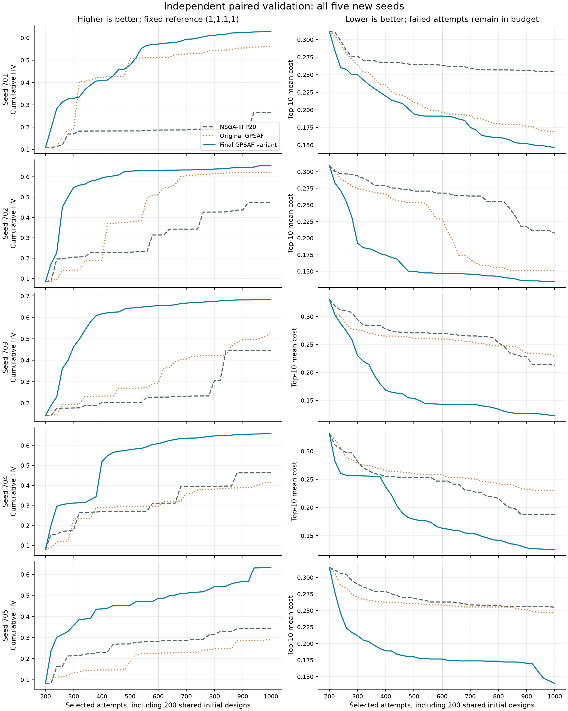
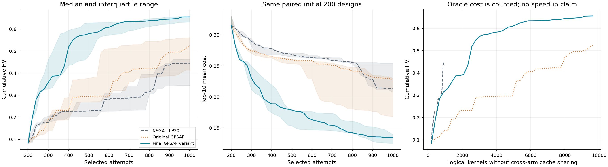
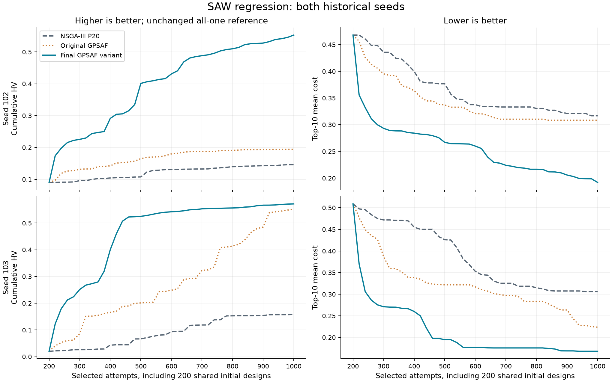
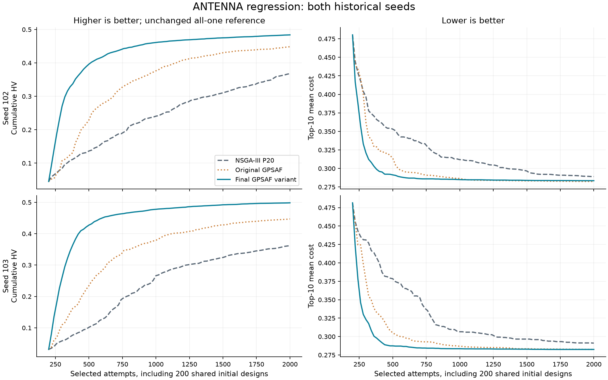
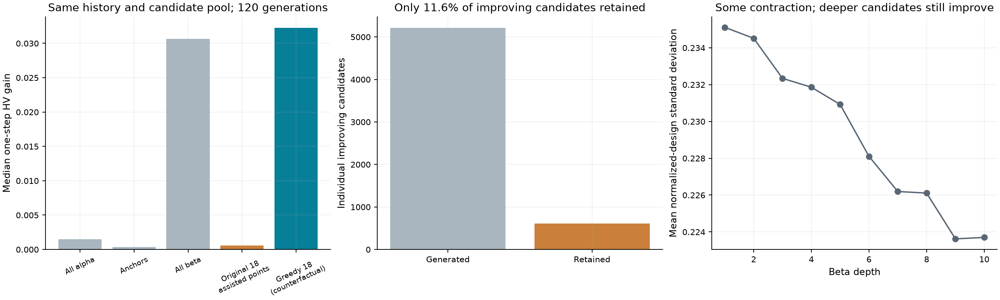

# Chrono 完美 oracle GPSAF：机制、结构消融与独立验收

本轮找到达到预注册标准的改进：可选的历史 HV 贪心选择。在五个新的配对种子、每臂 1000 次入选尝试下，相对强 NSGA-III P20 的 HV 配对相对增益中位数为 53.48%，绝对增益中位数为 0.238121，top-10 平均成本相对变化中位数为 -42.40%。全部冻结门槛通过。

主要证据是：候选池已产生大量改善点，但原聚类/PKT 筛选没有保留多数覆盖收益；同池反事实、真实轨迹消融与独立验证依次检验了这一解释。另有 beta 失败值影响归一化的实现适配风险，不能将两者混成一个原因。结论限于当前精确 oracle、参数域与预算；没有验证学习型 surrogate 的收益，也没有证明实际运行加速。

[实验产物与复现入口](../../../temp/20260903_chrono_gpsaf_mechanism/README.md)；[全部统计](../../../temp/20260903_chrono_gpsaf_mechanism/FINAL_STATISTICS.json)；[冻结身份](../../../temp/20260903_chrono_gpsaf_mechanism/C3_FREEZE.json)；[两套成本账本](../../../temp/20260903_chrono_gpsaf_mechanism/COST_LEDGERS.json)。本文件与图表可随源码/文档包阅读，较大的原始产物保留在所选外层工作区的 `temp/20260903_chrono_gpsaf_mechanism/`。

## 五个独立种子：所有主结果

| 种子 | 强 P20 HV | 原 GPSAF HV | HV 变体 | 变体−P20 | 相对变化 |
|---|---|---|---|---|---|
| 701 | 0.266119 | 0.562081 | 0.627862 | +0.361744 | +135.93% |
| 702 | 0.473946 | 0.620405 | 0.655426 | +0.181480 | +38.29% |
| 703 | 0.445252 | 0.524721 | 0.683373 | +0.238121 | +53.48% |
| 704 | 0.463643 | 0.414215 | 0.659733 | +0.196090 | +42.29% |
| 705 | 0.344498 | 0.288675 | 0.633128 | +0.288630 | +83.78% |

| 种子 | 强 P20 top-10 | 原 GPSAF top-10 | 变体 top-10 | 变体/P20 变化 | 失败次数 P20/原/变体 |
|---|---|---|---|---|---|
| 701 | 0.254357 | 0.168499 | 0.146170 | -42.53% | 107/57/50 |
| 702 | 0.207520 | 0.150870 | 0.134492 | -35.19% | 112/71/73 |
| 703 | 0.212909 | 0.228179 | 0.122643 | -42.40% | 95/60/57 |
| 704 | 0.187712 | 0.230165 | 0.125419 | -33.19% | 111/77/80 |
| 705 | 0.254967 | 0.246501 | 0.139568 | -45.26% | 102/59/60 |

失败率存在反例：相对原 GPSAF，变体在 702 多 2 次、704 多 3 次、705 多 1 次。质量端点通过不代表每个种子的失败率都下降。

| 冻结门槛 | 结果 |
|---|---|
| HV 相对增益中位数 ≥10% | 通过 |
| HV 绝对增益中位数 ≥0.02 | 通过 |
| 至少 4/5 个种子严格 HV 胜出 | 通过 |
| 每个种子的 HV 损失 ≤10% | 通过 |
| top-10 成本变化中位数 ≤+2% | 通过 |
| 每个种子的 top-10 成本变化 ≤+5% | 通过 |
| 相对原 GPSAF 的 HV 差中位数 >0 | 通过 |

相对强 NSGA-III P20 的配对统计：

| 配对量 | 中位数 | 均值 | IQR | 范围 | 中位数 95% bootstrap 区间 | 双侧符号 p |
|---|---|---|---|---|---|---|
| HV 绝对差 | 0.238121 | 0.253213 | [0.196090, 0.288630] | [0.181480, 0.361744] | [0.181480, 0.361744] | 0.0625 |
| HV 相对差 | +53.48% | +70.76% | [+42.29%, +83.78%] | [+38.29%, +135.93%] | [+38.29%, +135.93%] | 0.0625 |
| top-10 相对差 | -42.40% | -39.71% | [-42.53%, -35.19%] | [-45.26%, -33.19%] | [-45.26%, -33.19%] | 0.0625 |
| HV AUC 绝对差 | 0.277677 | 0.271964 | [0.219429, 0.320066] | [0.201442, 0.341208] | [0.201442, 0.341208] | 0.0625 |

相对原 GPSAF 的配对统计：

| 配对量 | 中位数 | 均值 | IQR | 范围 | 中位数 95% bootstrap 区间 | 双侧符号 p |
|---|---|---|---|---|---|---|
| HV 绝对差 | 0.158652 | 0.169885 | [0.065782, 0.245518] | [0.035021, 0.344453] | [0.035021, 0.344453] | 0.0625 |
| HV 相对差 | +30.24% | +45.24% | [+11.70%, +59.27%] | [+5.64%, +119.32%] | [+5.64%, +119.32%] | 0.0625 |
| top-10 相对差 | -43.38% | -31.85% | [-45.51%, -13.25%] | [-46.25%, -10.86%] | [-46.25%, -10.86%] | 0.0625 |
| HV AUC 绝对差 | 0.236366 | 0.195314 | [0.150712, 0.268516] | [0.051918, 0.269059] | [0.051918, 0.269059] | 0.0625 |

这里是以种子为重采样单位的 10000 次百分位 bootstrap 中位数区间，随机种子固定 873421。n=5 的区间和符号检验分辨率很粗；即使五个方向全相同，双侧符号 p 也只有 0.0625。因此不宣称常规 p<0.05 的显著性，更不把这些区间当作总体性能保证。实际验收用的是实验前冻结的效果量与非劣界限。

600 次辅助终点的全部配对结果（主比较仍为 1000）：

| 种子 | 强 P20 HV | 原 GPSAF HV | 变体 HV | 变体/P20 HV 变化 | 变体/P20 top-10 变化 |
|---|---|---|---|---|---|
| 701 | 0.186599 | 0.512422 | 0.571873 | +206.47% | -27.47% |
| 702 | 0.313830 | 0.511204 | 0.630501 | +100.90% | -45.11% |
| 703 | 0.227626 | 0.290825 | 0.654464 | +187.52% | -47.16% |
| 704 | 0.310880 | 0.295742 | 0.608143 | +95.62% | -33.84% |
| 705 | 0.281769 | 0.225686 | 0.486403 | +72.62% | -32.81% |

原 GPSAF 在这五个新种子中有 3/5 个 HV 超过强 P20，配对 HV 相对差中位数为 +17.85%，top-10 相对成本差中位数为 -3.32%。这组独立结果必须与旧三种子的弱表现一起理解，不能将旧观察扩展成“原 GPSAF 总是无效”。其逐种子及不确定性统计保存在 `ORIGINAL_VS_REAL.json`。





## 领域回归与物理核验

SAW，预算 1000；表格每格为 HV / top-10：

| 旧种子 | 强 P20 | 原 GPSAF | HV 变体 | 失败 P20/原/变体 |
|---|---|---|---|---|
| 102 | 0.145816 / 0.316697 | 0.194428 / 0.308369 | 0.552753 / 0.191855 | 0/0/0 |
| 103 | 0.157767 / 0.306012 | 0.550686 / 0.223547 | 0.571528 / 0.167799 | 0/0/0 |

两种子均增加相对强对照的 HV：是；两种子 HV 均不低于原 GPSAF：是；两种子 top-10 均不劣于原 GPSAF：是。全部差异、AUC 与 n=2 的粗粒度区间保存在 `REGRESSION_SAW.json`；这些旧种子检查不构成独立跨领域泛化证明。原 GPSAF 和真实对照均与历史 X/F/代次逐位一致；SAW 还核对了原有 rawData 哈希，antenna 的历史 NPZ 未保存 rawData 哈希。



ANTENNA，预算 2000；表格每格为 HV / top-10：

| 旧种子 | 强 P20 | 原 GPSAF | HV 变体 | 失败 P20/原/变体 |
|---|---|---|---|---|
| 102 | 0.367749 / 0.289043 | 0.448335 / 0.282373 | 0.483746 / 0.283439 | 0/0/0 |
| 103 | 0.361583 / 0.291064 | 0.447021 / 0.282555 | 0.498300 / 0.282496 | 0/0/0 |

两种子均增加相对强对照的 HV：是；两种子 HV 均不低于原 GPSAF：是；两种子 top-10 均不劣于原 GPSAF：否。全部差异、AUC 与 n=2 的粗粒度区间保存在 `REGRESSION_ANTENNA.json`；这些旧种子检查不构成独立跨领域泛化证明。原 GPSAF 和真实对照均与历史 X/F/代次逐位一致；SAW 还核对了原有 rawData 哈希，antenna 的历史 NPZ 未保存 rawData 哈希。

保留反例：种子 102 相对原 GPSAF 的 HV 变化为 +7.90%、top-10 成本变化为 +0.38%；相对强 P20 分别为 +31.54%、-1.94%。覆盖与标量成本并非总能同时获益，不能把该领域称作各项指标全面改善。



最后以原普通 Chrono 适配器复核 237 个已入选样本行（去重后 217 次实际新调用），覆盖每个主臂/种子的 top-10、各目标最优点及失败/有限零体积样本；237/237 成本、失败掩码与完整 rawData 哈希一致。没有通过缩短时间、简化物理模型或丢弃 rawData 来取得收益。

各组 top-10 的实际物理量均值；这是十个设计的均值，并非声称单个设计同时达到四项均值：

| 种子 | 方法 | 射程 m | 运动质量 kg | 加载最高点 m | 峰值强度利用率 |
|---|---|---|---|---|---|
| 701 | NSGA-III P20 | 15.9614 | 3.4949 | 1.1646 | 0.2291 |
| 701 | 原 GPSAF | 55.7651 | 4.5125 | 1.6571 | 0.3842 |
| 701 | HV 变体 | 61.0339 | 2.8356 | 1.7961 | 0.3571 |
| 702 | NSGA-III P20 | 51.6282 | 7.8336 | 2.7329 | 0.1535 |
| 702 | 原 GPSAF | 62.6990 | 3.7768 | 2.4096 | 0.2526 |
| 702 | HV 变体 | 68.7321 | 4.5549 | 2.3107 | 0.3396 |
| 703 | NSGA-III P20 | 38.1574 | 2.8668 | 1.1131 | 0.2792 |
| 703 | 原 GPSAF | 42.3646 | 6.7150 | 2.2767 | 0.1651 |
| 703 | HV 变体 | 70.9342 | 3.0751 | 2.0673 | 0.3490 |
| 704 | NSGA-III P20 | 47.0534 | 2.8132 | 1.7860 | 0.1894 |
| 704 | 原 GPSAF | 41.9109 | 5.2486 | 2.1012 | 0.3348 |
| 704 | HV 变体 | 67.7123 | 3.4785 | 1.7615 | 0.3420 |
| 705 | NSGA-III P20 | 13.7171 | 3.1193 | 1.2720 | 0.1435 |
| 705 | 原 GPSAF | 22.3126 | 2.0777 | 1.5427 | 0.2198 |
| 705 | HV 变体 | 67.8630 | 5.0734 | 2.3884 | 0.3345 |

完整四成本向量、目标极值、前沿规模、目标及设计多样性见 `ENDPOINTS.json`；物理量范围、释放与接地有效计数见 `C4_normal_audit/top10_physical.json`。不同目标极值可能来自不同设计，不能拼成一项可实现设计。失败表和物理表保留覆盖与工程目标的取舍。

top-10 各成本的配对绝对差（变体−对照，负数较好），采用相同种子 bootstrap：

| 对照 | 成本分量 | 差值中位数 | 中位数 95% 区间 | 下降/上升种子数 |
|---|---|---|---|---|
| NSGA-III P20 | 射程成本 | -0.402960 | [-0.559816, -0.216879] | 5/0 |
| NSGA-III P20 | 运动质量成本 | +0.000207 | [-0.023856, +0.012039] | 2/3 |
| NSGA-III P20 | 加载高度成本 | +0.022565 | [-0.073920, +0.064795] | 2/3 |
| NSGA-III P20 | 强度利用率成本 | +0.019976 | [-0.002945, +0.022542] | 1/4 |
| 原 GPSAF | 射程成本 | -0.334364 | [-0.507180, -0.069665] | 5/0 |
| 原 GPSAF | 运动质量成本 | -0.011008 | [-0.032219, +0.017634] | 3/2 |
| 原 GPSAF | 加载高度成本 | -0.011926 | [-0.072827, +0.047124] | 3/2 |
| 原 GPSAF | 强度利用率成本 | +0.011030 | [-0.016690, +0.021917] | 2/3 |

射程成本在五个种子中均下降，top-10 实际射程均值的配对提升中位数为 32.777 m；其 95% 区间为 [17.104, 54.146] m。质量、高度和强度成本没有同时全面改善。入选有效设计的归一化标准差均值在五个种子均下降，配对变化中位数 -0.055099，覆盖提升伴随设计空间收缩。所有 top-10 样本都已释放且接地有效。

`AUXILIARY_STATISTICS.json` 保存两个对照下每个种子的四成本、物理量、失败和多样性差异，以及均值、中位数、IQR、范围与区间。这些是原定辅助指标的描述性汇总，不增加或修改验收门槛，不作经多重比较校正的显著性宣称。物理量与非线性成本分别取均值，不能把均值再代入成本映射来替代逐设计计算。

## 两套成本账本

全过程（含回放及复筛前缀）共计 51000 次逻辑入选尝试、349740 次 oracle 请求、199472 次新的 Chrono/SAW 内核、75596 次新的合成 antenna 内核，benchmark 累计墙钟 6000.209 秒。均在预注册 350000 请求/230000 物理内核/8400 秒界限内。回放不是独立新证据，缓存前缀仍逐臂完整计入逻辑预算。

| 阶段 | cell | 逻辑入选 | oracle 请求 | 新物理内核 | 新合成内核 | 记录墙钟 s |
|---|---|---|---|---|---|---|
| C1_replay | 4 | 4000 | 28080 | 0 | 0 | 27.291 |
| C1_advance_probe | 1 | 1000 | 9360 | 0 | 0 | 6.401 |
| C2_screen | 10 | 6000 | 46800 | 45158 | 0 | 1289.485 |
| C2_refine | 6 | 6000 | 56160 | 37378 | 0 | 1009.193 |
| C3_equivalence | 2 | 1000 | 7020 | 0 | 0 | 5.056 |
| C4_part1 | 6 | 6000 | 37440 | 39283 | 0 | 1061.978 |
| C4_part2 | 6 | 6000 | 37440 | 39284 | 0 | 1068.935 |
| C4_part3 | 3 | 3000 | 18720 | 19642 | 0 | 566.055 |
| C4_saw | 6 | 6000 | 37440 | 18408 | 0 | 503.602 |
| C4_antenna | 6 | 12000 | 71280 | 0 | 75596 | 412.288 |
| C1_physical_probe | 0 | 0 | 0 | 102 | 0 | 8.562 |
| C4_normal_audit | 0 | 0 | 0 | 217 | 0 | 15.258 |

主比较每臂均有 1000 次入选：真实 NSGA-III 的逻辑内核为 1000；两种 GPSAF 均为 40×18×(3+10)=9360 次预测，另有初始 200 和未辅助探索 80，即 9640 次逻辑内核。720 个辅助入选点复用已预测成本。这一账本给每条 oracle 请求收费，并未抵扣其他重复预测；实际缓存命中及新内核在 `ENDPOINTS.csv` 逐臂列出，受历史缓存和执行顺序影响。相同请求量的 T/A/B/AB/F 消融及质量—调用量曲线没有隐藏 oracle 成本。阶段记录墙钟与总墙钟的边界略有不同，总台账包含阶段关闭开销；均不含后续代码测试和报告编写。

## 研究问题、口径与冻结

历史研究在相同 200 点初始化、随后 P20/B20、1000 次入选尝试预算下，Chrono 的完美 oracle GPSAF 并未稳定超过 NSGA-III P20。完美预测并不自动保证整体搜索更好：它只移除了预测误差，不会把候选生成或多目标平局规则自动变成最大覆盖选择。本轮依次做来源/协议审计、同状态反事实、有限结构消融、安装实现等价验证，再用五个未观察种子独立验收。

`PREREGISTRATION.md` 在任何新增优化实验之前写入，SHA-256 为 `bdec94d9ffd28e5fa12d6650f59c106417026959c4f6e33e71d7f3226c914d9e`。主终点固定 1000，辅助终点固定 600，报告 200–1000 预算归一化 HV AUC 和每 20 次的完整轨迹。初始化、数值失败均计预算；只有入选并确认成本的点进入真实历史和指标。

主要比较为强 NSGA-III P20、原 GPSAF alpha=3/beta=10/gamma=0.5/exploration=0.1、最终变体。固定 crossover_probability=0.85、crossover_eta=10、mutation_probability=0.35、mutation_eta=10、mutated_dimensions_per_individual=7、refill_attempts=8、das-dennis 自动方向、去重精度 10。Chrono 是 13 变量/4 目标/20 条参考方向；SAW 是 10 变量/5 目标/P20 自动得到 15 条参考方向；antenna 是 20 变量/4 目标。没有改变底层遗传算子，无需用额外算子臂混入主比较。原 P200 仅保留历史结果，没有为新种子伪造 P200 对照。

最终标准全部同时满足：相对 NSGA-III 的配对 HV 相对增益中位数至少 10%、绝对增益中位数至少 0.02；至少 4/5 严格 HV 胜出，任何种子损失不超过 10%；top-10 平均成本相对变化中位数不高于 +2%、每个种子不高于 +5%；相对原 GPSAF 的配对 HV 中位增益为正。门槛没有在看到结果后放宽。报告 10000 次配对 bootstrap 中位数百分位区间（随机种子 873421）、均值、中位数、IQR、范围及双侧精确符号检验；n=5 的区间及检验分辨率有限。

并发和成本边界为一个优化臂、最多 16 个物理 worker、BLAS/OMP 单线程、单内核 30 秒、单 cell 900 秒、单阶段 2400 秒；总 oracle 请求不超过 350000，新增 Chrono/SAW 内核不超过 230000，benchmark 墙钟不超过 8400 秒。质量账本按入选尝试；计算账本单列 oracle 请求、缓存复用、新内核和墙钟。

## C0：版本与协议审计

起点提交 `97c50efd38608dbe58e6bf4d6db28aa3b7112477`。使用安装在所选外层虚拟环境 site-packages 的 yadof 0.5.1、yadof-benchmark 0.5.0、NumPy 2.5.2、pymoo 0.6.2，Python 3.13.11。`source_audit.json` 核对了历史研究记录的 65 个源文件与当前来源，也比较了 installed optimize 与 checkout；全部一致。仅比较包版本号不够，后续缓存只在物理适配器、参数、成本、rawData 内核和 oracle 文件哈希一致时复用。

原模拟仍是柔性 King Arthur trebuchet 的原 Chrono 内核，时间步 1 ms、最大 6 s，原参数域（含不连续角度/初始球偏移区间）、释放逻辑、完整 rawData 和成本定义均未修改。四个成本依次对应射程、运动质量、加载最高点、材料强度利用率。soft-cost 的 goal/worst 锚点依次为 100/5 m、4.5/50 kg、2.35/5 m、0.5/1.0，映射至 0.1/0.9 并保留尾部排序。

实验沿用已核对的内存研究通路，没有写入正式任务的评价数据库（formal_recorded_evaluations=0）。原内核仍计算完整 rawData，再经过原成本链；内存缓存保存成本及完整 rawData 的规范哈希，只有入选行进入内存真实 HistoryRecord 和累计质量指标。普通适配器抽样及最终 top-10 核验用于检查这一路径的语义，哈希用于比对，不能代替完整波形本身。

有限 cost=1 与仿真失败严格分开。机械接地无效可产生合法的全一成本；未释放、未落地或弹丸接地无效可产生有限的射程成本 1；这些都有合法 rawData。声明的数值/物理失败是无有效 rawData、全 +inf、valid_mask=False。完美 oracle 同时提供精确成本和真实失败识别，误差状态确实为零。未知接口/协议异常不会被吞成物理失败。去重以有限真实历史和当前已生成候选为准，入选失败仍消耗预算，预测候选不会混入真实档案。

`C1_replay` 的四个 1000 点轨迹逐位重放通过：原 GPSAF 的 102/103/201 和强 NSGA-III 的 103，共 4000 行设计、成本、代次、完整 rawData 哈希一致，没有新增物理内核。alpha 不 tell；beta 从 alpha ask 之后的状态深拷贝推进，最终恢复真实优化器群体/归一化状态并保留候选生成的随机流与排除集。120 代输入及返回真实状态不变检查全部通过，没有发现真实/克隆状态泄漏。`C1_physical_probe` 另以原普通适配器抽查失败、有限零体积、有限正体积各 16 个，48/48 成本和完整 rawData 哈希一致。

对照 [GPSAF 论文](https://arxiv.org/abs/2204.04054v1) 与[作者固定版本](https://github.com/anyoptimization/pysamoo/blob/75056b4d02f27b5c3fb36aa493999d608f56699d/pysamoo/algorithms/gpsaf.py)后，需区分论文描述、作者代码和 yadof 的工作流适配。论文正文的 alpha 是从可行非支配者中随机选，Algorithm 2/作者旧实现具有顺序比较细节，不能称三者逐位等价。yadof 的 PKT 符合一次打乱、奇数补点、每次独立噪声的论文描述；作者旧实现的逐轮打乱与 beta 深度平局规则不同。最近作者代码迁移版本也保存在 `references/`，其提交为 `3109b19a114882c5c8399fbfdea073bf632c405b`。簇赢家无需优于 alpha anchor、按簇密度概率替换属于算法选择规则，不能仅因它损失 HV 就叫实现 bug。

## C1：候选已经产生，但覆盖收益在选择中流失

三条原 GPSAF 轨迹的 120 代都有相同历史状态与候选池的阶段记录。以下是各代汇总，单步增益不是运行后能累加得到的收敛轨迹。

| 阶段 | 候选数 | 有效率 | 有效点中零体积比例 | 单步 HV 增益中位数 | 设计标准差均值 |
|---|---:|---:|---:|---:|---:|
| 全 alpha 池 | 6480 | 91.74% | 40.64% | 0.001515 | 0.240970 |
| alpha anchors | 2160 | 99.86% | 35.93% | 0.000344 | 0.233158 |
| 全 beta 池 | 21600 | 91.23% | 38.58% | 0.030662 | 0.238679 |
| 原 18 个辅助入选点 | 2160 | 99.54% | 33.72% | 0.000560 | 0.237569 |
| 同池历史 HV 贪心反事实 | 2160 | 100% | 0.09% | 0.032251 | 0.204364 |

在 anchors+beta 池中，5213 个候选各自能增加历史 HV，原选择只保留 607 个（11.64%）。池中每代 top-10 平均成本候选共 1200 个，仅保留 152 个。2091 次非空簇 PKT 有 200 个赢家被同簇其他候选支配；64 次替换的赢家甚至被自己的 anchor 支配。即使预测误差为零，非支配关系的随机比较也不保证最后赢家在整个簇内非支配，更不保证改善相对历史的 HV。

同池细分消融进一步分离损失来源：原选择的单步增益合计为 0.758728；只禁止被 anchor 支配的替换得到 0.795441；每簇选择历史 HVI 最大者得到 6.126642；全局逐点更新边际 HVI 得到 6.641316。最后两者说明簇内的目标覆盖选择是主要差异，一簇一点的容量限制还有次要贡献。全局贪心在全部 120 代突破了原簇配额，平均使用 8.44/18 个簇，每代单簇最多入选点数的中位数为 5。它明确牺牲了部分设计空间分散性来增加目标空间覆盖，不是所有多样性指标同时改善。

完整批次的检查没有漏掉 2 个探索点。原探索点共 240 个，其中 215 个有效，单步 HVI 中位数为零；原完整 20 点批次的 HVI 中位数为 0.000621。保持同一批真实探索点，仅替换 18 个辅助点，反事实中位数变为 0.032310，120/120 代均提高。此证据支持把选择损失作为主方向，不能证明探索比例 0.1 最优。将全部 alpha 竞争者也纳入池，单步增益合计只比 anchors+beta 再高约 4.25%，因此本轮保留 alpha 不变。

beta 深度仍有作用：归一化设计标准差均值从第 1 层的 0.235109 收缩至第 10 层的 0.223698，但深层依然产生改善点；第 10 层单步 HVI 中位数 0.000355，并不比第 1 层 0.000136 更差。因此“深 beta 已完全失效”被证据否定；多轨迹重启仅作为可证伪结构方向，不能预先认定它会获益。

另发现一个实现适配风险：失败的 +inf 在 beta 内部 NSGA-III 推进时转成 1e30，可以污染历史 worst_point 并影响 nadir 的回退。1200 次 beta 推进中 935 次含失败，203 次 nadir 有分量超过 1，最大约 207.78；这本身不等于每次都改变选择。同状态排除失败的 264 个一步 probe 中，22 次同时改变 nadir 和存活群体。没有发现其泄漏到返回的真实优化器。这是独立的归一化风险，因此增加 F 单因素消融；不能用它替代完整机制解释。

该归一化问题没有在本次公共默认或 A 中修复。F 只测试到 600，不能据此断言它无须修复或普遍无害；F+A 的联合效果没有验证。F 在有有效点时仅向 beta tell 这些点，无有效点时保留 ask 后状态而不 tell。

## 物理解释及其局限

普通适配器抽查的 16 个有限零体积点都未释放，但机械/弹丸接地有效；16 个正体积点均释放、落地且接地有效。它们与 16 个真实仿真失败是不同现象。一个未释放点即使质量、高度较好，也可与射程好的点互不支配，随机平局因此会保留对固定参考盒没有覆盖增量的点。HVI 选择在有正增益候选时主动避开这些平台。

局部扰动共记录 81 行，但自动选择的三个标签中有两个指向同一个设计，实际只有两个独立中心、54 次新的唯一内核；不能报告成三个独立中心或全局敏感性。未释放中心的射程为 0、强度利用率约 1.348；归一化 loaded_arm_angle 加 0.01、loaded_hanger_angle 减 0.01、cw_trigger_drop_angle 加 0.01 分别触发释放，射程约 15.97/4.44/8.29 m，强度成本明显降低。局部改变 release_sling_arm_rotation 没有触发这个平台的释放，说明释放参数并非在所有姿态下都有效。

0.01 是各维度归一化区间的步长，并非统一的物理单位；多区间参数映射还包含缺口。因此这些有限扰动描述局部现象，不等同于光滑导数或跨参数的全局重要性排名。

较好中心的射程约 60.76 m、运动质量 3.49 kg、加载高度 2.20 m、峰值强度利用率 0.273；对 13 个维度的这些局部扰动均保持释放，其中释放角导致最大射程变化，正/负扰动得到约 55.12/52.66 m。这些观察支持释放边界、有限惩罚平台与目标冲突造成选择困难，但只代表两个中心的局部行为。同池存在大量可改善点且后来真实入选点确实提高覆盖，排除了“当时已无可改善候选”；没有测出全局 Pareto 前沿，也没有证明距离物理上限多远。

## C2：有限消融与最终选择

最多五个候选、旧种子 102/103、600 次入选预算；每臂 oracle 请求均为 4680，避免预测请求量混淆。C1 发现归一化风险后、任何 C2 优化开始前，`C2_PLAN.md` 用 F 替代原可选的简单 anchor 消融，未增加候选数量、改变种子或放宽主标准。

| 候选 | 修改类型 | s102 HV / top-10 | s103 HV / top-10 |
|---|---|---:|---:|
| T alpha1/beta12 | 原算法等请求调参 | 0.318809 / 0.215571 | 0.502257 / 0.218496 |
| A 历史 HVI | 覆盖选择结构 | 0.679006 / 0.149352 | 0.665705 / 0.134527 |
| B 两条 beta5 | 生成/推进结构 | 0.283489 / 0.257899 | 0.347703 / 0.245910 |
| A+B | 两结构组合 | 0.590029 / 0.155983 | 0.539939 / 0.199522 |
| F valid-only beta tell | 失败归一化单因素 | 0.360184 / 0.220139 | 0.502322 / 0.242194 |
| 强 NSGA-III P20 | 历史配对对照 | 0.140425 / 0.271373 | 0.315499 / 0.261975 |
| 原 GPSAF | 历史配对对照 | 0.223763 / 0.254828 | 0.265199 / 0.258689 |

所有五项在这两个 600 端点都超过强对照，F/T 并非无效。A 与 A+B 筛选表现最好，按冻结的复筛规则仅延长这两项至旧种子 102/103/201、预算 1000；四个已有 600 前缀逐位一致。

| 种子 | 强 P20 HV / top-10 | 原 GPSAF HV / top-10 | A HV / top-10 | A+B HV / top-10 |
|---|---:|---:|---:|---:|
| 102 | 0.276584 / 0.264009 | 0.470331 / 0.236670 | 0.692973 / 0.124027 | 0.630409 / 0.142536 |
| 103 | 0.598613 / 0.181147 | 0.282962 / 0.247321 | 0.675437 / 0.129007 | 0.647856 / 0.148554 |
| 201 | 0.413569 / 0.221041 | 0.411764 / 0.220659 | 0.523536 / 0.170529 | 0.642208 / 0.125468 |

A 相对强对照的配对 HV 相对增益中位数为 26.59%、绝对增益中位数 0.109967，top-10 相对变化中位数 -28.78%。A+B 的配对 HV 中位相对增益更高，为 55.28%，并在 201 明显优于 A；这是保留的反例。两者均达到旧种子的数值效果门槛之后，选择 A 的依据是只保留必要改动：重启相对 A 在 2/3 种子降低 HV 并恶化 top-10，配对 HV 增量中位数 -0.027582、top-10 相对恶化中位数 +14.92%；A 的 AUC 在 2/3 种子也更好，600 筛选两种子均胜组合。`C3_DECISION.json` 在新种子访问前记录了全部结果和简单性取舍，不把 A 说成在所有旧种子都最优。未延长 F/T 到 1000，不能推断其长期效果。

## C3：保留的正式实现与独立冻结

新增可选 `gpsaf_settings(infill_selection="hypervolume")`，默认仍为 `"cluster"`。只有 beta 已完成并且误差状态可用时，对同一 anchors+全 beta 池使用预测成本均值、有效掩码及真实累计历史，以固定全一参考点逐点选择边际 HV 最大者。使用递减边际收益的 lazy greedy；精确相等按池顺序，增益不大于 1e-12 后停止。剩余位置依次取有效原 PKT/gamma 结果、其他有效池点、必要的无效点，保证批量；有限 1.0 仍有效。探索配额、alpha、beta ask/tell 次数、遗传算子及真实状态恢复均保留。

它是显式覆盖选择变体，不是宣称原 GPSAF 论文规定必须最大化 HV，也不是 qNEHVI 或不确定性感知采集函数。代码没有 benchmark 名称、已知最优点、oracle 真值接口或物理模型依赖。预测点只进入私有临时覆盖前沿，不进入真实历史。PKT/误差/gamma 仍用于无正增益时的 fallback 顺序。没有将未证实稳定有益的 beta 重启或 F 行为改成公共默认。

以 host 身份 wheel 构建并 force-reinstall 后验证 import 来源为 site-packages；相关 41 项测试在 11.47 秒全部通过，覆盖解析/校验、历史依赖、逐点边际更新、有效/失败 fallback、查询数、探索额度、预测绑定与 beta 未启用情况。原 GPSAF 的 400 行与历史原轨迹逐位一致，正式 HV 路径的 600 行与研究原型轨迹逐位一致，核对字段均为设计、成本、代次和完整 rawData 哈希；共 7020 oracle 请求但零新增物理内核。正式验证使用安装版公开配置，不再替换 beta 函数为研究原型。

`C3_FREEZE.json` 的 SHA-256 为 `81e0d25dbaaf839652ebe38e163eaab247403df4ce6c29264d4bf89aec50b8ac`，在访问 701–705 的任何结果之前记录最终代码、运行器、分析规则、配置及预注册身份。此后不再调参。antenna 和 SAW 仅用旧种子 102/103 回归，前者 alpha1/beta10、预算 2000，后者 alpha3/beta10、预算 1000；两者的结果都不能充作新的普适性能证据。

来源说明：预注册初始文字含“论文改名/补全”的暂定描述；后来将 Git blob 与新文件逐项比较，确认只是内容不变的更名及 acceptance 链接修正。最终提交描述以核验结果为准，预注册原件保留不改。



## 使用范围、安装验证与交付身份

本次只新增可选的 infill_selection，原 cluster 默认保持。Chrono 的复现配置为共同初始 200、随后 P20/B20，以及上述不变遗传算子：

```python
from yadof.optimize import gpsaf_settings

settings = gpsaf_settings(
    alpha=3, beta=10, gamma=0.5, exploration_fraction=0.1,
    infill_selection="hypervolume",
)
```

推荐范围必须结合本报告的主门槛和各领域回归结果理解；不把它默认用于未经验证的领域或学习模型。误差状态仍按 `user_doc/gpsaf.md` 校准，不能把完美 oracle 的零误差初始化照搬给学习模型。

对本轮相同精确 oracle、参数域及成本，Chrono 可优先使用上面的 HV 配置；SAW 回归也支持 alpha=3/beta=10 的同一选项。Antenna 保留其原 alpha=1/beta=10、gamma=0.5、exploration=0.1，以 HV 覆盖为优先时可选该变体；若只看 top-10 标量成本，两个旧种子不足以支持它全面替代原 cluster。三者都保留共同初始 200、随后 P20/B20 和已记录遗传算子。

C3 相关测试为 41 passed in 11.47s；C5 全套已安装包测试为 **491 passed in 100.93s (0:01:40)**，退出码 0，禁用 pytest 缓存并使用独立工具临时目录。测试期间代码与冻结 optimize/job-template 哈希一致。随后只将本报告和图表等文档装入刷新 wheel，保持这些算法/物理源字节不变，并核对安装资源与文档链接。benchmark 包没有代码或文档改动，复用已验证的 0.5.0 安装。

代码、测试、用户指南、架构和对应蓝图与本报告一起提交。包含已审阅的预存论文纯更名和 acceptance 链接修正，没有丢弃历史证据。提交起点为 `97c50ef`，实验实现由 C3_FREEZE 的完整文件 SHA 确定；提交后的精确 hash、fetch/领先落后计数及是否按 main/behind=0/ahead≥5 规则推送，记录在外层产物 [GIT_COMPLETION.json](../../../temp/20260903_chrono_gpsaf_mechanism/GIT_COMPLETION.json)，避免把提交 hash 写回它自身。最终 [MANIFEST.json](../../../temp/20260903_chrono_gpsaf_mechanism/MANIFEST.json) 与 [便携包](../../../temp/20260903_chrono_gpsaf_mechanism/artifact_bundle.zip) 包含完整入选数据、阶段追踪、配置、统计、图表、源码脚本和核对过的 wheel。
