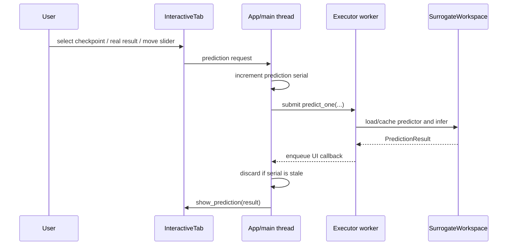

# 4+1 process view

## Workspace Load

1. The user selects an explicit directory and requests loading.
2. The app cancels any prior audit, invalidates old request serials, and constructs
   `SurrogateWorkspace` on the Tk thread.
3. The backend loads effective configuration, checkpoint descriptors, parameter
   definitions, objective names, completed-record metadata, and one rawData
   template.
4. Both tabs replace their selectors and derived state. The interactive tab
   randomly selects one available optimization generation and then one real
   individual from that generation.
5. The app submits the initial interactive prediction.

Metadata loading is synchronous because it establishes all subsequent UI state.
Failures leave the prior process alive, update the footer, and show a visible
dialog.

## Interactive Prediction

Slider changes are debounced. Selecting a real individual copies its normalized
variables into the controls and attaches its job name so true rawData and current
costs are returned for comparison. Selecting a rawData item rebuilds one control
row for every stored dimension. Zero to two checked dimensions are retained as
plot axes; each unchecked dimension offers both a stored-coordinate dropdown and a
free numeric entry. Requests whose fixed values are stored coordinates reuse the
already predicted full rawData. A non-grid fixed value queries the same conditional
INR at that physical coordinate and interpolates checkpoint target-scaler arrays,
or queries a coordinate-enabled hierarchical CAE at all declared in-domain axes.
Both return plot-only member values and preserve the checkpoint state. Recorded
truth is omitted for that rawData plot
because the requested coordinate was never recorded; objective bars continue to
use the unchanged full-grid reconstruction.

## Cross-Generation Audit

1. Sample each optimization generation independently without replacement; retain
   at least one result per generation.
2. Load sampled real rawData and calculate current true costs once.
3. For each checkpoint:
   - validate/load schema and model;
   - flatten the same real samples against that schema;
   - predict samples in batches;
   - calculate predicted current costs;
   - accumulate finite absolute/relative cost errors;
   - accumulate finite absolute/relative errors per rawData item;
   - release the predictor and optional CUDA cache.
4. Publish one `CrossGenerationErrorAudit` only after every checkpoint completes.
5. The tab derives the selected matrix from cached sums/counts and draws it.

Changing Error or Quantity after completion performs only NumPy aggregation and
division. It must not load a checkpoint or execute PyTorch.

## Terminal Reports

`summary` constructs `SurrogateWorkspace`, reads the same checkpoint, task, record,
and first-sample metadata used for GUI setup, bounds coordinate output to
count/min/max per dimension, and exits without constructing a predictor or
importing Tkinter.

`audit` constructs the same workspace facade, resolves `all-costs`, `cost:NAME`,
`all-rawdata`, or `rawdata:NAME` against current names, then calls
`calculate_error_audit()` once. After full completion it derives the requested
relative/absolute matrices in memory and renders text or JSON. `--metric both`
reuses the one complete aggregate rather than repeating inference. Requested
progress is written to stderr; stdout contains only the final report. A failed
audit returns no partial report and writes nothing to the workspace.

## Cancellation And Previous Results

The Stop button sets a thread-safe event. The backend checks it before and after
expensive batches and raises `AuditCancelled`. Cancellation is cooperative, so the
current inference batch may finish first.

The in-progress audit is never installed into the tab. On cancellation, the tab
redraws its previous complete audit when one exists; otherwise it returns to the
empty state.

## Thread And Failure Rules

- Tk and Matplotlib mutations occur only in callbacks drained on the main thread.
- The executor has one worker, preventing interactive and audit model operations
  from racing over shared accelerator/process state.
- Request serials suppress callbacks from an older workspace or superseded
  prediction.
- Expected backend failures become a visible status and dialog.
- Unexpected Tk callback failures are printed and reported in the GUI.
- Closing sets cancellation, invalidates requests, cancels pending futures where
  possible, shuts down without waiting, and destroys the root window.
