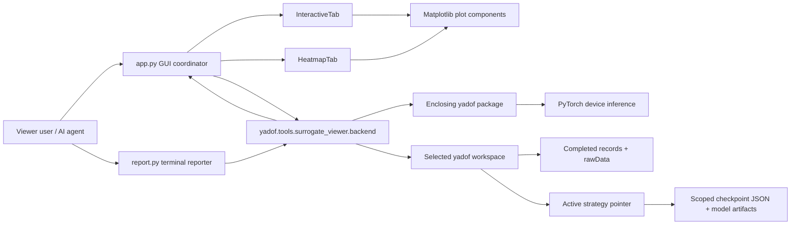

# C4 containers

## Application Coordinator

`app.py` constructs the root window, header, notebook, footer, and the two tabs. It
owns the single-worker executor, UI callback queue, request serials, cancellation
event, workspace replacement, error dialogs, and shutdown. It does not own plot
details or checkpoint parsing.

## Terminal Reporter

`report.py` constructs a bounded metadata summary without model loading or asks the
same backend facade for one complete audit. It selects an aggregate quantity and
one or both error metrics, then renders human-readable text or schema-versioned
JSON. It owns no inference, workspace, or persistence logic and never imports the
GUI.

## UI Components

`ui/interactive.py` owns checkpoint/real-result selectors and normalized parameter
controls. `ui/heatmap.py` owns audit selectors, progress state, last complete audit,
and start/stop controls. `ui/plots.py` owns Matplotlib figures and presentation
rules. `ui/style.py` and `ui/widgets.py` contain actual shared visual/keyboard
behavior rather than application logic.

## Backend

`backend/` is the read-only adapter from the viewer to its enclosing yadof package:

- `workspace.py` loads records, task definitions, and the active strategy scope,
  caches one interactive predictor, samples history, and orchestrates audit
  aggregation.
- `checkpoints.py` owns generic discovery/dispatch plus conditional-INR compatibility,
  loading, coordinate queries, and batched inference.
- `hierarchical_checkpoints.py` validates and loads hierarchical-CAE artifacts,
  preserves their full-grid audit/cost path, and provides all-axis in-domain
  coordinate plots for coordinate-enabled checkpoints.
- `pca_svd_checkpoints.py` validates no-pickle PCA/SVD state/artifact identity and
  exposes deterministic one-member prediction, stored-grid plots, and audit.
- `rawdata.py` copies templates, flattens true samples against checkpoint slots,
  aggregates errors by rawData item, and extracts display curves.
- `types.py` defines the data passed between backend and UI, including derivation of
  one heatmap matrix from aggregate arrays.

`backend/__init__.py` is the stable viewer-local import surface.

## Data Ownership

Workspace records and rawData are external durable evidence. Strategy-scoped
checkpoint artifacts are external read-only model state; inactive namespaces stay
retained but undiscovered. Predicted samples, member samples, objective values,
and error aggregates are derived session memory.

The interactive path caches at most one loaded predictor. The heatmap path releases
each audit predictor after its checkpoint column and retains only aggregate
`sum/count` arrays. The terminal audit follows that same path and releases all
session state at process exit; terminal reports are stdout values, not workspace
artifacts.
