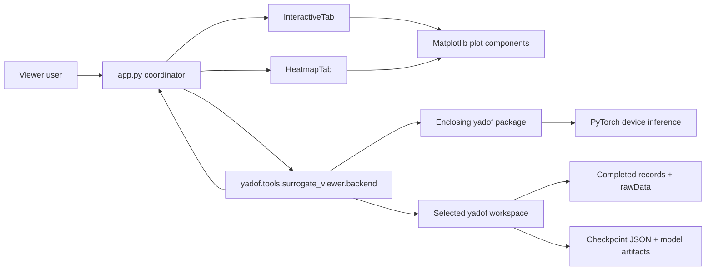

# C4 containers

## Application Coordinator

`app.py` constructs the root window, header, notebook, footer, and the two tabs. It
owns the single-worker executor, UI callback queue, request serials, cancellation
event, workspace replacement, error dialogs, and shutdown. It does not own plot
details or checkpoint parsing.

## UI Components

`ui/interactive.py` owns checkpoint/real-result selectors and normalized parameter
controls. `ui/heatmap.py` owns audit selectors, progress state, last complete audit,
and start/stop controls. `ui/plots.py` owns Matplotlib figures and presentation
rules. `ui/style.py` and `ui/widgets.py` contain actual shared visual/keyboard
behavior rather than application logic.

## Backend

`backend/` is the read-only adapter from the viewer to its enclosing yadof package:

- `workspace.py` loads records and task definitions, caches one interactive
  predictor, samples history, and orchestrates audit aggregation.
- `checkpoints.py` discovers checkpoint metadata, validates compatibility, loads
  artifacts, and performs batched inference.
- `rawdata.py` copies templates, flattens true samples against checkpoint slots,
  aggregates errors by rawData item, and extracts display curves.
- `types.py` defines the data passed between backend and UI, including derivation of
  one heatmap matrix from aggregate arrays.

`backend/__init__.py` is the stable viewer-local import surface.

## Data Ownership

Workspace records and rawData are external durable evidence. Checkpoint artifacts
are external read-only model state. Predicted samples, member samples, objective
values, and error aggregates are derived session memory.

The interactive path caches at most one loaded predictor. The heatmap path releases
each audit predictor after its checkpoint column and retains only aggregate
`sum/count` arrays.
